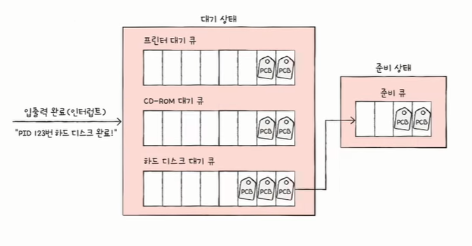
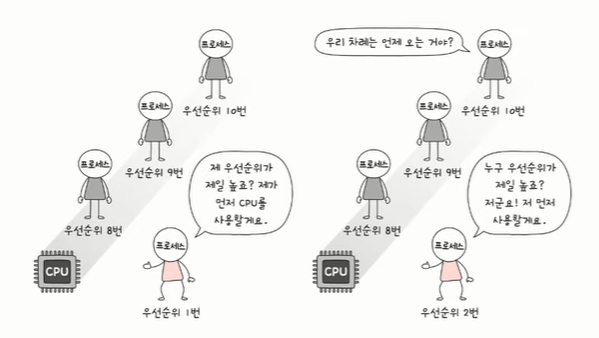
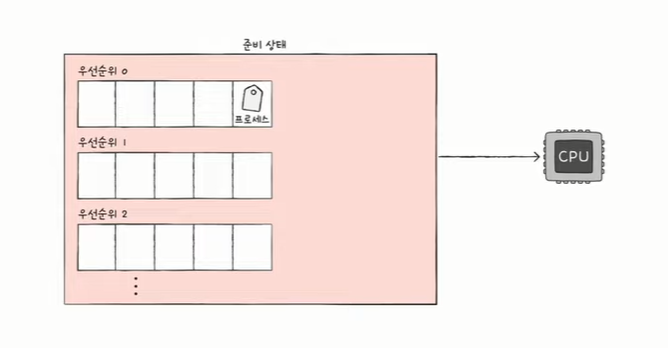
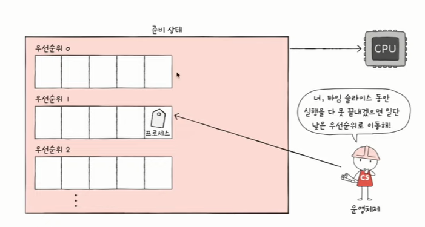

# CPU 스케줄링
- 운영체제가 프로세스들에게 공정하고 합리적으로 CPU 자원을 배분하는 것
- 컴퓨터 전체 성능과도 직결되는 아주 중요한 주제
- 가장 공정한 CPU 스케줄링은 무엇일까..

### ✅ 프로세스 우선순위
- 프로세스마다 우선순위가 다르다.
- 우선순위는 사용자가 정할 수도 있고 운영체제가 정할 수도 있다.
- 예시)
    - 입출력 작업이 많은 프로세스(=입출력 집중 프로세스 IO bust procedd)의 우선순위는 CPU 작업이 많은 프로세스(=CPU 집중 프로세스. CPU bound process)의 우선순위보다 높다.

    - 입출력 집중 프로세스는 CPU 집중 프로세스에 비해 대기상태에 많이 머무를 것 (실행 상태보다)
    - 대기상태에서는 어차피 CPU를 잘 안 쓰기 때문에
    - 입출력 집중 프로세스의 우선순위를 높여서 빨리 처리를 해버리는 게 CPU 집중 프로세스에 CPU를 많이 집중적으로 할당할 수 있게 됨

- 프로세스의 중요도에 맞게 프로세스가 CPU를 이용할 수 있도록 운영체제가 우선순위를 부여
- 우선순위는 프로세스의 PCB에 저장이 됨
- 운영체제는 PCB를 보고 이것을 기반으로 CPU 할당
- 일부 우선순위는 사용자가 직접 부여할 수도 있음

- 운영체제 입장에서 다음에 CPU를 사용할 프로세스를 정하기 위해 CPU를 요구하는 모든 프로세스의 PCB를 뒤지는 것은 매우 비효율적이다.
- CPU 뿐 아니라 메모리, 입출력 장치를 요구하는 프로세스가 늘 여러개일 것이기 때문이다.
- 이런 문제를 해결하기 위해 **스케줄링 큐**를 사용한다.

### ✅ 스케줄링 큐
- 특정 자원을 이용하고 싶어 하는 프로세스들이 서는 줄

- 스케줄링에서의 큐는 반드시 선입선출 방식일 필요는 없다.
- 프로세스마다 요구하는 자원은 여러 개이고, 스케줄링 큐에도 여러 종류가 있다.
- 대표적으로 준비 큐와 대기 큐가 있다.

**✔️준비 큐**
- 레디 큐
- CPU를 이용하고 싶어하는 프로세스가 서는 줄
- 준비 상태에 접어든 프로세스가 있는 큐

**✔️대기 큐**
- 입출력장치를 이용하고 싶어하는 프로세스가 서는 줄
- 대기 상태에 접어든 프로세스가 있는 큐

**✔️운영체제의 프로세스 관리**
- 입출력 완료되면 대기 큐에서 준비 큐로 넘어감
- 대기 큐도 여러개 (입출력 장치 여러개이므로)
- 대기 큐는 입출력 장치 별로 있는 경우가 많음

- 같은 장치를 요구한 프로세스들은 같은 큐에서 대기
- 입출력이 완료돼서 입출력 완료 인터럽트가 발생을 하면 운영체제는 대기 큐에서 해당하는 PCB를 찾고
- PCB의 상태를 대기 > 준비 상태로 변경하고 대기 큐에서 제거하고 준비 큐로 넣어준다.
- 운영체제는 프로세스를 이러한 흐름으로 관리한다.
- 먼저 큐에 삽입되었다고 해서 먼저 자원을 이용할 수 있느 것은 아님
- 우선순위가 높은 프로세스가 먼저 이용

## ✅ 선점형과 비선점형 스케줄링
- 어떤 프로세스가 CPU를 이용하고 있는데 어떤 프로세스가 너무 급하다고 잠깐 써도 되는지 부탁하면?
- 이 경우 2가지 선택을 할 수 있음
    - 현재 CPU를 사용 중인 프로세스로부터 CPU 자원을 빼앗아 다른 프로세스에 할당 > **선점형 스케줄링**
    - 현재 CPU를 사용 중인 프로세스의 작업이 끝날 때까지 프로세스 기다리게 함 > **비선점형 스케줄링**

### 1. 선점형 스케줄링
- 지금까지 앞에서 설명한 내용(프로세스 상태)은 모두 선점형 스케줄링이었음
- 장) 어느 한 프로세스의 자원 독점을 막고 프로세스들에 골고루 자원을 배분할 수 있다.
- 단) 그만큼 문맥 교환이 많아 그 과정에서 오버헤드가 발생할 수 있다.

### 2. 비선점형 스케줄링
- 어느 한 프로세스가 자원을 이용하고 있거나 종료되거나 대기 상태에 접어들 때까지 다른 프로세스가 끼어들 수 없는 것
- 장) 선점형 스케줄링에 비해 문맥 교환에서 발생하는 오버헤드가 적다
- 단) 모든 프로세스가 골고루 자원을 이용하기 어렵다

## ✅ CPU 스케줄링 알고리즘
대표적인 7가지 알고리즘
1. 선입 선처리 스케줄링
2. 최단 작업 우선 스케줄링
3. 라운드 로빈 스케줄링
4. 최소 잔여 시간 우선 스케줄링
5. 우선순위 스케줄링
6. 다단계 큐 스케줄링
7. 다단계 피드백 큐 스케줄링

### 1. 선입 선처리 스케줄링
- FCFS (First Come First Served) 스케줄링
- 단순히 준비 큐에 삽입된 순서대로 처리하는 비선점 스케줄링
- 먼저 CPU 를 요청한 프로세스부터 CPU 할당
- 단) 프로세스들이 기다리는 시간이 매우 길어질 수 있음 (=호위 효과. Convoy Effect)
  

### 2. 최단 작업 우선 스케줄링
- SJF (Shortest Job First) 스케줄링
- CPU 사용 시간이 가장 짧은 프로세스부터 처리하는 스케줄링 방식
- 기본적으로 비선점형

### 3. 라운드 로빈 스케줄링
- RR (Round Robin) 스케줄링
- 돌아가면서 한다
- 선입 선처리 스케줄링 + 타임 슬라이스
- 타임 슬라이스: 각 프로세스가 CPU를 사용할 수 있는 정해진 시간
- 정해진 타임 슬라이스만큼의 시간 동안 돌아가며 CPU를 이용하는 선점형 스케줄링
- 큐에 삽입된 프로세스들은 순서대로 CPU를 이용하되 정해진 시간만큼만 이용
- 정해진 시간을 모두 사용하였음에도 아직 프로세스가 완료되지 않았다면 다시 큐의 맨 뒤에 삽입 (문맥교환)
  
- 타임 슬라이스의 크기가 중요
- 너무 크면 선입 선처리 스케줄링처럼 호위효과 발생 가능
- 너무 작으면 문맥 교환이 커 오버헤드 발생 가능

### 4. 최소 잔여 시간 우선 스케줄링
- SRT (Shortest Remaining Time) 스케줄링
- 최단 작업 우선 스케줄링 + 라운드 로빈 스케줄링
- 정해진 시간만큼 CPU를 이용하되, 다음으로 CPU를 사용할 프로세스로는 남은 작업 시간이 가장 적은 프로세스 선택

### 5. 우선순위 스케줄링
- 프로세스들에 우선순위를 부여하고 우선순위 높은 프로세스부터 실행
- 우선순위가 같은 프로세스들은 선입 선처리로 스케줄링
- 최단 작업 우선 스케줄링, 최소 잔여 시간 스케줄링 <(포함) 우선순위 스케줄링
- 근본적인 문제가 있음 > **기아(starvation) 현상**
    - 우선순위 높은 프로세스만 주구장창 실행
    - 우선순위 낮은 프로세스는 (준비 큐에 먼저 삽입되었음에도 불구하고) 실행 연기
      
    - 이를 방지하기 위한 기법: **에이징**
        - 오랫동안 대기한 프로세스의 우선순위를 점차 높이는 방식
        - 대기 중인 프로세스의 우선순위를 마치 나이 먹듯 점차 증가시키는 방법 > 우선순위가 낮아도 언젠가는 우선순위가 높아진다.

### 6. 다단계 큐 스케줄링
- Multilevel queue 스케줄링
- 우선순위 스케줄링의 발전된 형태
- 우선순위별로 준비 큐를 여러 개 사용하는 스케줄링 방식
- 우선순위가 가장 높은 큐에 있는 프로세스를 먼저 처리
- 우선순위가 가장 높은 큐가 비어 있으면 그 다음 우선순위 큐에 있는 프로세스 처리
- 프로세스 유형별로 우선순위를 구분하기 쉬워짐
    - 어떤 큐는 타임 슬라이스를 크게, 어떤 큐는 선입선처리 > 큐마다 다른 유형의 스케줄링 가능
      

- 단) 큐 간에 이동 불가 > 계속 우선순위가 낮은 큐에 있어 다시 기아 현상이 발생할 수 있음
- 이를 위해 다음 스케줄링이 생김

### 7. 다단계 피드백 큐 스케줄링
- Multilevel feedback queue 스케줄링
- 다단계 큐 스케줄링의 발전된 형태
- 큐 간의 이동이 가능한 다단계 큐 스케줄링
- 다단계 큐 스케줄링에서는 기본적으로 큐 간의 이동 불가
    - 우선순위 낮은 프로세스는 계속해서 실행 연기 우려
    - 기아 현상 발생 가능
- step1) 새롭게 준비 상태가 된 프로세스는 일단 우선순위가 가장 높은 큐에 넣음
- step2) 일정 시간 (타임슬라이스) 동안 CPU 할당 받아 사용하게 함
- step3) 그 시간 동안 실행이 안 끝났다면 우선순위가 다음으로 높은 큐에 넣음
- step4) 반복

- CPU 집중 프로세스(CPU 많이 씀)의 우선순위는 상대적으로 낮아지고 입출력 집중 프로세스(CPU 많이 안 씀)의 우선순위는 상대적으로 높아짐
- 다단계 피드백 큐 스케줄링에서도 에이징 기법 사용 가능
- 일정 시간 이상 낮은 우선순위 큐에 있었던 프로세스의 우선순위를 높임
- 즉 어떤 프로세스의 CPU 시간이 길면 우선순위가 낮아지고 어떤 프로세스가 낮은 우선순위 큐에서 너무 오래 기다리면 우선순위를 높이는 방식
- 가장 일반적인 CPU 스케줄링 방식으로 알려져 있음