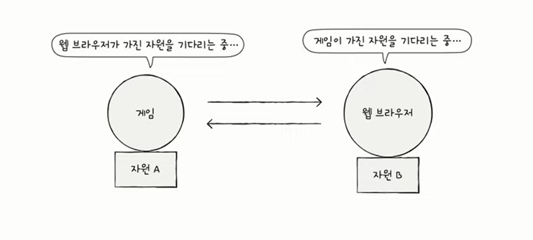
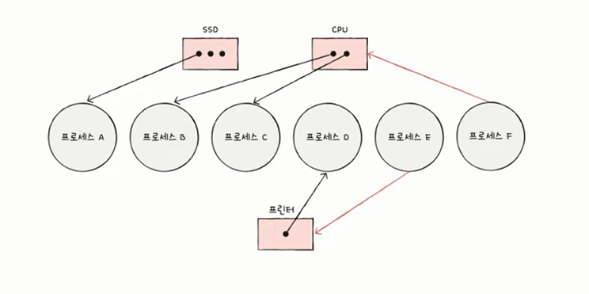
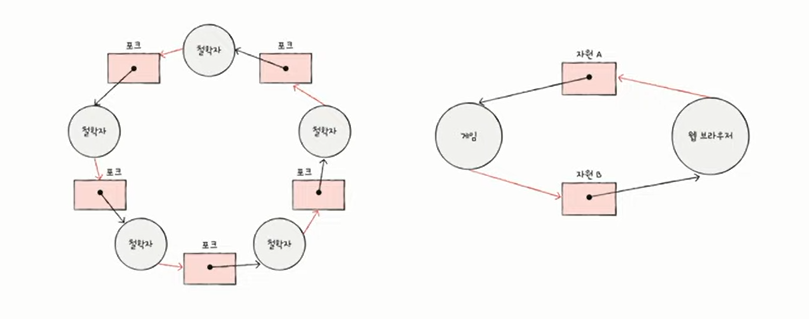

## 교착상태

- 식사하는 철학자 문제
- 일어나지 않을 사건을 기다리며 진행이 멈춰 버리는 현상

- 교착 상태를 해결하기 위해서는
  1. 교착 상태가 발생했을 때의 상황을 정확히 표현해보기
  2. 교착 상태가 일어나는 근본적인 이유 이해하기

**✔️자원 할당 그래프**
- 교착 상태 발생 조건 파악 가능
    1) 어떤 프로세스가 어떤 자원을 할당 받아 사용 중인지 확인 가능
    2) 어떤 프로세스가 어떤 자원을 기다리고 있는지 확인 가능
- 그리는 방법
     1) 프로세스는 원으로, 자원의 종류는 사각형으로 표현
     2) 사용할 수 있는 자원의 개수는 자원 사각형 내에 점으로 표현
     3) 프로세스가 어떤 자원을 할당 받아 사용 중이라면 자원에서 프로세스를 향해 화살표를 표시
     4)프로세스가 어떤 자원을 기다리고 있다면 프로세스에서 자원으로 화살표를 표시

- 교착 상태가 일어난 자원 할당 그래프는 원의 형태를 띠고 있다.

## ✅  ️교착 상태가 발생할 조건
1. 상호 배제 : 한 프로세스가 사용하는 자원을 다른 프로세스가 사용할 수 없는 상태
2. 점유와 대기 : 자원을 할당 받은 상태에서 다른 자원을 할당 받기를 기다리는 상태
3. 비선점 : 어떤 프로세스도 다른 프로세스의 자원을 강제로 빼앗지 못하는 상태
4. 원형 대기 : 프로세스들이 원의 형태로 자원을 대기하는 상태

- 위 4가지 중 하나라도 만족하지 않으면 교착 상태 발생하지 않지만 모두 만족하면 교착 상태가 발생할 수 있음

## ✅ 교착 상태의 해결 방법
교착 상태 해결: 예방, 회피, 검출 후 회복

### 1. 예방
- 애초에 교착 상태가 발생하지 않도록 하는 것
- 교착 상태 발생 조건(상호 배제, 점유와 대기, 비선점, 원형 대기) 중 하나를 없애버리기
    1) `상호 배제`를 없애면?
        - 모든 자원을 공유 가능하게 만든다
        - 현실적으로 불가
    2) `점유와 대기`를 없애면?
        - 특정 프로세스에 자원을 모두 할당하거나 아예 할당하지 않는 방식으로 배분
        - 부작용: 자원을 활용률이 너무 낮아질 수 있음
    3) `비선점`을 없애면?
        - 다른 프로세스의 자원을 빼앗을 수 있게 하는 것
        - 선점이 가능한 자원(CPU)에 한해 효과적
        - 부작용: 모든 자원이 선점 가능한 것은 아니다. (ex. 프린터)
    4) `원형 대기`를 없애면?
        - 모든 자원에 번호를 붙이고 오름차순으로 자원을 할당하면 원형 대기는 발생하지 않음
        - 그나마 가장 현실적이긴 하나,
        - 부작용: 자원에 번호 붙이는 것은 어려운 작업, 어떤 자원에 어떤 번호를 붙이느냐에 따라 활용률이 달라짐

### 2. 회피
- 교착 상태를 무분별한 자원 할당으로 인해 발생했다고 간주
- 교착 상태가 발생하지 않을 만큼 조심 조심 할당하기
- 배분할 수 있는 자원의 양을 고려하여 교착 상태가 발생하지 않을 만큼만 자원 배분

> **안전 순서열:** 교착 상태 없이 안전하게 프로세스들에 자원을 할당할 수 있는 순서

> **안전 상태:** 교착 상태 없이 모든 프로세스가 자원을 할당 받고 종료될 수 있는 상태 = 안전 순서열이 있는 상태

> **불안전 상태:** 교착 상태가 발생할 수도 있는 상태 = 안전 순서열이 없는 상태

- 예시)
    - 컴퓨터 시스템에 총 12개의 자원
    - P1, P2,P3가 각각 5개, 2개, 2개의 자원을 할당 받아 실행중
    - 운영체제가 배분할 수 있는 자원의 개수 > 3개
    - P1,P2,P3는 각각 최대 10개, 4개, 9개 자원 요구 가능
    - 안전 순서열 존재: P2 > P1 > P3

**- 안전 상태에서 안전 상태로 움직이는 경우에만 자원을 할당하는 방식**
- 항시 안전 상태를 유지하도록 자원을 할당하는 방식 > 추가 정보를 실행환경에서 계속 확인해야 하므로 매우 느리고 비효율적
- c.f. **은행원 알고리즘**

### 3. 검출 후 회복
- 교착 상태의 발생을 인정하고 사후에 조치하는 방식
- 프로세스가 자원을 요구하면 일단 할당, 교착 상태가 검출되면 회복
- **선점**을 통한 회복
    - 교착 상태가 해결될 때까지 한 프로세스씩 자원을 몰아주는 방식
- **프로세스 강제 종료**를 통한 회복
    1) 교착 상태에 놓인 프로세스 모두 강제 종료 > 작업 내역을 잃을 위험
    2) 교착 상태가 해결될 때까지 한 프로세스씩 강제 종료 > 강제종료 시킬 프로세스를 찾아야 하므로 오버헤드 큼

### 교착 상태 **무시**하는 방법도 있음 > **타조 알고리즘**
- 응답없음
- 운영체제가 처리하지 않고 사용자에게 넘기는 것
- 위에 소개한 방법들은 비효율적이어서 요즘은 이 케이스가 많음