# 메모리

- CPU가 메모리에 접근하는 시간은 CPU의 연산 속도보다 압도적으로 느리다.
## 저장 장치 계층 구조 (memory hierarchy)

**✔️개념**

명제1) CPU와 가까운 저장 장치는 빠르고, 멀리 있는 저장 장치는 느리다.

명제2) 속도가 빠른 저장 장치는 저장 용량이 작고, 가격이 비싸다.

- 낮은 가격대의 대용량 저장 자치를 원한다면 느린 속도는 감수해야 하고,
빠른 속도의 저장 장치를 원한다면 작은 용량과 비싼 가격을 감수해야 한다.
- 저장 장치들은 `CPU에 얼마나 가까운가`를 기준으로 계층적으로 나타낼 수 있음
- 각각의 저장장치의 장단점이 명확하여 일반적으로 모든 저장장치를 장단점에 맞게 잘 배치하여 계층적으로 사용한다.
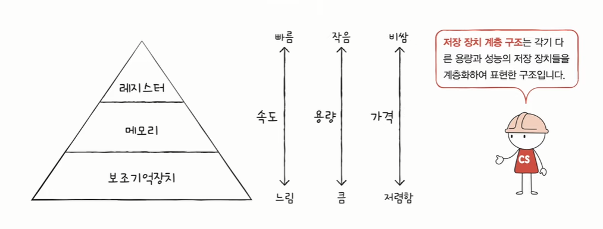

## 캐시
**✔️캐시**
- 데이터를 미리 복사해 놓는 **임시 저장소**이자 빠른 장치와 느린 장치에서 속도 차이에 따른 병목 현상을 줄이기 위한 메모리
- 결국 `모든 계층이 캐시 역할을 하는 것`
- 참고) 캐시 파일
    - 인터넷 웹 브라우저에는 캐시 파일이라는 개념이 있는데 캐시 파일은 웹 페이지 상의 이미지 등을 하드디스크에 미리 저장해두고, 다음 번에도 해당 웹 페이지에 접근할 때 해당 사이트에 이미지를 다시 요청하는 게 아니라 하드디스크에서 이미지를 불러들여 로딩 속도를 높이는 역할을 한다.
    - 즉 캐시 파일은 비교적 속도가 빠른 하드디스크와 상대적으로 느린 웹 페이지 가운데서의 병목을 줄이는 역할을 한다.
  
**✔️캐싱**
- 캐시에 데이터를 저장해 두는 것 

**✔️캐싱 계층**
- 속도 차이를 해결하기 위해 계층과 계층 사이에 있는 계층
    - ex) 캐시 메모리와 보조기억장치 사이에 있는 주기억장치는 보조기억장치의 캐싱 계층

## 캐시 메모리
- CPU와 메모리 사이에 위치한,
- 레지스터보다 용량이 크고 메모리보다 빠른 SRAM 기반의 저장 장치
- CPU의 연산 속도와 메모리 접근 속도의 차이를 조금이나마 줄이기 위해 탄생
- "CPU가 매번 메모리에 왔다 갔다 하는 건 시간이 오래 걸리니, 메모리에서 CPU가 사용할 일부 데이터를 미리 캐시 메모리로 가지고 와서 쓰자"
  
- 메모리 > 물건은 많지만 집과는 멀리 떨어져 있어 왕복이 오래 걸리는 대형 마트
- 캐시 메모리 > 물건은 적지만 집과는 가까이 있는 편의점
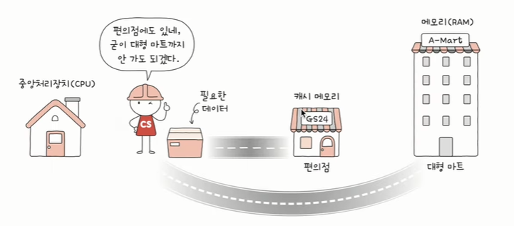

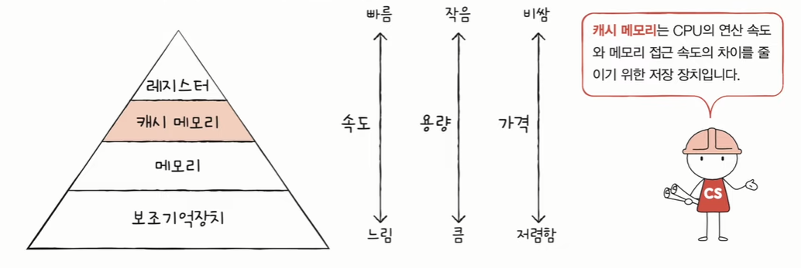

- 캐시 메모리는 하나가 아니다. 
- 계층적으로 구성 > **계층적 캐시 메모리 (L1-L2-L3 캐시)**
- 일반적으로, L1과 L2 캐시 메모리는 CPU 내부에, L3는 외부에 위치
- L1 캐시는 레지스터보다는 용량이 크지만 L2 캐시보다는 작다.
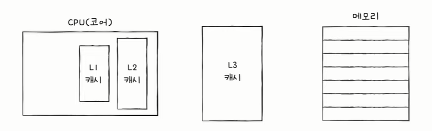
- 참고) 멀티코어 프로세서의 캐시 메모리
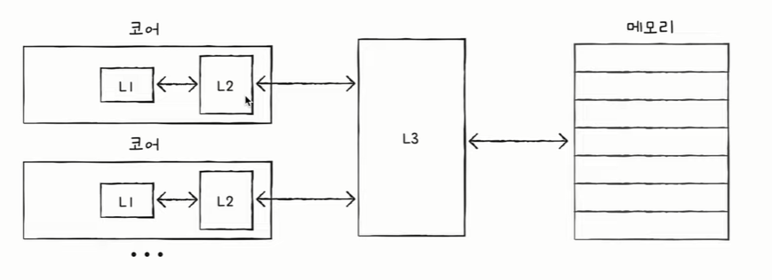
- 참고) 분리형 캐시
L1캐시는 캐시 메모리 중 가장 빠르다. L1 캐시를 조금이라도 더 빠르게 만들기 위해 나누기도 한다.
    - 명령어만 담은 L1 캐시 > L1I
    - 데이터만 담은 L1 캐시 > L1D

- 계층적 캐시 메모리까지 반영한 저장 장치 계층 구조
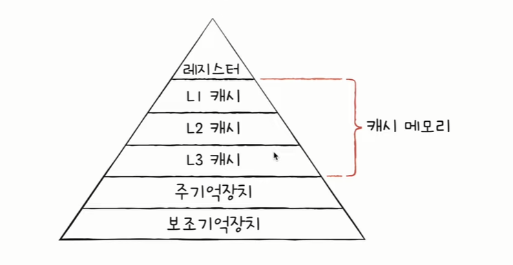

## 참조 지역성의 원리 (Locality of Reference)
- 캐시 메모리는 메모리보다 용량이 작다.
- 당연하게도 메모리의 모든 내용을 저장할 수 없다.
- 그렇다면 뭘 저장해야 할까?
- CPU가 자주 사용할 법한 내용을 예측하여 저장해야 한다.
- 예측이 들어맞은 경우 (CPU가 캐시 메모리에 저장된 값을 활용할 경우) = **캐시 히트**

- 예측이 틀렸을 경우 (CPU가 메모리에 접근해야 하는 경우) = **캐시 미스**
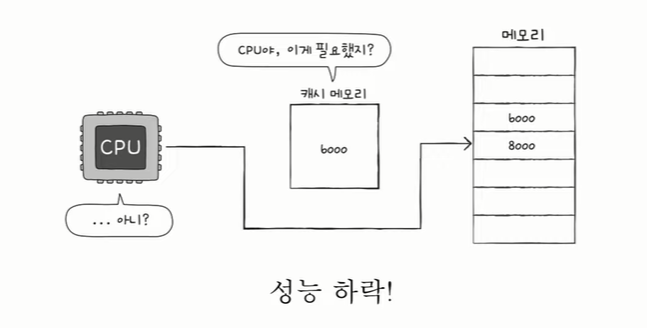

**✔️캐시 적중률**
- 캐시 히트 횟수 / (캐시 히트 횟수 + 캐시 미스 횟수)
- 요즘 CPU의 캐시 적중률은 8-90%
- 캐시 적중률을 높여야 한다! == CPU가 사용할 법한 데이터를 잘 예측해야 한다!

- CPU가 사용할 법한 데이터를 예측하는 방법 = 참조 지역성의 원리

- 2가지 경향성을 바탕으로 만들어진 원리
    1. CPU는 최근에 접근했던 메모리 공간에 다시 접근하려는 경향이 있다. (시간 지역성)
    2. CPU는 접근한 메모리 공간 근처를 접근하려는 경향이 있다. (공간 지역성)
        - CPU가 실행하려는 프로그램은 관련 데이터가 모여 있는 경우가 많다.
   

**✔️캐시 매핑**
- 캐시가 히트되기 위해 매핑하는 방법
- CPU의 레지스터와 주 메모리(RAM) 간에 데이터를 주고받을 때를 기반으로 설명

## 메모리의 주소 공간
- 메모리 내에 주소 체계는 크게 2가지가 있다. > 논리 주소 & 물리 주소
- CPU와 실행 중인 프로그램은 현재 메모리 몇 번지에 무엇이 저장되어 있는지 다 알고 있을까요?
- NO! 메모리에 저장된 값들은 시시각각 변하기 때문
    - 새롭게 실행되는 프로그램은 새롭게 메모리에 적재
    - 실행이 끝난 프로그램은 메모리에서 삭제
    - 같은 프로그램을 실행하더라도 실행할 때마다 적재되는 주소는 달라짐
- 이러한 점을 극복하기 위해 주소 체계를 물리 주소와 논리로 주소를 나누었다.

**✔️물리 주소**
- 메모리 입장에서 바라본 주소
- 말 그대로 정보가 실제로 저장된 하드웨어상의 주소
- 0번지는 하나 뿐 (겹치는 주소 번지가 없음)

**✔️논리 주소**
- CPU와 실행 중인 프로그램 입장에서 바라본 주소
- 실행 중인 프로그램 각각에게 부여된 0번지부터 시작하는 주소
- 각각의 프로그램이 0번지에서 시작

- 논리 주소는 얼마든지 같은 주소가 있을 수 있고, 물리 주소는 겹치는 주소 없다.
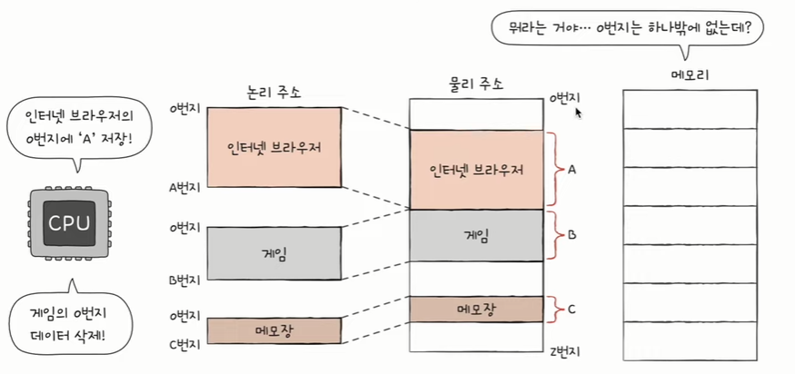
- 따라서 CPU가 메모리와 상호 작용하려면 결국에는 논리 주소를 물리 주소로 변환해야 한다.

### ️물리 주소와 논리 주소의 변환
- CPU와 메모리 사이에 있는 **MMU(메모리 관리 장치)**라는 하드웨어에 의해 변환된다.
- CPU가 이해하고 실행하는 주소는 모두 논리주소이다.
- 주소 버스를 통해 CPU와 메모리가 교통할 때는 무조건 MMU를 거친다.
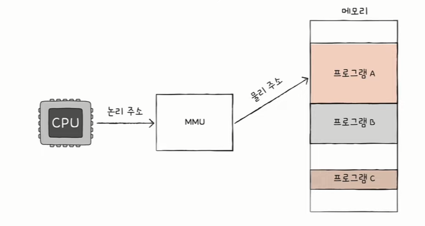
- MMU는 논리 주소와 **베이스 레지스터** 값을 더하여 논리 주소를 물리 주소로 변환한다.
- 베이스 레지스터에는 프로그램의 시작 주소가 담긴다.
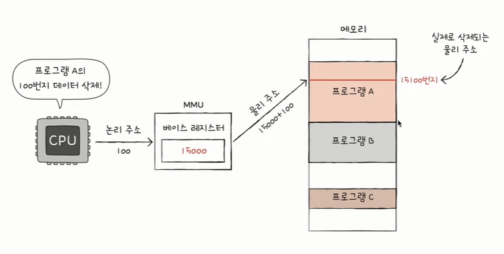
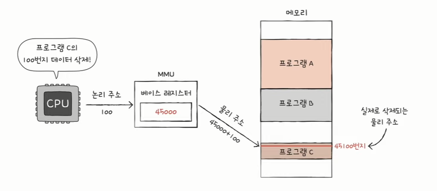

**✔️베이스 레지스터**
- 프로그램의 가장 작은 물리 주소(프로그램의 첫 물리 주소)를 저장하는 셈
논리 주소
- 프로그램의 시작점으로부터 떨어진 거리인 셈

## 메모리 보호
**✔️한계 레지스터**
- 프로그램의 영역을 침범할 수 잇는 명령어의 실행을 막음
- 베이스 레지스터가 실행 중인 프로그램의 가장 작은 물리 주소를 저장한다면,
- 한계 레지스터는 논리 주소의 최대 크기를 저장한다.
- 베이스 레지스터 값 < = 프로그램의 물리 주소 범위 < 베이스 레지스터 + 한계 레지스터 값
- CPU는 메모리에 접근하기 전 접근하고자 하는 논리 주소가 한계 레지스터보다 작은지를 항상 검사한다.
- 실행 중인 프로그램의 독립적인 실행 공간을 확보 & 하나의 프로그램이 다른 프로그램을 침범하지 못하게 보호

## 가상 메모리
**✔️가상 메모리**
- 메모리가 실제 메모리보다 많아 보이게 하는 기술
- 어떤 프로세스가 실행될 때 메모리에 해당 프로세스 전체가 올라가지 않더라도 실행이 가능하다는 점에 착안하여 고안되었다.
- 프로그램이 실행될 때, 실행에 필요한 일부분만 메모리에 올라가며 프로그램의 나머지는 디스크에 남게 됨.
- 즉, 디스크가 RAM의 보조 기억장치(backing store)처럼 작동하는 것임. 
- 결국 빠르고 작은 기억장치(RAM)을 크고 느린 기억장치(디스크)와 병합하여, 하나의 크고 빠른 기억장치(가상 메모리)처럼 동작하게 하는 것이다.

- 가상 메모리를 구현하기 위해서 MMU가 사용된다.
- MMU는 가상 주소를 물리 주소로 변환하고, 메모리를 보호하는 기능을 수행한다.
- 그러나 메모리를 일일이 가상 주소에서 물리 주소로 번역하게 되면 작업 부하가 너무 높아지므로
- MMU는 RAM을 여러 부분(페이지, pages)로 나누어 각 페이지를 하나의 독립된 항목으로 처리한다.
- 페이지 및 주소 번역 정보를 기억하는 작업이 가상 메모리를 구현하는 데 있어 결정적인 절차이다.

**✔️요구 페이징**
- 요구 페이징은 CPU가 요청할 때 프로세스의 데이터를 메모리에 올리는 것을 의미한다.
- 즉, 처음부터 모든 데이터를 메모리로 적재하지는 않는다.

**✔️페이지 폴트(page faults)**
- 어떤 페이지에 접근하려고 했을 때 해당 페이지가 실제 물리 메모리에 부재할 때 뜨는 **인터럽트**
- 페이지 폴트가 발생하면 운영체제가 이를 해결한 뒤 다시 동일한 명령을 수행하는 식으로 동작한다.
- 페이지 폴트란, 어떤 프로그램이 자신의 주소 공간(가상 메모리 공간)에는 존재하지만 시스템의 RAM에는 현재 존재하지 않는 데이터·코드에 접근을 시도할 경우 발생하는 현상을 의미한다.
- 페이지 폴트가 발생하면 운영체제는 그 데이터를 메모리로 가져와서, 마치 페이지 폴트가 전혀 발생하지 않은 것처럼 프로그램이 계속적으로 작동하게 한다.
- 이러한 페이지 폴트가 자주 일어날수록 운영체제의 성능이 많이 저하되기 때문에 페이지 폴트가 일어나지 않도록 하는 것이 중요하다.
- 페이지 폴트를 최소화하기 위한 방법으로는 페이지 교체 정책(page replacement policy)이 있다.
- 메모리가 꽉 차있을 때 기존 페이지 중 하나를 물리 메모리에서 저장 매체로 내리고,
- 새로운 페이지를 방금 비워진 해당 물리 메모리 공간에 올린다.
- 이때 기존 페이지 중 어떤 것을 내리면 좋을지에 대한 알고리즘을 짠 것이 바로 **페이지 교체 알고리즘**

**✔️TLB(Translation Lookaside Buffer, 페이지 정보 캐시)**
- 가상 메모리 주소를 물리적 주소로 변환하는 속도를 높이기 위해 사용하는 캐시
- 최근에 일어난 가상 메모리와 물리 주소의 변환 테이블을 저장해 둔다.
- CPU가 가상 주소를 가지고 메모리에 접근하려고 할 때 우선은 TLB에 접근하여 가상 주소에 해당되는 물리 주소를 찾고,
- `만약 TLB에 매핑이 존재하지 않는다면 MMU가 페이지 테이블에서 해당되는 물리 주소로 변환한 후 메모리에 접근하게 된다.`
- TLB는 **MMU에 포함되어 있는 작은 캐시**로, 일종의 주소 변환 캐시라고 할 수 있음.
- TLB 사용 이점: 물리주소를 갖고 있으면 메모리(RAM)에 두 번 들릴 필요없이, 바로 해당 물리주소(in 메모리)를 찾아갈 수 있음.
-----
**이미지 출처 및 참고 내용**

1. [컴퓨터 공학 기초 강의] 16강. 메모리의 주소 공간-물리 주소와 논리 주소
<https://www.youtube.com/watch?v=_mQNCRA1fVA&list=PLVsNizTWUw7FCS83JhC1vflK8OcLRG0Hl&index=18>

2. [컴퓨터 공학 기초 강의] 17강. 캐시 메모리
<https://www.youtube.com/watch?v=qLCP0PwRp_w&list=PLVsNizTWUw7FCS83JhC1vflK8OcLRG0Hl&index=19>

3. <https://ahnanne.tistory.com/15>

