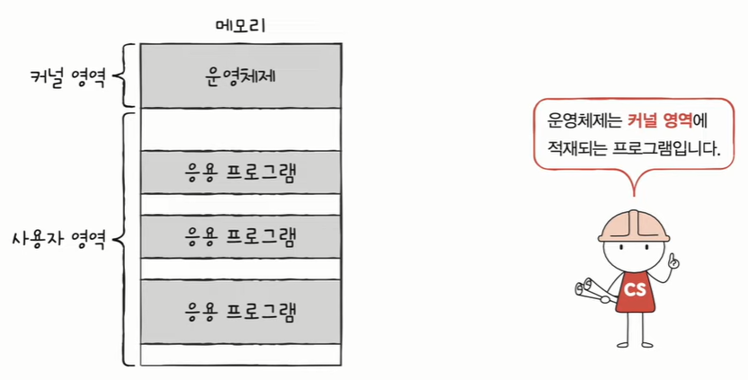
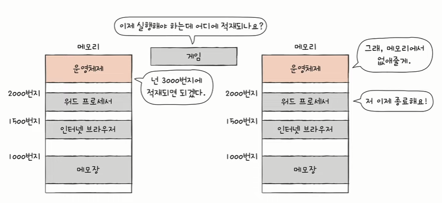
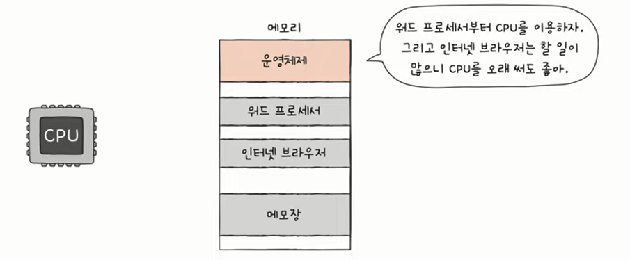
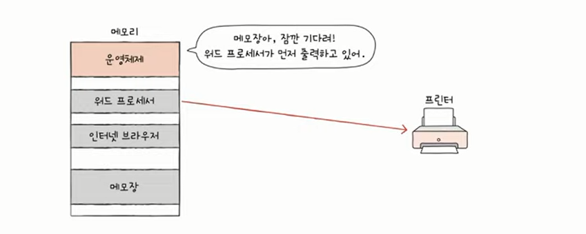
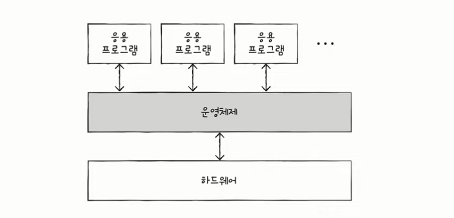
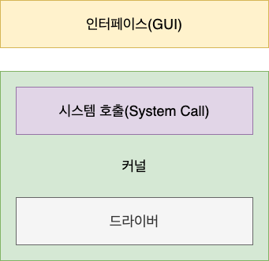
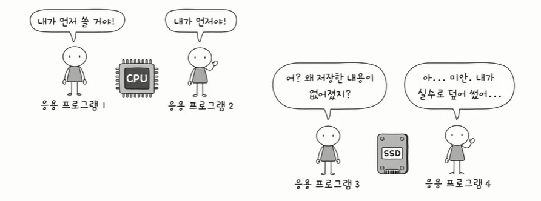
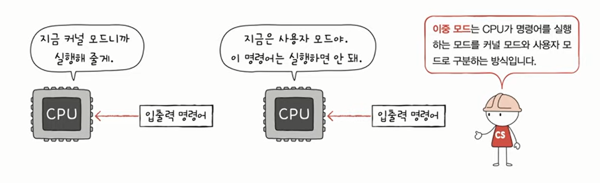
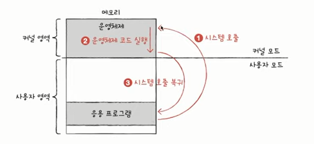
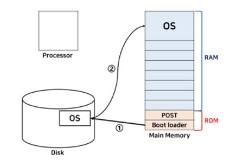

# 운영체제

- 윈도우, 맥OS, 리눅스, 안드로이드, IOS 등
- 컴퓨터 부품은 전기만 공급하면 마법처럼 동작하는 것이 아니다.
- 운영체제라는, 컴퓨터의 가장 근원적인 프로그램을 통해 동작한다.
- 모든 프로그램은 실행을 위해 자원(resource)을 필요로 한다. 
    - 자원/시스템 자원: 프로그램 실행에 있어 마땅히 필요한 요소 (컴퓨터의 4가지 핵심 부품 포함). 하드웨어만을 자원이라고 말하지 않음

### ✅운영체제란?
- 실행할 프로그램에 필요한 자원을 할당하고
- 프로그램이 올바르게 실행되도록 돕는
- **특별한 프로그램** 이다.

- 운영체제도 프로그램이기 때문에 메모리에 저장되어야 실행이 된다.
- 그러나 너무 특별한 프로그램이기 때문에 메모에 따로 적재되는 영역이 정해져 있으며, 그 영역을 **커널 영역**이라고 한다.
- 우리가 사용하는 응용 프로그램은 **사용자 영역**에 적재된다.
- 프로그램이 적재될 수 있는 메모리 영역은 커널 영역과 사용자 영역으로 나뉜다.
- 참고) 응용 프로그램(Application software): 사용자가 특정 목적을 위해 사용하는 일반적인 프로그램

### ✅운영체제의 역할
**01 메모리 관리**

- 프로그램이 실행될 때 메모리의 어느 부분에 적재할지 정한다.
- 프로그램이 종료되면 메모리에서 삭제한다.

**02 CPU 관리**
- 사용자는 여러개 프로그램 동시 실행한다.
- 사실은 말이 동시지 빠르게 번갈아 가면서 실행되는 것이다.
- 동시 실행의 환경에서 운영체제가 실행 우선순위, 실행 시간을 결정한다.

**03 입출력 장치 관리**
- ex) 워드에서 프린터 쓰고 있으면 메모장이 프린터 못 쓰게 관리
- ex) 보조기억장치의 정보 덩어리를 파일과 폴더로 묶어서 관리

**✔️운영체제의 역할 요약**

- 사용자가 실행하는 응용프로그램과 하드웨어 사이에 위치하여 그 사이를 연결하는 프로그램이다.
- 하드웨어와 가까운 곳에 위치하여 응용 프로그램을 돕는다.

- 정부와 비슷한 역할을 한다.
    - 정부는
        - 다양한 자원을 관리하고 국민들을 위해 자원을 효율적으로 배분하는 역할을 한다.
        - 나라의 여러 문제를 해결한다.
        - 관리하는 자원 별로 부서가 있다.
    - 운영체제도
        - 컴퓨터의 프로그램에게 자원을 배분한다.
        - 실행에 문제가 없도록 관리해 준다.
        - 운영체제 내부에도 관리하는 부분 별로 묶여 있는 경우가 많다.

**✔️운영체제 없다면?**

생각만 해도 끔찍하다!

운영체제 없이 프로그램을 개발하려면,,

1과 2를 더한 결과를 모니터네 출력해라 라는 명령을 수행하기 위해
- 프로그램을 메모리에 적재하는 코드
- CPU로 하여금 1과 2를 더하게 하는 코드
- 모니터에 계산 결과를 출력하는 코드
이 모든 코드를 작성해야 한다.

** printf 와 같은 함수도 운영체제의 특정 코드를 실행하라 라고 정의 되어 있음

- 운영체제 덕분에 개발자는 하드웨어에 접근하는 코드를 직접 작성할 필요가 없다.
- 우리는 운영체제한테 부탁하는 코드, 운영체제의 코드를 실행하는 코드를 작성하는 것이다.

**✔️운영체제한테 부탁하면 되는데 왜 개발자는 운영체제를 알아야 하는가?**

- 운영체제는 사용자를 위한 프로그램이 아니라 프로그램을 위한 프로그램이다.
- 그러므로 프로그램을 만드는 개발자는 운영체제를 알아야 한다.
- 우리가 만드는 프로그램은 운영체제의 도움을 받으며 만들어 지기 때문이다.
- 컴퓨터 부품은 하드웨어이므로 대화할 수 없지만 운영체제는 프로그램이기 때문에 대화할 수 있다.
- 운영체제를 깊이 이해하게 되면 오류 메세지에 대한 깊은 이해가 생겨 문제 해결 능력이 좋아진다.

------
## 운영체제의 구조
- 운영체제는 **커널**과 **인터페이스**로 이루어져 있다.
- 운영체제 구조

### ✅인터페이스
- 사용자의 명령을 전달하고 실행 결과를 사용자에게 알려주는 역할을 한다.
- 유저 인터페이스: 사용자와 상호작용하는 통로
- 종류: GUI, CLI
- 사용자와 컴퓨터 간의 통로일 뿐 운영체제의 핵심 기능(커널)은 아님

- **커널** : 프로세스 관리, 메모리 관리, 저장장치 관리와 같은 운영체제의 핵심적인 기능을 모아놓은 것으로 운영체제의 성능을 좌우한다.

### ✅커널
- 운영체제의 심장
- 운영체제의 핵심 기능을 담당한다.
- 운영체제는 다양하지만 커널은 비슷하다.
  

**✔️사용자가 실행하는 프로그램은 자원에 직접 접근할 수 있을까?**

NO! 자원에 직접 접근은 위험하다.

- 한 프로그램이 CPU 쓰고 있는데 다른 프로그램 쓰려고 하면 충돌할 수 있다.
- 저장 내용 덮어 써버릴 수도 있다.
- 따라서 일반적으로 응용프로그램은 자원에 직접 접근이 불가하다.
- 운영체제는 응용 프로그램들이 자원에 접근하려 할 때 오직 자신을 통해서만 접근하도록 하여 자원을 보호한다.
- 응용프로그램이 자원에 접근하려면 응용프로그램은 `운영체제에 도움을 요청(=운영체제의 코드를 실행)`해야 한다.
- 일종의 문지기 역할을 하는 것이다.
  
- 이 문지기 역할은 이중모드로써 구현이 된다.

**✔️이중모드**
- CPU가 명령어를 실행하는 모드를 크게 **사용자 모드**와 **커널 모드**로 구분하는 방식
- **사용자 모드**
    - 운영체제 서비스를 제공받을 수 **없는** 실행 모드
    - 커널 영역의 코드를 실행할 수 없는 실행 모드
    - 자원 접근 불가
- **커널 모드**
    - 운영체제의 서비스를 제공받을 수 **있는** 실행 모드
    - 자원 접근을 비롯한 모든 명령어 실행 가능

- CPU의 플래그 레지스터 안의 슈퍼바이저 플래그는 사용자 모드인지 커널모트인지 나타낸다.
- 입출력 명령어가 들어오면 > 슈퍼바이저 플래그 확인 > 커널 모드면 실행해 주고, 사용자 모드면 실행하지 않음
  

### 🔷 시스템 호출과 디바이스 드라이버
- 커널 내부에 있는 **시스템 호출**과 **드라이버**

**✔️시스템 호출(System Call)**
- 커널이 자신을 보호하기 위해 만든 인터페이스
- 사용자나 프로그램이 직접 컴퓨터 자원에 직접 접근하는 것을 막는다.
- 그러므로 사용자나 응용 프로그램이 컴퓨터 자원을 사용하기 위해서는 시스템 호출을 사용해야 한다.
- 운영체제 서비스를 제공받기 위해 **커널 모드로 전환하는 방법**
- 일종의 소프트웨어 인터럽트
  
- 시스템 호출은 운영체제마다 이미 정해져 있다.
- 보통은 함수의 형태로  제공 (Ex. printf(), write())
    - printf()도 내부적으로 시스템 호출을 통해 실행된다.
  

**- 시스템 호출 = 운영체제에게 부탁을 하는 것.**
  
  

**✔️드라이버(Driver)**
- 커널과 하드웨어의 인터페이스를 담당한다.
- 컴퓨터 하드웨어의 종류는 다양하다.
- 이때 운영체제가 각 하드웨어에 맞는 인터페이스를 개발하기는 어려우므로  하드웨어 제작자가 만든 소프트웨어를 받아서 설치하여 하드웨어를 사용할 수 있게 한다.
- 이 소프트웨어가 **디바이스 드라이버**

-----
- 모든 응용 프로그램은 운영체제의 도움을 받는다.
- 운영체제는 현존하는 프로그램 중 규모가 가장 큰 프로그램 중 하나이다.
- 또 다양한 종류의 운영체제가 있다. 스마트폰에서 사용되는 운영체제, 서버에서, 데스크탑에서 사용되는 운영체제
- 그렇기에 운영체제가 제공하는 기능은 종류가 다양하다.
- 같은 스마트폰이어도 안드로이드와 IOS는 다르다.
- 그러나 가장 핵심적인, 공통적인 서비스는 존재한다.
- 아이폰과 안드로이드는 다르지만 가장 핵심적인 기능(전화, 문자, 와이파이 등)은 동일하게 제공한다.
- 컴퓨터 자원에 접근하고 조작하는 기능, 프로그램이 올바르고 안전하게 실행되게 하는 기능 등
- 이러한 운영체제의 핵심 서비스를 담당하는 부분을 커널이라고 한다.

### ✅운영체제의 핵심 서비스 
**01 프로세스 관리**
- 프로세스 == 실행 중이 프로그램
- 수많은 프로세스들이 동시에 실행됨
- 내부적으로는 아주 빠르게 번갈아 가며 실행되는 것
- 프로세스가 실행이 되어도 문제 없이 실행되도록 관리해야 함
- 프로세스도 다양하고 프로세스마다 상황도 다양
- **동시다발적으로 생성/실행/삭제되는 다양한 프로세스를 일목요연하게 관리**
    - 프로세스와 스레드, 프로세스 동기화, 교착상태 해결 등

**02 자원 접근 및 할당**
1. 운영체제의 **CPU** 접근 및 할당
    - CPU 스케줄링 : 어떤 프로세스를 먼저, 얼마나 오래 실행할지 결정

2. 운영체제의 **메모리** 접근 및 할당
    - 페이징, 스와핑 등 
    - 새로운 프로세스를 적재할 때 어디에 적재할 것인지
    - 수많은 프로세스를 모두 메모리에 적재할 것인지
    - 적재할 프로세스가 메모리보다 큰 경우는 어떻게 할 것인지 고민

3. 운영체제의 **입출력장치** 접근 및 할당
    - 응용프로그램이 입출력장치에 접근하고자 할 때 **인터럽트 서비스 루틴**을 제공하여 응용프로그램이 접근할 수 있도록 함

**03 파일 시스템 관리**
- 파일과 폴더 또한 운영체제가 제공하는 기능이다.
- 보조기억장치에 있는 정보 덩어리를 파일이라고 하는 단위로 묶어서 저장장치에 보관
- 파일들을 묶어 폴더(디렉토리) 단위로 저장 장치에 보관
- 보조기억장치에 어떻게 파일과 폴더로 저장되고 관리되는지

------
**✔️컴퓨터가 처음에 켜지면?**
- 컴퓨터가 켜지자마자 메인보드에 내장된 부품인 ROM을 자동으로 읽어서 해야 할 일들을 하나씩 수행한다.
- 그래서 가장 먼저 ROM에 기본으로 설치되어 있는 BIOS를 읽어들인다.
    - BIOS : 운영체제 중 가장 기본적인 소프트웨어이자 컴퓨터의 입출력을 처리하는 펌웨어로 메인보드에 필수로 내장되어 있다.
    - 펌웨어(펌 소프트웨어): 변경할 필요가 없는 소프트웨어를 ROM에 내장하여 하드웨어를 제어하는 프로그램

- BIOS는 부팅 과정 중 컴퓨터에 연결된 키보드, 램, 디스크 드라이브 등의 하드웨어가 올바로 작동하는지 각종 테스트나 초기화를 하는 POST(Power On Self Test)를 진행한다.
- BIOS는 POST를 성공적으로 마치면 `하드디스크에 저장된 운영체제를 메인 메모리에 적재`하는 **Boot Loader**를 실행시킨다.
- CPU가 곧바로 읽어들여야 하기 때문에 Boot Loader는 처음부터 Main Memory에 상주해있다.
- 부트 로더를 잘못 건드리면 OS가 실행이 되지 않기 때문에 건드리지 못하게 Memory 안에서도 ROM(Read Only Memory)라는 영역에 할당되어 있다.
- Boot Loader와 달리 운영체제는 하드디스크에 저장되어 있기 때문에 누군가가 메모리로 로드를 해줘야 한다.
- 그래서 초기에는 스토리지(HDD, SSD)에 OS 프로그램이 있다가 Boot Loader에 의해 OS(window or Linux)가 메모리에 올라가게 된다.
- 이제 메모리에 올라간 OS 프로그램을 CPU가 읽어들이면서 OS를 실행하고 부팅 과정을 마치게 된다.
>**부팅**: PC가 켜진 후에 운영체제를 메인 메모리(DRAM)에 적재하는 일련의 과정

**✔️프로그램 실행 원리**
- CPU는 프로그램(명령어의 집합)을 메인 메모리(DRAM)에서만 가져와 처리할 수 있기 때문에 프로그램을 실행하려면 반드시 프로그램이 메모리에 할당되어 있어야 한다.
- 보조기억장치에 있던 운영체제는 ROM에 있는 부트 로더가 메모리에 적재해주었지만, 다른 응용 프로그램(게임, 워드 등)들은 어떻게 메인 메모리에 적재할 수 있는 걸까?
- 바로 운영체제의 **커널**이 그 역할을 해준다.
- 커널은 `전원이 켜져 있는 동안에는 메인 메모리에 계속 상주`하면서 시스템 자원을 관리한다.
- `커널이 응용 프로그램이나 데이터를 메인 메모리에 적재하는 것`을 **로드**(Load)라고 하며 그 과정을 ****이라고 한다.
- 프로그램이 메모리에 적재되면 비로소 CPU는 메모리에 있는 프로그램 명령어들을 읽어와 실행을 한다.

-----
**이미지 출처 및 참고 내용**

1. [컴퓨터 공학 기초 강의] 24강. 운영체제의 큰 그림
<https://www.youtube.com/watch?v=R4j_hDQuBOc&list=PLVsNizTWUw7FCS83JhC1vflK8OcLRG0Hl&index=26>
2. <https://bentist.tistory.com/63>