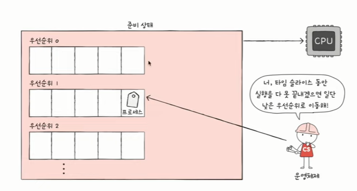
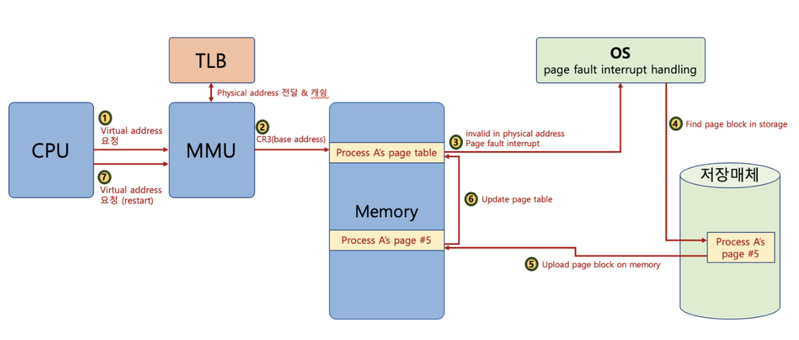
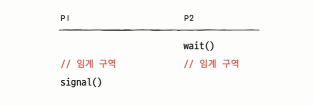
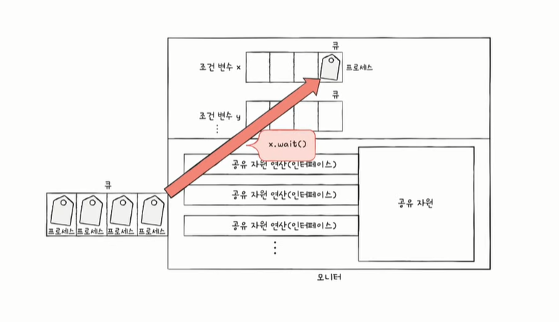
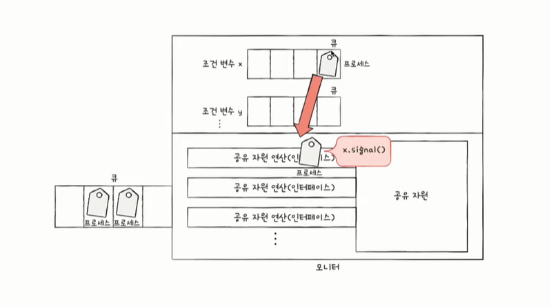
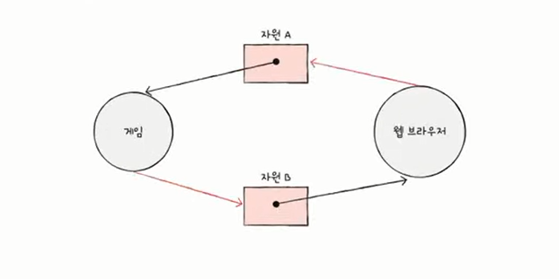
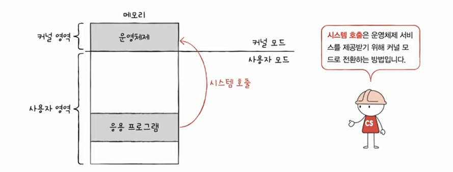
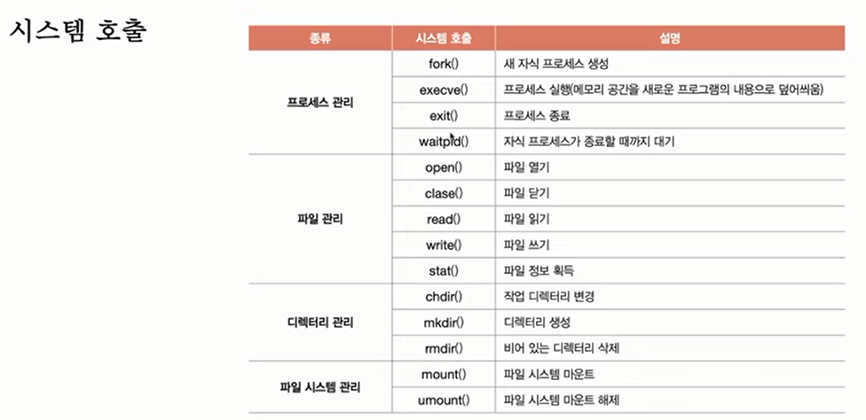
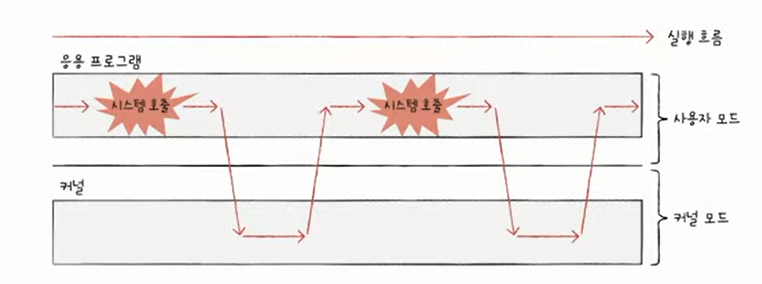
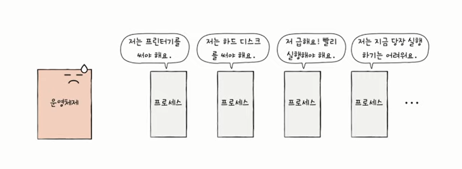

# 운영체제

- 윈도우, 맥OS, 리눅스, 안드로이드, IOS 등
- 컴퓨터 부품은 전기만 공급하면 마법처럼 동작하는 것이 아니다.
- 운영체제라는, 컴퓨터의 가장 근원적인 프로그램을 통해 동작한다.
- 모든 프로그램은 실행을 위해 자원(resource)을 필요로 한다. 
    - 자원/시스템 자원: 프로그램 실행에 있어 마땅히 필요한 요소 (컴퓨터의 4가지 핵심 부품 포함). 하드웨어만을 자원이라고 말하지 않음

### ✅운영체제란?
- 실행할 프로그램에 필요한 자원을 할당하고
- 프로그램이 올바르게 실행되도록 돕는
- **특별한 프로그램** 이다.

- 운영체제도 프로그램이기 때문에 메모리에 저장되어야 실행이 된다.
- 그러나 너무 특별한 프로그램이기 때문에 메모에 따로 적재되는 영역이 정해져 있으며, 그 영역을 **커널 영역**이라고 한다.
- 우리가 사용하는 응용 프로그램은 **사용자 영역**에 적재된다.
- 프로그램이 적재될 수 있는 메모리 영역은 커널 영역과 사용자 영역으로 나뉜다.
- 참고) 응용 프로그램(Application software): 사용자가 특정 목적을 위해 사용하는 일반적인 프로그램

### ✅운영체제의 역할
**01** 메모리 관리

- 프로그램이 실행될 때 메모리의 어느 부분에 적재할지 정한다.
- 프로그램이 종료되면 메모리에서 삭제한다.

**02** CPU 관리
- 사용자는 여러개 프로그램 동시 실행한다.
- 사실은 말이 동시지 빠르게 번갈아 가면서 실행되는 것이다.
- 동시 실행의 환경에서 운영체제가 실행 우선순위, 실행 시간을 결정한다.

**03** 입출력 장치 관리
- ex) 워드에서 프린터 쓰고 있으면 메모장이 프린터 못 쓰게 관리
- ex) 보조기억장치의 정보 덩어리를 파일과 폴더로 묶어서 관리

**✔️운영체제의 역할 요약**

- 사용자가 실행하는 응용프로그램과 하드웨어 사이에 위치하여 그 사이를 연결하는 프로그램이다.
- 하드웨어와 가까운 곳에 위치하여 응용 프로그램을 돕는다.

- 정부와 비슷한 역할을 한다.
    - 정부는
        - 다양한 자원을 관리하고 국민들을 위해 자원을 효율적으로 배분하는 역할을 한다.
        - 나라의 여러 문제를 해결한다.
        - 관리하는 자원 별로 부서가 있다.
    - 운영체제도
        - 컴퓨터의 프로그램에게 자원을 배분한다.
        - 실행에 문제가 없도록 관리해 준다.
        - 운영체제 내부에도 관리하는 부분 별로 묶여 있는 경우가 많다.

**✔️운영체제 없다면?**

생각만 해도 끔찍하다!

운영체제 없이 프로그램을 개발하려면,,

1과 2를 더한 결과를 모니터네 출력해라 라는 명령을 수행하기 위해
- 프로그램을 메모리에 적재하는 코드
- CPU로 하여금 1과 2를 더하게 하는 코드
- 모니터에 계산 결과를 출력하는 코드
이 모든 코드를 작성해야 한다.

** printf 와 같은 함수도 운영체제의 특정 코드를 실행하라 라고 정의 되어 있음

- 운영체제 덕분에 개발자는 하드웨어에 접근하는 코드를 직접 작성할 필요가 없다.
- 우리는 운영체제한테 부탁하는 코드, 운영체제의 코드를 실행하는 코드를 작성하는 것이다.

**✔️운영체제한테 부탁하면 되는데 왜 개발자는 운영체제를 알아야 하는가?**

- 운영체제는 사용자를 위한 프로그램이 아니라 프로그램을 위한 프로그램이다.
- 그러므로 프로그램을 만드는 개발자는 운영체제를 알아야 한다.
- 우리가 만드는 프로그램은 운영체제의 도움을 받으며 만들어 지기 때문이다.
- 컴퓨터 부품은 하드웨어이므로 대화할 수 없지만 운영체제는 프로그램이기 때문에 대화할 수 있다.
- 운영체제를 깊이 이해하게 되면 오류 메세지에 대한 깊은 이해가 생겨 문제 해결 능력이 좋아진다.

------
학습목표
- 커널이란?
- 운영체제의 서비스 종류?
- 시스템 콜과 이중 모드란?

모든 응용 프로그램은 운영체제의 도움을 받는다.
운영체제는 현존하는 프로그램 중 규모가 가장 큰 프로그램 중 하나이다.
또 다양한 종류의 운영체제가 있다. 스마트폰에서 사용되는 운영체제, 서버에서, 데스크탑에서 사용되는 운영체제
그렇기에 운영체제가 제공하는 기능은 종류가 다양하다.
같은 스마트폰이어도 안드로이드와 IOS는 다르다.

그러나 가장 핵심적인, 공통적인 서비스는 존재한다.

아이폰과 안드로이드는 다르지만 가장 핵심적인 기능(전화, 문자, 와이파이 등)은 동일하게 제공한다.

컴퓨터 자원에 접근하고 조작하는 기능, 프로그램이 올바르고 안전하게 실행되게 하는 기능 등

이러한 운영체제의 핵심 서비스를 담당하는 부분을 커널이라고 한다.

## 커널
- 운영체제의 심장
- 운영체제의 핵심 기능을 담당한다.
- 운영체제는 다양하지만 커널은 비슷하다.

운영체제에 속하지만 커널에 속하지 않는 기능
대표적으로 유저 인터페이스가 있다.
사용자와 상호작용하는 통로
GUI, CLI
사용자와 컴퓨터 간의 통로일 뿐 운영체제의 핵심 기능(커널)은 아님

사용자가 실행하는 프로그램은 자원에 직접 접근할 수 있을까?

NO! 자원에 직접 접근은 위험하다.

한 프로그램이 CPU 쓰고 있는데 다른 프로그램 쓰려고 하면 충돌
저장 내용 덮어 써버릴 수도

일반적으로 응용프로그램은 자원에 직접 접근이 불가하다.
운영체제는 응용 프로그램들이 자원에 접근하려 할 때 오직 자신을 통해서만 접근하도록 하여 자원을 보호

응용프로그램이 자원에 접근하려면
응용프로그램은 운영체제에 도움을 요청(=운영체제의 코드를 실행)해야 한다.

일종의 문지기

이 문지기 역할은 이중모드로써 구현이 된다.
이중모드
- CPU가 명령어를 실행하는 모드를 크게 사용자 모드와 커널 모드로 구분하는 방식
- 사용자 모드
    - 운영체제 서비스를 제공받을 수 없는 실행 모드
    - 커널 영역의 코드를 실행할 수 없는 실행 모드
    - 자원 접근 불가
- 커널 모드
    - 운영체제의 서비스를 제공받을 수 있는 실행 모드
    - 자원 접근을 비로한 모든 명령어 실행 가능
  
CPU의 플래그 레지스터 안의 슈퍼바이저 플래그는 사용자 모드인지 커널모트인지 나타낸다.

입출력 명령어가 들어오면
슈퍼바이저 플래그 확인
커널 모드면 실행해 주고
사용자 모드면 실행하지 않음

시스템 호출을 하면 커널 모드로 전환할 수 있다.
시스템 호출 > 일종의 소프트웨어 인터럽트

printf()도 내부적으로 시스템 호출을 통해 실행된다. 
시스템 호출은 운영체제마다 이미 정해져 있음

시스템 호출 = 운영체제에게 부탁을 하는 것.

### ✅운영체제의 핵심 서비스 
**01** 프로세스 관리
- 프로세스 == 실행 중이 프로그램
- 수많은 프로세스들이 동시에 실행됨
- 내부적으로는 아주 빠르게 번갈아 가며 실행되는 것
- 프로세스가 실행이되어도 문제 없이 실행되도록 관리해야 함
- 프로세스도 다양하고 프로세스마다 상황도 다양
- **동시다발적으로 생성/실행/삭제되는 다양한 프로세스를 일목요연하게 관리**
    - 프로세스와 스레드, 프로세스 동기화, 교착상태 해결 등

**02** 자원 접근 및 할당
1. 운영체제의 **CPU** 접근 및 할당
    - CPU 스케줄링 : 어떤 프로세스를 먼저, 얼마나 오래 실행할지 결정

2. 운영체제의 **메모리** 접근 및 할당
    - 페이징, 스와핑 등 
    - 새로운 프로세스를 적재할 때 어디에 적재할 것인지
    - 수많은 프로세스를 모두 메모리에 적재할 것인지
    - 적재할 프로세스가 메모리보다 큰 경우는 어떻게 할 것인지 고민

3. 운영체제의 **입출력장치** 접근 및 할당
    - 응용프로그램이 입출력장치에 접근하고자 할 때 **인터럽트 서비스 루틴**을 제공하여 응용프로그램이 접근할 수 있도록 함

**03** 파일 시스템 관리
- 파일과 폴더 또한 운영체제가 제공하는 기능이다.
- 보조기억장치에 있는 정보 덩어리를 파일이라고 하는 단위로 묶어서 저장장치에 보관
- 파일들을 묶어 폴더(디렉토리) 단위로 저장 장치에 보관
- 보조기억장치에 어떻게 파일과 폴더로 저장되고 관리되는지