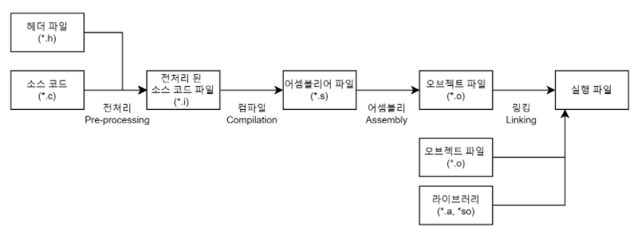
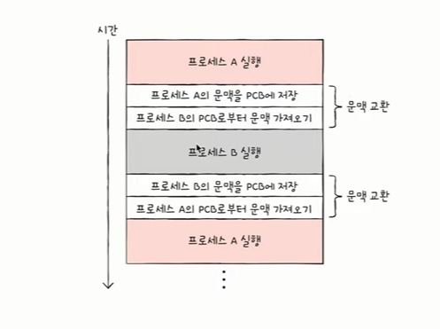
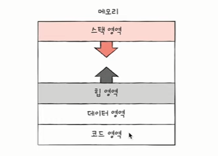
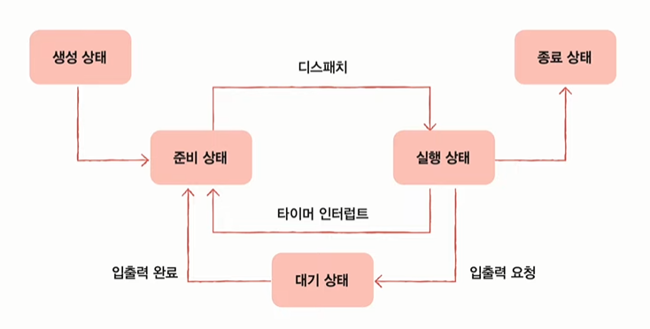
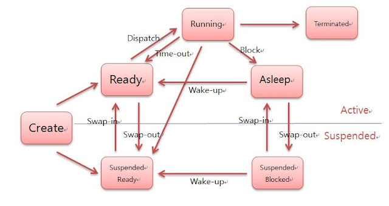
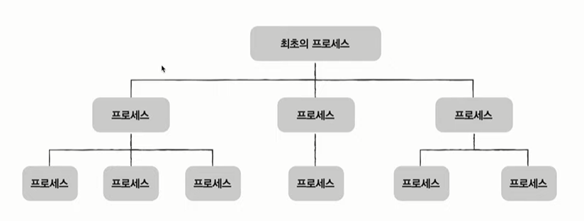
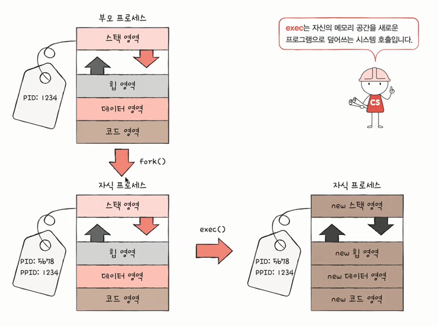
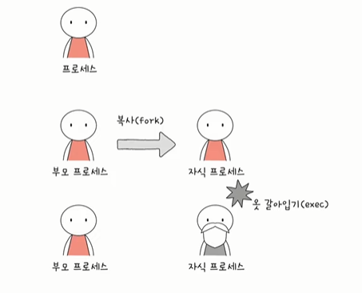

# 프로세스

## 컴파일 과정

**1. 전처리(Pre-processing) 과정**
- 전처리기(Preprocessor)를 통해 소스코드 파일(*.c)을 전처리된 파일(*.i)으로 변환하는 과정
- 본격적으로 컴파일하기 전에 처리할 작업들
- 대표적인 작업
    - 주석 제거
    - 헤더 파일 삽입
        - 외부에 선언된 다양한 소스 코드, 라이브러리 포함
        - #include 지시문을 만나면 해당하는 헤더 파일을 찾아 헤더 파일에 있는 모든 내용을 복사해서 소스코드에 삽입
        - 즉, 헤더 파일은 컴파일에 사용되지 않고 소스파일 내에 전부 복사된다.
        - 헤더 파일에 선언된 함수 원형은 후에 링킹 과정을 통해 실제로 함수가 정의되어있는 오브젝트 파일과 결합한다. 
    - 매크로 치환 및 적용:
        - #define 지시문에 정의된 매크로를 저장하고 같은 문자열을 만나면 #define된 내용으로 치환한다.
        - 즉, 매크로 이름을 찾아서 정의한 값으로 전부 바꿔준다.
    - 컴파일할 영역 명시

**2. 컴파일 과정**
- 컴파일러가 수행
- 언어의 문법 검사가 이루어짐
- 전처리된 소스파일을 기계어로 번역
- 전처리가 완료되어도 여전히 소스코드이다.
- 전처리 완료된 소스 코드를 저급언어(어셈블리어)로 변환
- 어셈블리어: 기계어와 일대일 매칭됨

**3. 어셈블 과정**
- 어셈블리어를 기계어로 변환
- 목적코드를 포함하는 목적 파일이 됨
- 다 0과 1로 이루어져 있긴 하지만 목적파일은 실행파일과 다르다.

**4. 링킹 과정**
- 각기 다른 목적 파일과 라이브러리를 하나의 실행 파일로 연결해 주는 과정
- 라이브러리: 미리 정의되어 있는 변수와 함수의 집합
- 라이브러리(사용자가 갖고 와서 쓰는 것) vs 프레임워크(사용자가 그 환경에 들어가서 쓰는 것)
- 정적 라이브러리와 동적 라이브러리
    - 정적 라이브러리
        - 프로그램 빌드 시 라이브러리가 제공하는 모든 코드를 실행 파일에 넣는 방식
        - 시스템 환경 등 외부 의존도가 낮지만 코드 중복 등 메모리 효율성이 떨어진다.
    - 동적 라이브러리
        - 프로그램 실행 시 필요할 때만 DLL이라는 함수 정보를 통해 참조하는 방식
        - 메모리 효율은 높지만 외부 의존도가 높다.

**✔️빌드**
- **빌드(Build)**
    - 소스 코드 파일을 실행할 수 있는 독립 소프트웨어 가공물로 변환하는 과정을 말하거나 그에 대한 결과물을 일컫는다.
    - 다시말해, 컴파일과 링크 두 개의 과정을 합친것을 뜻한다.
- **빌더 툴(Build tool)** : 빌드를 수행하는 도구
    - 종류 : Ant, Maven, Gradle
    - 빌드 툴이 제공하는 기능은 전처리(preprocessing), 컴파일(Compile), 패키징(packaging), 테스팅(testing), 배포(distribution) 이 있다.

## 프로세스란
- 컴퓨터에서 실행되고 있는 프로그램
- CPU스케줄링의 대상이 되는 작업(task)이라는 용어와 거의 같은 의미
- 인스턴스화: 프로그램이 메모리에 올라가면 프로세스가 되는 것
    - 예) 프로그램은 구글 크로 프로그램(chrome.exe)와 같은 실행파일 / 이를 두 번 클릭하면 구글 크롬 '프로세스'가 시작되는 것
- 이후 운영체제의 CPU 스케줄러에 따라 CPU가 프로세스를 실행한다.
- 종류
    - 포그라운드 프로세스
        - 사용자가 볼 수 있는 공간에서 실행되는 프로세스
        - 워드, 게임, 웹,,
    - 백그라운드 프로세스
        - 사용자가 볼 수 없는 공간에서 실행되는 프로세스
        - 사용자와 직접 상호작용이 가능한 프로세스
        - 사용자와 상호작용하지 않고 그저 정해진 일을 묵묵히 하는 프로세스 = 데몬, 서비스

**✔️운영체제가 이런 프로세스를 어떻게 관리하는가?**
- 모든 프로세스는 실행을 위해 CPU가 필요하다.
- 그러나 CPU의 자원은 한정되어 있다.
- 프로세스들은 돌아가면서 한정된 시간 만큼만 CPU를 이용한다.
- 자신의 차례에 정해진 시간만큼 CPU 이용
- 타이머 인터럽트(주기적으로 발생하는 하드웨어 인터럽트)가 발생하면 차례를 양보한다.

## 프로세스 제어 블록 (PCB)
- 빠르게 번갈아 수행되는 프로세스들을 관리해야 한다.
- 이를 위해 사용하는 자료구조가 프로세서 제어 블록(이하 PCB)라고 한다.
- 프로세스 관련 정보를 저장하는 자료 구조
- 마치 상품에 달린 태그와 같은 정보
- 프로세스 생성 시 **커널 영역**에 생성, 종료 시 폐기
- PCB에 담기는 대표적인 정보 (운영체제마다 차이가 있음)
    - 프로세스 ID(=PID)
        - 특정 프로세스를 식별하기 위해 부여하는 고유한 번호
    - 레지스터 값
        - 프로세스는 자신의 실행 차례까 오면 이전까지 사용한 레지스터 중간 값을 모두 복원 > 실행 재개 
        - 프로세스는 CPU가 필요하기 때문에 그 안의 레지스터를 사용한다.  
        - 타이머 인터럽트가 발생하면 중단해야 함. 지금까지의 레지스터에 저장한 정보를 알고 있어야 다음 차례가 왔을 때 이어서 일을 할 수 있음
        - 프로그램 카운터, 스택 포인터.. 등
    - 프로세스 상태
        - 입출력 장치를 사용하기 위해 기다리는 상태, CPU를 기다리는 상태, CPU를 이용 중인 상태 등
    - CPU 스케줄링 정보
        - 프로세스가 언제 어떤 순서로 CPU를 할당 받는지의 스케줄링 정보 
    - 메모리 정보
        - 프로세스가 어느 주소에 저장되어 있는지에 대한 정보
        - 페이지 테이블 정보 (메모리 주소를 알 수 있는 정보)
    - 사용한 파일과 입출력장치 정보
       - 할당된 입출력장치, 사용 중인(열린) 파일 정보
- 운영체제는 PCB를 보고 프로세스를 관리한다.

## 문맥 교환
- 한 프로세스(프로세스 A)에서 다른 프로세스(프로세스 B)로 실행 순서가 넘어가면?
- 기존에 실행되던 프로세스 A는 지금까지의 중간 정보를 백업
    - 프로그램 카운터 등 각종 정보 (레지스터, 메모리 주소 등)
    - 이러한 중간 정보 == 문맥
    - 다음 차례가 왔을 때 실행을 재개하기 위한 정보
    - "실행 문맥을 백업해두면 언제든 해당 프로세스의 실행을 재개할 수 있다."
    - 뒤이어 실행할 프로세스 B의 문맥을 복구 (자연스럽게 프로세스가 바뀜)
- 이처럼 기존의 실행 중인 프로세스 문맥을 백업하고
- 새로운 프로세스 실행을 위해 문맥을 복구하는 과정
- 여러 프로세스가 빠르게 번갈아 수행되는 원리

## 프로세스의 메모리 영역
- PCB는 커널 영역에,
- 사용자 영역에는 특정 영역에 나뉘어 저장됨
- 크게 코드 영역(텍스트 영역), 데이터 영역, 힙 영역, 스택 영역

- 코드 영역
    - 실행할 수 있는 코드, 기계어로 이루어진 **명령어** 저장
    - 데이터가 아닌 CPU가 실행할 명령어가 담기기에 쓰기가 금지된 영역 (read-only)
    - 크기가 고정된 영역  - 정적 할당 영역

- 데이터 영역
    - 잠깐 썼다가 없앨 데이터가 아닌 프로그램 실행되는 동안 유지할 데이터 저장
    - 전역 변수
    - 크기가 고정된 영역 - 정적 할당 영역

- 힙 영역
    - 실행 시 결정됨
    - 프로그래머가 직접 할당할 수 있는 저장공간
    - 언젠가는 이 영역을 반환해야 함 (요즘은 가비지 컬렉터가 알아서 반환하긴 함) feat. 메모리 누수
    - 동적으로 영역의 크기가 변함 - 동적 할당 영역

- 스택 영역
    - 컴파일 시 결정됨
    - 데이터가 일시적으로 저장되는 공간
    - (데이터 영역에 담기는 값과는 달리) 잠깐 쓰다가 말 값들이 저장되는 공간
    - 매개변수, 지역 변수
    - 동적으로 영역의 크기가 변함 - 동적 할당 영역

- 힙 영역은 일반적으로 낮 > 높 주소로 할당=
- 스택 영역은 높 > 낮 주소로 할당
- 이 둘이 동적 할당 영역이기 때문에 반대 방향으로 차 오르게 됨

## 프로세스의 상태
- PCB에 기록되는 프로세스 상태
- 실행 중, 일시 중단 됨 등
- 프로세스를 계층적으로 관리하는 경우가 많음
- 운영체제마다 상태가 조금씩 다름

- 생성 상태(create, new)
    - 디스크에 있던 프로그램이 이제 막 메모리에 적재되어 PCB를 할당 받은 상태
    - 준비가 완료되었다면 준비 상태로
- 준비 상태(책에서는 대기)(ready)
    - 당장이라도 CPU를 할당 받아 실행할 수 있지만
    - 자신의 차례가 아니기에 기다리는 상태
    - 자신의 차례가 된다면 실행 상태로 (=디스패치)
- 실행 상태(running)
    - CPU를 할당 받아 실행 중인 상태
    - 할당된 시간 모두 사용 시(타이머 인터럽트 발생 시) 준비 상태로
    - 실행 도중 입출력장치를 사용하면 입출력 작업이 끝날 때까지 대기 상태로(입출력 끝나서 인터럽트 올 때까지)
- 대기 상태(책에서는 중단)
    - 프로세스가 실행 도중 입출력장치를 사용하는 경우
    - 입출력 작업은 CPU에 비해 느리기에 이 경우 대기 상태로 접어듬
    - 입출력 작업이 끝나면(입출력 완료 인터럽트를 받으면) 준비 상태로
- 종료 상태(terminated)
    - 프로세스가 종료된 상태
    - PCB, 프로세스의 메모리 영역 정리

## 프로세스 계층 구조
- 프로세스 실행 도중(시스템 호출을 통해) 다른 프로세스 생성 가능
- 새 프로세스를 생성한 프로세스: 부모 프로세스
- 부모 프로세스에 의해 생성된 프로세스: 자식 프로세스

- 부모 프로세스와 자식 프로세스는 별개의 프로세스이므로 각기 다른 PID를 가짐 (같은 프로그램을 2번 실행했을지라도)
- 일부 운영체제는 자식 PCB에 부모 프로세스의 PID를 저장하기도 함

- 자식 프로세스는 또 다른 자식 프로세스를 낳을 수 있음 > 계층 구조

- 데몬 프로세스도 최초 프로세스의 자식 프로세스임

### 프로세스 생성 기법 (윈도우는 해당 x)
- 부모 프로세스는 자식 프로세스를 어떻게 만들어 내고, 자식 프로세스는 어떻게 자신만의 코드를 실행할까?
> 복제와 옷 갈아입기의 과정을 거침

- 부모 프로세스는 fork라는 시스템 호출을 통해 자신의 복사본을 자식 프로세스로 생성 > 복제
- 자식 프로세스는 exec라는 시스템 호출을 통해 자신의 메모리 공간을 다른 프로그램으로 교체> 옷 갈아입기

1. fork()
- 복사본이 자식 프로세스로서 생성됨
- 부모 프로세스의 자원 상속
- PID와 메모리 주소는 다름
엄연히 다른 프로세스이므로

2. exec()
- 자식 프로세스가 exec라는 시스템 호출
- 내 메모리 공간을 새로운 프로그램으로 덮어쓰기
- 코드/데이터 영역은 실행할 프로그램 내용으로 바뀌고 나머지 영역은 초기화

- 자식 프로세스와 부모 프로세스의 내용이 달라짐

계층 구조가 만들어지는 과정 > fork 호출과 exec 호출의 반복

- exec 호출을 안 할 수도. 그건 동일 프로그램이 병행 실행됨

