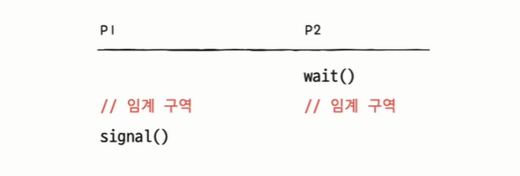

## 동기화

- 동시다발적으로 실행되는 프로세스들은 서로 협력하며 영향을 주고 받는다.
- 이 과정에서 자원의 일관성을 보장하기 위해 프로세스/스레드의 동기화를 고려해야 한다.
- 참고) 프로세스 동기화라고 하지만 스레드도 동기화 대상임

**✔ ️프로세스 동기화란?** 
- 프로세스들의 수행 시기를 맞추는 것
    - 실행 순서 제어: 프로세스를 올바른 순서대로 실행하기
    - 상호 배제: 동시에 접근해서는 안 되는 자원에 하나의 프로세스만 접근하게 하기

**✔ ️공유 자원**
- 여러 프로세스가 공동으로 이용하는 변수, 메모리, 파일 등

**✔ ️임계 영역**
- **공유 자원에 접근하는 프로세스 내부의 코드 영역**
- 한 프로세스가 이 영역을 수행 중일 때 다른 프로세스가 같은 영역을 수행한다면 문제가 발생할 수 있다.
- 따라서 문제가 발생하지 않도록 한번에 하나의 프로세스만 이용하게끔 보장해야 하는 영역이다.

### 임계구역 해결 조건
- 임계 구역 문제를 해결하는 3가지 조건
1. 상호 배제: 한 프로세스가 임계 영역에 들어가면 다른 프로세스는 들어갈 수 없다.
2. 한정 대기: 어떤 프로세스도 무한 대기하지 않아야 한다.
3. 진행의 융통성: 한 프로세스가 다른 프로세스의 진행을 막아서는 안된다.

### 동기화 기법
대표적인 방법: 뮤텍스 락, 세마포어, 모니터

1. 뮤텍스 락 > **상호배제를 위한 동기화 도구**
- 공유 자원이 하나인 경우
- 자물쇠의 기능을 함 
- 전역 변수 하나, 함수 두 개로 구현 가능 (아래는 예시)
    - 자물쇠 역할: 프로세스가 공유하는 전역 변수 lock (true: 잠김, false: 열림)
    - 임계 구역을 잠그는 역할: acquire 함수 (lock이 false일 때까지 기다리다가 false되면 lock=true로 바꾸고 임계 영역 진입)
    - 임계 구역 잠금 해제하는 역할: release 함수(lock=false로)
- acquire 함수
    - 프로세스가 임계 영역 진입하기 전 호출
    - 임계 영역 잠겨 있다면 열릴 때까지 임계 영역 반복적으로 확인 > busy waiting (바쁜 대기)
    - 임계 영역 열려 있다면 임계 영역 잠그기
  
- release 함수
    - 임계 영역 작업 끝나고 호출
    - 현재 잠긴 잉계 영역 열기

- **다른 프로세스 간 동기화**에 사용된다.
- 임계 영역에 하나의 스레드만 접근 가능
- 한 프로세스에 의해 소유될 수 있는 Key를 기반으로 한 상호배제 기법이고 Key에 해당하는 어떤 객체(Object)가 있으며, 이 객체를 소유한 스레드/프로세스만이 공유자원에 접근할 수 있다.
- 프로세스나 스레드가 공유 자원을 lock()을 통해 잠금 설정하고 사용한 후에는 unlock()을 통해 잠금 해제하는 객체
- 잠금이 설정되면 다른 프로세스나 스레드는 잠긴 코드 영역에 접근할 수 없고 해제는 그 반대이다.
- 뮤텍스는 `잠금` 또는 `잠금 해제`라는 상태만을 갖는다.
- 뮤텍스 알고리즘
    1) 데커(Dekker) 알고리즘 : flag(어떤 프로세스가 진입할 것인지 나타냄)와 turn(누가 들어갈 차례인지 나타냄) 변수를 통해 임계 구역에 들어갈 프로세스/스레드를 결정하는 방식
    2) 피터슨(Peterson) 알고리즘 : 데커와 유사하지만 상대방 프로세스/스레드에게 진입 기회를 양보하는 것에 차이가 있다.
    3) 제과점(Bakery) 알고리즘 : 가장 작은 수의 번호표를 가지고 있는 프로세스가 임계 영역에 들어간다. 여러 프로세스/스레드에 대한 처리가 가능하다.

2. 세마포어(Semaphore)
- 좀 더 일반화 되어 공유 자원이 여러 개 있는 경우에도 적용 가능
- - 두 개의 원자적 함수로 조작되는 **정수 변수**
- 전역 변수 하나, 함수 두 개로 구현 가능
    - 사용 가능한 공유 자원의 개수를 나타내는 전역 변수 S
    - wait() 함수: 임계 영역에 들어가기 전에 수행됨(자신의 차례가 올 때까지 기다리는 함수)
        - 먼저 호출되어 임계 영역에 들어갈 수 있는지 확인 or 먼저 실행되어야 하는 프로세스가 실행되는지 확인
        - S가 0 이하이면 기다리고 1 이상이 되면 S를 1 감소시키고 임계 영역 진입 > busy waiting (바쁜 대기)
    - signal(): 임계 영역에서 나올 때 수행됨 (다음 프로세스로 순서를 넘겨주는 함수)
        - S를 1 증가시킴

* busy waiting은 좋은 방법이 아님
- 해결방법) sleep wait
    - 사용할 수 있는 자원이 없을 경우 대기 상태로 만듦 (PCB를 대기 큐에 삽입)
    - 사용할 수 있는 자원이 생기면 준비 상태로 만든다.(PCB를 대기 큐에서 빼서 레디 큐에 넣는다.)

- wait(P함수라고도 함) 및 signal(V함수라고도 함)로 공유 자원에 대한 접근을 처리한다.
- 세마포어 변수 S는 정수값을 가지는 변수이며, wait()와 signal() 함수로만 접근할 수 있다.
- 이 변수는 운영체제나 커널에 실제로 저장되며, 각 프로세스가 이 값을 확인하고 변경할 수 있다.

- 바이너리 세마포어, 카운팅 세마포어
    1. 바이너리 세마포어(이진 세마포어)
        - 세마포어 변수 : 0과 1 두 가지 값만 가능하다.
        - 0이면 busy, 1이면 wait (뮤텍스와 반대)
    2. 카운팅 세마포어(계수 세마포어)
        - 구조체로 사용됨
        - 세마포어 변수: 0~N 사이의 숫자 (임계 영역에 접근이 가능한 프로세스/스레드를 의미)
        - 자원을 사용하면 세마포가 감소, 방출하면 세마포 증가

- 세마포어는 상호배제 뿐 아니라 실행 순서를 위한 동기화도 제공을 함
> 세마포를 변수 S를 0으로 두고, 먼저 실행할 프로세스 뒤에 signal 함수, 다음에 실행할 프로세스 앞에 wait 함수를 붙이면 된다.

- 매번 임계 영역 앞뒤로 wait signal 호출하는 것은 번거로움 > 모니터의 등장

- 뮤텍스와의 차이점
    - 뮤텍스는 소유하고 있는 스레드가 직접 release 되어야 함 (lock을 사용함)
    - 이진 세마포어는 어떤 스레드이든 signal을 통해 제어할 수 있다.
    - 세마포어는 뮤텍스로 사용될 수 있으나 뮤텍스는 세마포어로 사용될 수 없다.
    - 세마포어는 소프트웨어 측면에서 임계 영역 문제 해결하는 동기화 도구, 뮤텍스는 하드웨어 기반..?
    - 뮤텍스가 임계 영역에 들어가는 스레드가 하나라면, 세마포어는 복수개가 가능하다. > 뮤텍스는 동기화 대상이 1개, 세마포어는 동기화 대상이 하나 이상일 때 사용
    - 운영체제나 커널에 저장되고 변경되는 세마포어와는 다르게 뮤텍스는 프로세스 단에서 관리된다. 프로세스가 종료될 때 자동으로 clean up 된다.
    **- 뮤텍스는 락을 건 프로세스/스레드 본인이 아니면 그 락을 해제할 수 없다.**

3. 모니터 (Monitor)
- 개발자가 다루기 편리한 동기화 도구
- 상호배제, 실행 순서를 위한 동기화 모두 제공

1) 상포 배제를 위한 동기화 
- 공유 자원과 공유 자원에 접근하는 통로를 묶어서 관리
- 이 공유 자원에 접근하고자 하는 프로세스/스레드는 반드시 특정 인터페이스를 통해 접근해야 함
- 인터페이스를 위한 큐(entry queue)가 있음. 공유자원에는 하나의 프로세스/스레드만 들어갈 수 있음. 하나씩만 모니터에 들어갈 수 있음

2) 실행 순서 제어를 위한 동기화
- 조건 변수 이용 (프로세스나 스레드의 실행 순서를 제어하기 위해 사용하는 특별한 변수)
- 모니터 내부에는 각각의 조건 변수에 대한 큐(waiting queue)가 만들어져 있음
- 상호 배제를 위한 큐와 조건 변수를 위한 큐는 다름
- 조건변수로 wait() 함수와 signal() 함수 호출 가능
- wait(): 특정 프로세스/스레드를 대기 상태로 변경, 조건 변수에 대한 큐에 삽입
- signal() : wait()으로 대기 상태로 접어든 조건 변수를 실행 상태로 변경

P1보다 P2가 먼저 실행되어야 한다면
x.wait() 호출해 P1을 대기상태로 만들고 (큐에 넣음)

P2 실행하고 
P2 실행이 끝나면 x.signal() 호출해 P1을 다시 모니터로 불러옴

모니터 안에는 하나의 프로세스만이 있을 수 있다.
방법1) wait 를 호출했던 프로세스는 signal을 호출한 프로세스가 모니터를 떠난 뒤 수행 재개
방법2) signal을 호출한 프로세스의 실행을 일시 중단하고 자신이 실행된 뒤 다시 signal을 호출한 프로세스의 수행 재개

1. 특정 프로세스가 아직 실행될 조건이 되지 않았을 때 는 wait를 통해 실행 중단
2. 조건이 충족되었을 때는 다른 프로세스가 signal을 호출해주면 내가 실행을 재개한다.

- 하나의 프로세스 내 다른 스레드 간 동기화에 사용된다.
- 프레임워크나 라이브러리 그 자체에서 제공된다.
- C언어에는 없고 Java에 있다.
- 일련의 동기화 작업들이 캡슐화되어 있어서 synchronized, wait(), notify() 등의 키워드를 통해 편하게 동기화할 수 있다.
- 즉, 세마포어와 달리 wait, signal 설정 없이 함수 앞에 synchronized를 붙여주기만 하면 상호 배제하여 함수의 작업을 수행한다.
- 뮤텍스와의 차이점
    - 뮤텍스는 다른 프로세스 간에 동기화할 때 사용
    - 모니터는 하나의 프로세스 내 다른 스레드 간 동기화에 사용