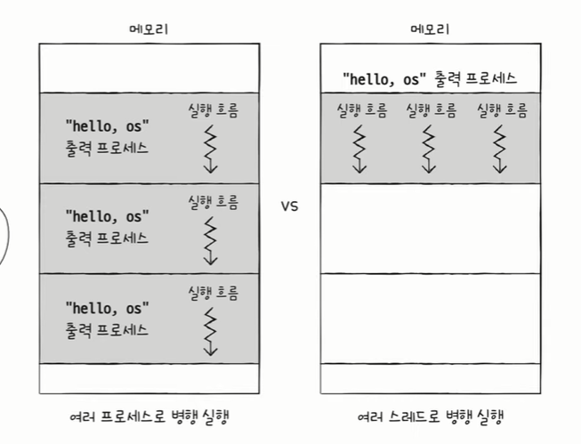
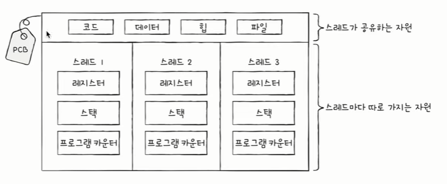

# 스레드

## 스레드란?
- **프로세스를 구성하는 실행 흐름의 단위**
- 하나의 프로세스는 하나 이상의 스레드를 가질 수 있다.

- 지금까지는 실행 흐름이 하나인 프로세스 (단일 스레드 프로세스)를 상정했던 것
- 일반적으로는 멀티 스레드 프로세스로 구현이 됨 > 멀티 스레드 프로세스
    - 프로세스를 이루는 여러 명령어 동시 실행 가능

### 스레드의 구성 요소
- 스레드마다 `스레드 ID`, `프로그램 카운터를 비롯한 레지스터 값`, `스택` 등 실행에 필요한 최소한의 정보를 가지고 있다.

- 각기 다른 스레드마다 스택과 프로그램 카운터를 따로 가지고 있다.
- 실행에 필요한 최소한의 정보를 유지한 채 병행하여 실행
- 그러나 모든 스레드는 프로세스의 **자원을 공유**하면서 실행이 된다.
- 참고) 리눅스 운영체제는 프로세스와 스레드를 구분하지 않고, task라는 용어를 사용한다.
- 참고) 요즘은 프로세스가 아니라 스레드 단위로 운영체제가 CPU에 전달하는 경우가 많다.

### 멀티 프로세스와 멀티 스레드
- `동일한 작업을 수행하는 단일 스레드 프로세스 여러 개 실행` vs `하나의 프로세스를 여러 스레드로 실행`

**이 둘은 어떤 차이가 있을까?**
> 프로세스끼리는 기본적으로 자원을 공유하지 않지만
스레드끼리는 같은 프로세스 내의 자원을 공유하면서 실행된다.

- 프로세스를 fork하면 코드/데이터/힙 영역 등 모든 자원이 복제되어 저장된다.
- 저장된 메모리 주소를 제외하면 모든 것이 동일한 프로세스 두 개가 통째로 메모리에 적재됨
fork를 세 번 네 번하면 메모리에는 같은 프로세스가 통째로 세 개 네 개 적재됨

- 참고) 
fork 직후 같은 프로세스를 통째로 메모리에 중복 저장하지 않으면서
동시에 프로세스끼리 자원을 공유하지 않는 방법도 있다.
이를 쓰기 시 복사(copy on write)기법이라 한다.

### 멀티 스레드

**정리**
- 프로세스끼리는 자원을 공유하지 않는다. > 남남처럼 독립적으로 실행된다.
- 스레드는 프로세스의 자원을 공유한다 > 협력과 통신에 유리하다 but 때로는 문제가 된다. 하나의 스레드에서 문제가 발생하면 전체 프로세스에 문제가 생길 수 있다.

- 스레드만큼 유리하지 않을 뿐 프로세스끼리도 자원을 주고 받을 수 있다 : **프로세스 간 통신(IPC)**
- 같은 컴퓨터 내에 스레드, 프로세스끼리 데이터를 주고 받는 것도 **통신**이라고 할 수 있다.
    - 예1) 파일을 통한 프로세스 간 통신
         - 프로세스 A가 hello.txt에 새로운 값을 쓰고 프로세스 B가 hello.txt 파일을 읽으면
         - 이 두 프로세스는 hello.txt를 통해 서로 통신을 주고 받았다고 할 수 있음
    - 예2) 공유 메모리를 통한 프로세스 간 통신
        - 프로세스들끼리 공유하는 메모리 영역을 만들어 통신을 주고 받는 것
        - 전역변수 등
    - 이 외에도 소켓 파이프 등 다양한 통신 기법이 있음

###
- 유저레벨 스레드: 프로그래밍 언어에서 사용하는 스레드
- 커널레벨 스레드: 

