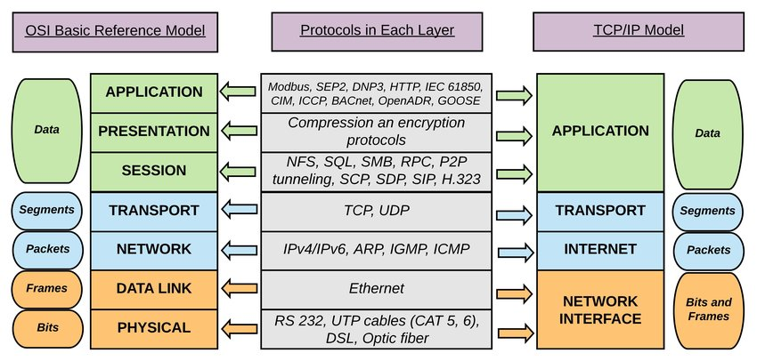
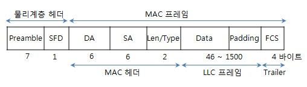

## TCP/IP 4계층 모델

 - `인터넷 프로토콜 스위트(internet protocol suite)`란 인터넷에서 컴퓨터들이 서로 정보를 주고 받는데 쓰이는 프로토콜의 집합
 - `인터넷 프로토콜 스위트(internet protocol suite)`를 `TCP/IP(Transmission Control Protocol) 4계층 모델`이나 `OSI 7계층 모델`로 설명함.

### 1. 계층 구조
 - TCP/IP 계층은 4개의 Layer로 이루어져 있으며 OSI 7 Layer와 많이 비교한다.
 - 이 계층 모델은 네트워크에서 사용되는 통신 프로토콜의 집합으로 계층들은 프로토콜의 네트워킹 범위에 따라 네 개의 추상화 계층으로 구성된다.

[The logical mapping between OSI basic reference model and the TCP/IP stack.](#tcp-ip-and-osi-layer)
> 위에서 그림에서 볼 수 있는 계층들은 특정 계층이 변경되었을 때 다른 계층이 영향을 받지 않도록 설계되었다.

##### **1. 애플리케이션 계층(Application Layer)**

- FTP, HTTP, SSH, SMTP, DNS 등 응용 프로그램이 사용되는 프로토콜 계층으로 웹 서비스, 이메일 등 서비스를 실질적으로 사람들에게 제공하는 층이다.
> - `FTP`: 장치와 장치 간의 파일을 전송하는 데 사용되는 표준 통신 프로토콜
> - `SSH`: 보안되지 않은 네트워크에서 네트워크 서비스를 안전하게 운영하기 위한 암호화 네트워크 프로토콜
> - `HTTP`: World Wide Web을 위한 데이터 통신의 기초이자 웹 사이트를 이용하는 데 쓰는 프로토콜
> - `SMTP`: 전자 메일 전송을 위한 인터넷 표준 통신 프로토콜
> - `DNS`: 도메인 이름과 IP 주소를 매핑해주는 서버.

##### **2. 전송 계층(Transport Layer)**

- 송신자와 수신자를 연결하는 통신 서비스를 제공하며 연결 지향 데이터 스트림 지원, 신뢰성, 흐름 제어를 제공할 수 있으며 Application 계층과 Internet 계층 사이의 데이터가 전달될 때 중계 역할을 한다.
- 대표적으로 TCP, UDP가 있다.
> - `TCP`: 패킷 사이의 순서를 보장하고 연결지향 프로토콜을 사용해 연결하여 신뢰성을 구축해 수신 여부를 확인하며 `가상회선 패킷 교환 방식`을 사용한다.
> - `UDP`: 순서를 보장하지 않고 수신 여부를 확인하지 않으며 단순히 데이터만 주는 `데이터그램 패킷 교환 방식`을 사용한다.
> > **가상회선 패킷 교환 방식**이란
> > - 각 패킷에는 가상회선 식별자(VCI)가 포함되며 모든 패킷을 전송하면 가상 회선이 해제되고 패킷들은 전송된 순서대로 도착하는 방식을 말한다.
> > => 데이터 그램은 패킷마다 라우터가 경로를 선택하지만 가상회선 방식은 경로를 설정할 때 한번만 수행한다. (연결 지향형)
 
[virtual-packet-switching](#virtual-packet-switching)

> > **데이터그램 패킷 교환 방식**이란
> > - 패킷이 독립적으로 이동하며 최적의 경로를 선택하여 가는데, 하나의 메세지에서 분할된 여러 패킷은 서로 다른 경로로 전송될 수 있으며 도착한 순서가 다를 수 있는 방식을 말한다.
> > => 송신 측에서 전송한 순서와 수신 측에 도착한 순서가 다를 수 있다. (비연결 지향형)
 
[datagram-packet-switching](#datagram-packet-switching)

> **TCP 연결 성립 과정**
> - TCP는 신뢰성을 확보할 때, `3-way handshake`라는 작업을 진행 한다.
> 1. SYN(Synchronization) 단계
> - client는 server에 클라이언트의 ISN(Initial Sequence Number)을 담아 SYN을 보낸다.
> - ISN은 새로운 TCP 연결의 첫번째 패킷에 할당된 임의의 시퀀스 번호를 말하며 장치마다 다를 수 있다. 초기 네트워크 연결 시 할당된 32비트 고유 시퀀스 번호이다.
> 2. SYN + ACK(Acknowledgement) 단계
> - 서버는 클라이언트의 SYN을 수신하고 서버의 ISN을 보내며 승인번호로 클리이언터의 ISN + 1을 보낸다.
> 3. ACK 단계
> - 클라이언트는 서버의 ISN + 1한 값인 승인번호를 담아 ACK를 서버에 보낸다.
>  
=> 이렇게 `3-way handshake`과정 이후 신뢰성이 구축되고 데이터 전송을 시작한다.
> - `TCP`는 이 과정이 있기에 신뢰성이 있는 계층이며, `UDP`는 이 과정이 없기 때문에 신뢰성이 없는 계층이다.

> **TCP 연결 해제 과정**
> - TCP가 연결을 해제할 때는 `4-way handshake`과정이 발생한다.
> 1. 먼저 클라이언트가 연결을 닫으려고 할 때 `FIN`으로 설정된 세그먼트를 보낸다. 그리고 클라이언트는 `FIN_WAIT_1` 상태로 들어가고 서버의 응답을 기다린다.
> 2. 서버는 클라이언트로 `ACK`라는 승인 세그먼트를 보낸다. 그리고 `CLOSE_WAIT`상태에 들어간다. 클라이언트가 세그먼트를 받으면 `FIN_WAIT_2` 상태에 들어간다.
> 3. 서버는 `ACK`를 보내고 일정 시간 이후에 클라이언트에 `FIN`이라는 세그먼트를 보낸다.
> 4. 클라이언트는 `TIME_WAIT`상태가 되고 다시 서버로 `ACK`를 보내서 서버는 `CLOSED`상태가 된다. 이후 클라이언트는 어느 정도의 시간을 대기한 후 연결이 닫히고 클라이언트와 서버의 모든 자원의 연결이 해제된다.
>  
>  - **그냥 연결을 닫으면 되지 왜 굳이 일정 시간 뒤에 닫을까?**
>  
> 1. 지연 패킷이 발생할 경우 대비 하기 위해서. 패킷이 뒤늦게 도착해 처리하지 못하면 데이터 무결성 문제가 발생한다.
> 2. 두 장치가 연결이 닫혔는지 확인 하기 위해서. 만약 `LAST_ACK`상태에서 닫히면 다시 새로운 연결을 하려고 할 때 장치는 계속 `LAST_ACK`로 되어 있기 때문에 접속 오류가 나타난다.
>  
> => `TIME_WAIT`가 중요한 이유. 소켓이 소멸되지 않고 일정 시간 유지되는 상태를 말하며 지연 패킷 등의 문제점을 해결하는데 쓰인다. OS마다 조금씩 다를수 있으며, 우분투에서는 60초, WINDOW에서는 4분으로 설정되어 있다.

** Transport 계층의 패킷을 `segment(세그먼트)`라고 한다.

##### **3. 인터넷 계층(Internet Layer)**
- 장치로 부터 받은 네트워크 패킷을 IP주소로 지정된 목적지로 전송하기 위해 사용되는 계층이다.
- IP, ARP, ICMP 등이 있으며 패킷을 수신해야 할 상대의 주소를 지정해 데이터를 전달한다. 상대방이 제대로 받았는지에 대해 보장하지 않는 비연결형적인 특징을 가진다.
 
IP가 완전히 연결되어 도착하는 것을 보장하지 않는다. 따라서 이를 보장하는 것이 transport 계층의 TCP/IP가 존재하는 것이다.

##### **4. 링크 계층(Link Layer)**
- 전선, 광섬유, 무선 등으로 실질적으로 데이터를 전달해 장치 간에 신호를 주고받는 `규칙`을 정하는 계층이다.
- 이를 물리 계층(Physical Layer)과 데이터 링크 계층(Data Link Layer)로 나누기도 한다.
- 물리 계층은 무슨 LAN과 유선 LAN을 통해 0과 1로 이루어진 데이터를 보내는 계층을 말한다.
- 데이터 링크 계층은 `이더넷 프레임`을 통해 에러 확인, 흐름 제어, 접근 제어를 담당하는 계층을 말한다.

> **유선 LAN**
> - 유선 LAN을 이루는 이더넷은 `IEEE802.3`이라는 프로토콜을 따른다.
> - 전이중화 통신을 쓴다.
> > **전이중화 통신**
> > - 전이중화(full duplex) 통신은 양쪽 장치가 동시에 송수신할 수 있는 방식을 말한다.
> > - 이는 송신로와 수신로로 나눠 데이터를 주고 받으며 현대의 고속 이더넷은 이 방식으로 통신한다.

> > **CSMA/CD**
> > - `반이중화 통신`중 하나인 CSMA/CD 방식을 이전에는 사용하였다.
> > - 데이터를 보낸 이후 충돌이 발생하면 일정 시간 이후 재전송하는 방식이다.
> > - 수신로와 송신로를 각각 둔것이 아니라 한 경로를 기반으로 데이터를 보내기에 데이터를 보낼때 충돌에 대비해야 했다.

> **유선 LAN을 이루는 케이블**
> - 유선 LAN을 이루는 케이블로는 `TP 케이블`이라는 `트위스트 페어 케이블`과 `광섬유 케이블`이 대표적이다.
> > **트위스트 페어 케이블(twisted pair cable)**
> > - 하나의 케이블 처럼 보이지만, 실제로는 여덟개의 구리선을 두 개씩 꼬아서 묶은 케이블을 지칭한다.
> > - 케이블은 구리선을 실드 처리하지 않고 덮은 `UTP 케이블`과 실드 처리하고 덮은 `STP 케이블`로 나뉘어 진다. (구리선에 은박지 씌우는 유무 차이)
> > - 우리가 많이 볼 수 있는 케이블은 `UTP 케이블`로 흔히 `LAN 케이블`이라고 한다.
      
> > **광섬유 케이블**
> > - 광섬유로 만든 케이블이다.
> > - 레이저를 이용해서 통신하기 때문에 구리선과는 비교할 수 없을 만큼의 장거리 및 고속 통신 가능
> > - 광섬유 내부와 외부를 다른 밀도를 가지는 유리나 플라스틱 섬유로 제작해 한 번 들어간 빛이 내부에서 계속적으로 반사하며 전진하여 반대편 끝까지 가는 원리를 이용함.

> **무선 LAN**
> - 무선 LAN 장치는 송신과 수신에 같은 채널을 사용하기 때문에 반이중화 통신을 사용한다.
> > **반이중화(half duplex) 통신**
> > - 양쪽 장치는 서로 통신할 수 있지만, 동시에는 통신할 수 없으며 한 번에 한 방향만 통신할 수 있는 방식을 말한다.
> > - 일반적으로 장치가 신호를 수신하기 시작하면 응답하기 전에 전송이 완료될때 까지 기다려야 한다. 
> > - 둘 이상의 장치가 동시에 전송하면 충돌이 발생해 메세지가 손실되거나 왜곡될 수 있기에 충돌방지 시스템이 필요하다. => CSMA/CA
 
> > **CSMA/CA**
> > - CSMA/CA는 반이중화 통신 중 하나로 (통신 방식 중 하나) 장치에서 데이터를 보내기 전에 캐리어 감지 등으로 사전에 가능한 한 충돌을 방지하는 방식을 사용하며 다음과같은 과정을 통해 이루어 진다.
> > 1. 데이터를 송신하기 전에 무선 매체를 살핀다.
> > 2. **캐리어감지** : 회선이 비어있는지 확인한다. (보내기 전 길이 뚫려있는지 확인)
> > 3. **IFS(Inter FrameSpace)**: 랜덤 값을 기반으로 정해진 시간만큼 기다리며, 만약 무선 매체가 사용중이면 점차 그 간격을 늘려가며 기다린다. (모두가 이것을 쓰고 있으면 기다림)
> > 4. 이후에 데이터를 송신한다.
>  
> => 양방향 통신으로 충돌 가능성이 없는 전이중화 통신과 다르게 반이중화 통신은 충돌 감지 / 방지 메커니즘이 필요함.

**무선 LAN을 이루는 주파수**
 - 무선 LAN은 무선 신호 전달 방식을 이용해 2대 이상의 장치를 연결하는 기술이다.
 - 비유도 매체(물리적 도체 없이 신호를 전달하는 매체로 아날로그 신호의 주파수가 높아지면 직진성이 강하게 되고, 반대는 떨어짐)인 공기에 주파수를 쏘아 무선 통신망을 구축한다.
 - 주파수 대역은 2.4GHz 대역 또는 5GHz 대역 중 하나를 써서 구축한다.
 - 2.4GHz는 장애물에 강한 특성을 가지고 있지만 전자레인지, 무선 등 전파 간섭이 일어나는 경우가 많다.
 - 5GHz 대역은 사용할 수 있는 채널 수도 많고 동시에 사용할 수 있기 때문에 상대적으로 깨끗한 전파 환경을 구축할 수 있다.
=> 보통은 5GHz 대역을 사용하는것이 좋다.

**와이파이**
- 와이파이는 전자기기들이 무선 LAN 신호에 연결할 수 있게 하는 기술로, 이를 사용하려면 무선 접속 장치(공유기)가 있어야 한다.
- 공유기를 통해 유선 LAN에 흐르는 신호를 무선 LAN 신호로 바꿔주어 신호가 닿는 범위 내에서 무선 인터넷을 사용할 수 있다.
- 무선 LAN을 사용한 기술로는 와이파이, 지그비, 블루투스 등이 있다.

**BSS(basic service set)**
- 기본 서비스 집합을 의미한다.
- 단순 공유기를 통해 네트워크에 접속하는 것이 아닌 동일 BSS내에 있는 AP들과 장치들이 서로 통신이 가능한 구조를 말한다.
- 근거리 무선 통신을 제공하고 하나의 AP만을 기반으로 구축이 되어 사용자가 한 곳에서 다른 곳으로 자유롭게 이동하며 네트워크에 접속하는 것은 불가능하다.

**ESS(extended service set)**
- 하나 이상의 연결된 BSS 그룹
- 장거리 무선 통신에서 제공하며 BSS보다 더 많은 가용성과 이동성을 지원한다.

**이더넷 프레임(ethernet frame)**
- Data link 계층은 이더넷 프레임을 통해 전달 받은 데이터의 에러를 검출하고 캡슐화해 다음과 같은 구조를 가진다.
 
[Ethernet Frame](#ethernet-frame)
 

- Preamable: 이더넷 프레임이 시작임을 알린다.
- SFD(start frame delimiter): 다음 바이트부터 MAC 주소 필드가 시작됨을 알린다.
- DMAC, SMAC: 수신, 송신 MAC 주소를 말한다.
- EtherType: 데이터 계층 위의 계층인 IP 프로토콜을 정의한다. 예를들어 IPv4나 IPv6가 된다.
- Payload: 전달받은 데이터
- CRC: 에러 확인 비트

**MAC 주소**: 컴퓨터나 노트북 등 장치에는 네트워크에 연결하기 위한 LAN카드가 있는데, 이 장치를 구별하기 위한 식별번호를 말하며 6바이트로 구성된다. (LAN 카드가 있어야 인터넷 신호를 받을 수 있다.)

##### **계층 간 데이터 송수신 과정**
- 웹 서버에 데이터를 요청하면 다음과 같인 일이 일어난다.
1. 애플리케이션 계층에서 전송 계층으로 클라이언트가 보내는 요청 값들이 `캡슐화 과정`을 거쳐 전달된다.
2. 다시 링크 계층을 통해 해당 서버와 통신한다.
3. 해당 서버의 링크 계층으로부터 애플리케이션까지 비캡슐화 과정을 거쳐 데이터가 전송된다.

**캡슐화 과정**
- 캡슐화 과정은 상위 계층의 헤더와 데이터를 하위 계층의 데이터 부분에 포함 시키고 해당 계층의 헤더를 삽입하는 과정을 말한다.
- 애플리케이션 계층의 데이터가 전송 계층으로 전달되면서 `세그먼트` 또는 `데이터그램화`되어 TCP 헤더가 붙는다
- 그리고 인터넷 계층으로 가면서 IP 헤더가 붙어 `패킷화`가 되고 이후 링크 계층으로 전달된다
- 링크계층에서 프레임 헤더와 프레임 트레일러가 붙어 `프레임화`가 된다.

**비캡슐화 과정**
- 비캡슐화 과정은 하위 계층에서 상위 계층으로 가며 각 계층의 헤더 부분을 제거하는 과정을 말한다.
- 캡슐화된 데이터를 받아 메세지화가 된다.
- 이후 최종적으로 사용자에게 애플리케이션의 PDU 메시지로 전달된다.

**PDU(protocol data unit)**
 - 네트워크의 어떠한 계층에서 계층으로 데이터 전달 시 한 덩어리 단위를 PDU라고 한다.
 - PDU는 제어 관련 정보들이 포함된 `헤더`, 데이터를 의미하는 `페이로드`로 구성되어 있으며 계층마다 부르는 명칭이 다르다.
 > - 애플리케이션 계층 : 메세지
 > - 전송계층 : 세그먼트(TCP), 데이터그램(UDP)
 > - 인터넷 계층 : 패킷
 > - 링크 계층 : 프레임(데이터 링크 계층), 비트(물리 계층)
 
- PDU 중 아래 계층인 비트로 송수신 하는 것이 모든 PDU 중 가장 빠르고 효율성이 높다.
- 하지만 애플리 케이션에서는 문자열을 기반으로 송수신 하는데, 그 이유는 헤더에 Authorization 값 등 다른 값들을 넣는 확장이 쉽기 때문이다.
  (개발자가 bit로 받으면 불편함)

Reference

<a name="tcp-ip-and-osi-layer">https://www.researchgate.net/figure/The-logical-mapping-between-OSI-basic-reference-model-and-the-TCP-IP-stack_fig2_327483011</a>
<a name="virtual-packet-switching">https://woovictory.github.io/2018/12/28/Network-Packet-Switching-Method/#:~:text=%EA%B0%80%EC%83%81%ED%9A%8C%EC%84%A0%20%ED%8C%A8%ED%82%B7%20%EA%B5%90%ED%99%98%20%EB%B0%A9%EC%8B%9D&text=(%EC%97%B0%EA%B2%B0%20%EC%A7%80%ED%96%A5%ED%98%95)%20%EA%B0%81%20%ED%8C%A8%ED%82%B7%EC%97%90%EB%8A%94,%EB%95%8C%20%ED%95%9C%20%EB%B2%88%EB%A7%8C%20%EC%88%98%ED%96%89%ED%95%9C%EB%8B%A4.</a>
<a name="datagram-packet-switching">https://woovictory.github.io/2018/12/28/Network-Packet-Switching-Method/#:~:text=%EA%B0%80%EC%83%81%ED%9A%8C%EC%84%A0%20%ED%8C%A8%ED%82%B7%20%EA%B5%90%ED%99%98%20%EB%B0%A9%EC%8B%9D&text=(%EC%97%B0%EA%B2%B0%20%EC%A7%80%ED%96%A5%ED%98%95)%20%EA%B0%81%20%ED%8C%A8%ED%82%B7%EC%97%90%EB%8A%94,%EB%95%8C%20%ED%95%9C%20%EB%B2%88%EB%A7%8C%20%EC%88%98%ED%96%89%ED%95%9C%EB%8B%A4.</a>
<a name="ethernet-frame">http://www.ktword.co.kr/test/view/view.php?m_temp1=2965</a>

