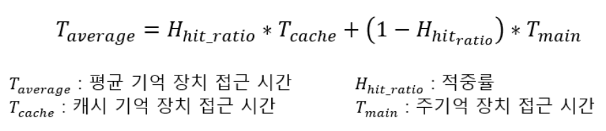

# 메모리
- CPU는 그저 `메모리`에 올라와 있는 프로그램의 명령어를 실행할 뿐이다. 

## 1. 메모리 계층
- 메모리 계층은 `레지스터`, `캐시`, `메모리`, `저장장치`로 구성되어 있다.
> **1. 레지스터**: CPU안에 있는 작은 메모리, 휘발성, 속도 가장 빠름, 기억 용량이 가장 적음.
> **2. 캐시**: L1, L2 캐시를 지칭한다. 휘발성, 속도 빠름, 기억 용량이 적다. 
> **3. 주기억장치(RAM)/주기억장치(Primary Memory, Computer Memory)**: RAM을 가리킴. 휘발성, 속도 보통, 기억 용량 보통.
> **4. 저장장치(HDD, SSD)/보조기억장치(Secondary Memory, Auxiliary Memory)**: HDD, SSD를 가리킴. 비휘발성, 속도 낮음, 기억 용량이 많음.
- RAM(Random Access Memory)는 하드디스크로부터 일정량의 데이터를 복사해 임시 저장하고 이를 필요할 때마다 CPU에 빠르게 전달하는 역할을 한다.
- 계층 위로 올라갈 수록 가격은 비싸지고, 용량은 작아지고, 속도는 빨라진다. 
- 계층이 있는 이유는 경제성과 캐시 때문이다. 경제성 때문에 계층을 두어 관리한다.
> 대표적인 계층 구조의 예시가 게임의 `로딩 중`이라는 메세지 이다. 이는 하드디스크 또는 인터넷에서 데이터를 읽어 RAM으로 전송하는 과정이 끝나지 않았음을 말한다.

- 대표적인 주기억장치로는 ROM과 RAM으로 나누어진다. 
> 1. ROM(Read Only Memory)은 전원이 끊어져도 기록된 데이터들이 소멸되지 않는 비휘발성 메모이다. 
>   - ROM은 데이터를 저장한 후 반영구적으로 사용할 수 있따. 그래서 BIOS와 같은 주요 데이터는 이 장치에 저장된다. 
> 2. RAM(Random Access Memory)

- 대표적인 보조기억장치는 HDD와 SSD가 있다.
> 1. HDD(Hard Disk Driver): 물리적인 디스크를 고속으로 회전시켜 데이터를 저장하는 장치이다. 
>    - 물리적으로 디스크에 저장하기 때문에 충격에 약하고 소음이 다소 발생하기에 최근에 많이 소멸되는 상황이다.
> 2. SSD(Solid State Driver): 반도체 기반의 정보를 저장하는 기억장치이다. 
>    - 물리적으로 데이터 저장하지 않고 전기적으로 데이터를 저장하기 때문에 HDD에 비해 속도가 월등히 빠르고 소음도 발생하지 않는다.

### 캐시(Cache)
 - CPU 칩에는 여러개의 캐시가 들어가며, 각각 목적과 역할을 가지고 있다.
 - 캐시는 데이터를 미리 복사해 놓은 임시 저장소이자 빠른 장치와 느린 장치에서 속도 차이에 따른 병목 현상을 줄이기 위한 메모리를 말한다.
 - 주기억장치(Primary Memory, RAM)에서 자주 사용하는 프로그램과 데이터를 저장해두어 속도를 빠르게 하는 메모리 (따라서 Cache는 주기억장치보다 크기가 작을 수 밖에 없다.)
 - 캐시 기억장치와 주기억장치 사이에서 정보를 옮기는 것을 `매핑(Mapping)`이라고 한다.
 
 
 - 이를 통해 데이터를 접근하는 시간이 오래 걸리는 경우를 해결하고 무언가를 다시 계산하는 시간을 절약할 수 있다.
 - 메모리와 CPU 사이 속도 차이가 너무 크기에 중간에 `레지스터`계층을 두어 속다 차이를 해결하는 것이다.
 - 이렇게 속도 차이 해결을 위해 계층과 계층 사이에 있는 계층을 `캐싱 계층`이라고 한다. 
> e.g) 캐시 메모리와 보조기억장치 사이에 있는 주기억장치를 보조기억장치의 캐싱 계층이라고 할 수 있다.
 - 주기억장치와 CPU 사이에 위치하여 **메모리 계층 구조의 가장 빠른 소자**이며, **처리 속도가 CPU의 속도와 비슷한 정도의 속도**를 가지고 있다.
 - 캐시 메모리를 사용함으로서 주 기억장치를 접근하는 횟수가 줄어들어 컴퓨터의 처리속도가 향상된다.

**캐시의 종류**
- 오늘날 CPU 칩의 면적 30~70%는 캐시가 차지한다.
 
 
- `L1 Cache`: 프로세서와 가장 가까운 캐시. 속도를 위해 I$와 D$로 나뉜다.
  - `Instruction Cache (I$)`: 메모리의 TEXT 영역 데이터를 다루는 캐시.
  - `Data Cache (D$)`: TEXT 영역을 제외한 모든 데이터를 다루는 캐시.
- `L2 Cache`: 용량이 큰 캐시. 크기를 위해 L1 캐시처럼 나누지 않는다.
- `L3 Cache`: 멀티 코어 시스템에서 여러 코어가 공유하는 캐시.
- 캐시에 달러 기호($)를 사용하는 이유는 캐시(Cache)의 발음이 현금을 뜻하는 'Cash’와 같기 때문이다

**캐시의 지역성**
- 캐시가 효율적으로 동작하기 위해서는, 캐시의 `적중룔(Hit-rate)`를 극대화 시켜야한다.
  > - `적중률`이란: 캐시 기억 장치가 있는 컴퓨터의 성능을 나타내는 척도이다. 프로그램 수행 중 기억 장치에 엑세스 하는 횟수, 즉 **적중 횟수와 실패 횟수의 합으로 적중 횟수를 나눈 것**을 말한다.
  > - 적중률이 높아질수록 기억 장치 접근 시간이 감소함을 쉽게 알아차릴 수 있다.
  

- 캐시에 저장할 데이터가 `지역성(Locality)`를 가져야 한다.
- 지역성이란 **데이터 접근이 `시간적`, `공간적`으로 가깝게 일어나는것**을 말한다.
- 즉 `지역성`이란, 기억장치 내의 정보를 균일하게 access하는 것이 아닌 **어느 한 순간에 특정 부분을 집중적으로 참조하는 특성**이다.  
- 지역성의 종류로는 `시간적 지역성`과 `공간적 지역성`이 있다.

#### 시간적 지역성(Temporal Locality)
 - 특정 데이터가 한번 접근되었을 경우, 가까운 미래에 또 한번 데이터에 접근할 가능성이 높은 것
 - 메모리 상에 같은 주소에 여러 차례 읽기 쓰기를 수행할 경우, 상대적으로 작은 크기의 캐시를 사용해도 효율성 꾀할 수 있음.

#### 공간적 지역성(Spacial Locality)
 - 최근 접근한 데이터를 이루고 있는 공간이나 그 가까운 공간에 접근하는 특성을 말한다.
 - CPU 캐시나 디스크 캐시의 경우 한 메모리 주소에 접근할 때 그 주소뿐 아니라 해당 블록을 전부 캐시에 가져오게 된다.
 - 이때 메모리 주소를 오름차순이나 내림차순으로 접근한다면, 캐시에 이미 저장된 같은 블록의 데이터를 접근하게 되면서 캐시의 효율성이 크게 향상된다.

#### 캐시 매핑
- `매핑 프로세스(Mapping Process)`란 주기억장치 RAM으로 부터 캐시 메모리로 데이터를 전송하는 방법으로 3가지 방법이 있다.
1. **직접 매핑(Directed Mapping)**: 
   - 주기억장치들의 블록들이 지정된 한 개의 캐시 라인으로만 mapping될 수 있는 방법.
   > 메모리가 1~100이 있고, 캐시가 1 ~ 10이 있다면 1:1~10, 2:1~20 같이 매핑하는 방법. 처리가 빠르지만 충돌 발생이 잦다.
2. **연관 매핑(Associative Mapping)**: 
   - 순서를 일치시키지 않고 관련 있는 캐시와 메모리를 매핑한다. 충돌이 적지만 모든 블록을 탐색해야 해서 속도가 느리다.
   - 직접 매핑의 방식의 단점을 보완한 방식
   - 하지만 모든 태그들을 병렬로 검사하기 때문에 복잡하고 비용이 높다는 단점이 있어 거의 사용하지 않는다.
3. **집합 연관 매핑(Set Associative Mapping)**:
   - 직접 매핑과 연관 매핑의 장점만 취한 방식.
   - 순서는 일치시키지만, 집합을 둬서 저장하여 블록화되어 있기 때문에 검색은 좀 더 효율적이다.
   > 메모리가 1~100이 있고, 캐시가 1~10이 있으면 캐시 1~5에는 1~50의 데이터를 무작위로 저장시키는 것을 말한다.
    
### Cache Metrics, 캐시 히트와 캐시 미스
- 캐시의 성능을 측정할 때는 `히트 레이턴시(Hit latency)`와 `미스 레이턴시(Miss latency)`가 중요한 요인으로 꼽힌다.
- `캐시 히트 (Cache Hit)`란: CPU에서 요청한 데이터가 캐시에 존재하는 경우를 캐시 히트(Hit)라고 한다.
- `Hit Latency`란: 히트가 발생해 캐싱된 데이터를 가져올 때 소요되는 시간을 의미한다.
- `캐시 미스 (Cache Miss)`란: 요청한 데이터가 캐시에 존재하지 않는 경우를 캐시 미스(Miss)라고 한다.
- `Miss Latency`란: 미스가 발생해 상위 캐시에서 데이터를 가져오거나(L1 캐시에 데이터가 없어서 L2 캐시에서 데이터를 찾는 경우) 메모리에서 데이터를 가져올 때 소요되는 시간을 말한다.
- 따라서 캐시의 성능을 높이기 위해서는 
  1. 캐시의 크기를 줄여 히트 레이턴시를 줄이거나, 
  2. 캐시의 크기를 늘려 미스 비율을 줄이거나, 
  3. 더 빠른 캐시를 이용해 레이턴시를 줄이는 방법이 있다.

### 웹 브라우저의 캐시
- 소프트웨어적인 대표적인 캐시로는 `쿠키`, `로컬 스토리지`, `세션 스토리지`가 있다.
- 이러한 것들은 보통 사용자의 커스텀한 정보나 인증 모듈 관련 사항들을 웹 브라우저에 저장해 추후 서버에 요청할 때 자신을 나타내는 아이덴티티나 중복 요청 방지를 위해 쓰인다.
- `웹 캐시(Web Cache) or HTTP Cache`란: 서버의 지연을 줄이기 위해 웹 페이지, 이미지, 기타 유형의 웹 멀티미디어 등의 웹 문서들을 임시 저장하기 위한 정보기술이다.
- 서버와 클라이언트가 서로 통신을 하면 당연하게 지연이 생길 수 밖에 없는데, 접근 시간 발생 문제를 해결하기 위한 기술의 일련을 웹 캐시라고 부른다. 
- `브라우저 캐시`는 웹 캐시의 일종이다.
- 브라우저가 웹사이트의 자산(asset)을 저장하는 것이다.
- 브라우저 캐시에는 자주 바뀌는 것이 저장되면 원본과 사본 사이의 문제가 생길 수 있다. 그래서 일반적으로 브라우저는 `정적 자산(static asset)`을 캐싱한다.
    > 대표적 정적 자산 1. 이미지 - 로고, 사진, 백그라운드 등 2. HTML, 3. CSS, 4.JavaScript

추가 자료 - 웹 캐시에 대하여

- [웹 캐시](https://velog.io/@jangwonyoon/%EC%BA%90%EC%8B%9C%EC%99%80-%EC%9B%B9-%EC%BA%90%EC%8B%9C)
- [웹 캐시2](https://hahahoho5915.tistory.com/33)

## 1. 메모리 관리
 - 운영체제의 대표적인 할 일 중 하나가 `메모리 관리`이다. 
   - 컴퓨터 내의 한정된 메모리를 극한으로 활용해야 한다.

### Address Binding
- 프로세스의 주소는 `논리적 주소(Logical Address) == 가상 주소(Virtual Address)`와 `물리적 주소(Physical Address)`로 나뉜다.
- 논리적 주소는 
  - 가상 주소라고도 하며, **CPU가 생성하는 주소**이다.
  - 프로세스 마다 독립적으로 가지는 주소 공간이기에 프로세스의 내부에서 사용하고, 각 프로세스마다 0부터 시작한다.
- 몰리적 주소는 프로세스가 실행되기 위해 실제로 메모리(RAM)에 올라가는 위치이다.

- `Address Binding`이란 어떤 프로그램이 메모리의 어느 위치에, 즉 어떤 물리적 주소에 load 될지를 결정하는 과정이다.

**1. Compile Time**
- 프로세스의 물리적 주소가 컴파일 때 정해진다.
- 프로세스가 메모리의 어느 위치에 들어갈지 미리 알고 있다면 컴파일러가 절대 주소(Absolute address), 즉 고정된 주소를 생성한다.
- 따라서 만약 위치가 변경된다면 재컴파일을 해주어야 한다.
- 컴파일 타임 주소 할당의 문제점은, 주소가 고정되어 있기 때문에 메모리 상에 빈 공간이 많이 발생할 수 있어 비효율적이고, 로드하려는 위치에 이미 다른 프로세스가 존재할 수 있다.
- 컴파일 타임 주소 할당은 프로세스 내부에서 사용하는 논리적 주소와 물리적 주소가 동일하다.

### Reference
- [주기억장치와 보조기억장치](https://mindstation.tistory.com/152)
- [캐시 메모리와 지역성](https://chelseashin.tistory.com/43)
- [적중률](https://yiyj1030.tistory.com/484#:~:text=%EC%A0%81%EC%A4%91%EB%A5%A0%EC%9D%80%20%EC%BA%90%EC%8B%9C%20%EA%B8%B0%EC%96%B5%20%EC%9E%A5%EC%B9%98,%EC%A0%81%EC%A4%91%20%ED%9A%9F%EC%88%98%EB%A5%BC%20%EB%82%98%EB%88%88%20%EA%B2%83%EC%9D%B4%EB%8B%A4.)
- [캐시가 동작하는 아주 구체적인 원리](https://parksb.github.io/article/29.html)
- [브라우저 캐시](https://velog.io/@mgm-dev/%EA%B0%84%EB%9E%B5-%EB%B8%8C%EB%9D%BC%EC%9A%B0%EC%A0%80-%EC%BA%90%EC%8B%9C%EC%97%90-%EB%8C%80%ED%95%B4)
- [메모리 관리](https://rebro.kr/178)
- [페이지 교체 알고리즘](https://code-lab1.tistory.com/60)
- [페이지 폴트(page fault)란](https://hooni-playground.com/939/)
- [내부 단편화, 외부 단편화](https://code-lab1.tistory.com/54)
- [가상메모리](https://ahnanne.tistory.com/15)