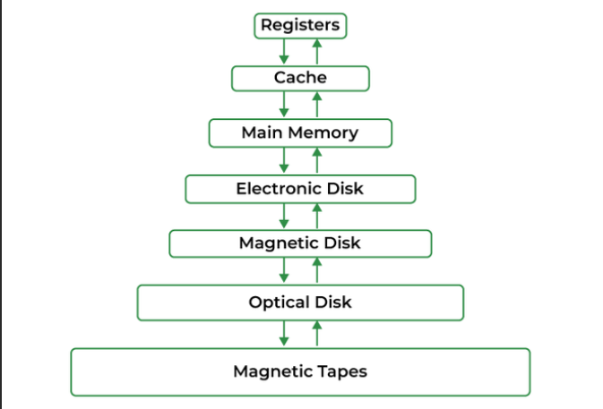
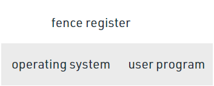
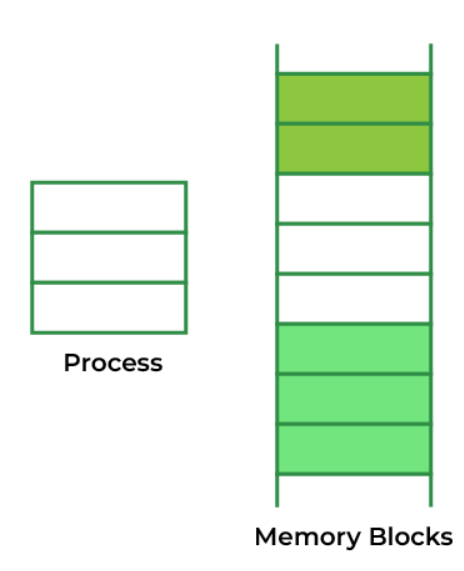
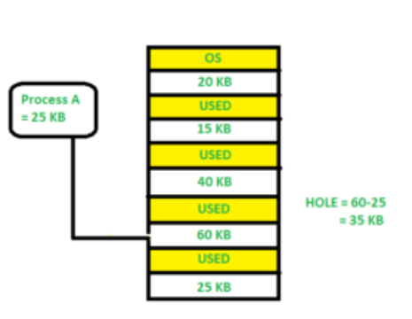

## Memory Management
- Memory의 정의: collection of data in specific format
- Memory는 지시사항(instructions)을 저장하고 process data를하기 위해 사용된다.
- memory는 large array나 words나 bytes의 그룹으로 이루어져 있고, 위치와 함께 있다.
- 컴퓨터 프로그램이 실행되기 위해서는, 실행하는 동안에 메인 메모리 안에 있어야한다.
- CPU는 PC(Program Counter)의 값에 따라서 메모리로 부터 instructions을 가져 온다.
- 메모리를 적절하게 사용하기 위해서 메모리 관리는 중요한데, 많은 memory management method가 존재하고 상황에 따라 유효한 알고리즘으로 다양한 접근을 반영한다.

### Main Memory란 무엇인가
- modern computer의 작동에 있어서 핵심적인 부분이다.
- 메인 메모리는 large array of words or bytes이며, 100~1000 billion까지 사이즈가 다르다
- 메인 메모리는 CPU와 I/O 디바이스에 의해 공유되는 빠르게 접근가능한 정보의 레포지토리이다.
- 프로세서가 효율적으로 메인 메모리를 사용할 때, 프로그램과 정보들이 저장되는 저장소이다.
- 메인 메모리는 프로세서(Processor)과 연관되어 있어서 processor에서 정보나 지시사항을 넣고 빼는것은 매우 빠르다.
- 메인 메모리는 RAM으로도 불린다. 휘발성이고, Power 공급이 안되면 데이터를 잃는다

### Memory Management란 무엇인가?
- 운영체제는 메모리 일부에 상주하고, 나머지는 여러 프로세스에 의해서 사용된다.
- 서로 다른 프로세스 간에 메모리를 세분화 하는 것을 메모리 관리라고 한다.
- 메모리 관리는 프로세스 실행 중 메인 메모리와 디스크 사이에서의 작업을 관리하는 운영체제의 한 방벙비다.
- 메모리 관리의 주 목적은 효율적으로 메모리를 사용하는 것이다

### Logical and Physical Address Space
- 논리 주소 공간(Logical Address Space): CPU에 의해서 생성된 주소는 `논리 주소`라고 하며, `가상 주소`라고도 불린다.
  - 논리 주소 공간은 프로세스의 크기에 의해 정의된다. 
  - 논리 주소는 변경될 수 있다.
- 물리 주소 공간(Physical Address Space): memory unit에서 볼수 있는 주소(즉, 메모리의 메모리 주소 레지스터에 로드 됨) 를 `물리 주소`라고 한다. 
    - 물리 주소는 실제 주소(Real Address)라고도 불린다.
    - 이러한 논리 주소에 correspond하는 모든 물리 주소 집합을 물리 주소 공간이라고 한다.
    - 물리 주소는 `MMU`에 의해서 계산된다. 가상주소에서 물리주소로의 런타임 매핑은 하드웨어 디바이스인 MMU에서 일어난다.
    - 물리적 주소는 항상 일정하게 유지된다.

### Static and Dynamic Loading
- 메인 메모리로 프로세스를 로딩하는 것은 `loader`에 의해 일어난다.
- 두가지 타입의 로딩이 있다.
1. Static loading: 고정된 주소에 전체 프로그램을 로딩하는 것이다. 따라서 더 많은 메모리 공간이 요구된다.
2. Dynamic loading: 전체 프로그램과 프로세스의 모든 데이터는 프로세스를 실행하기 위해서는 물리주소에 있어야 한다.
    - 따라서 프로세스의 크기는 물리 주소의 크기에 제한된다.
    - 적절한 메모리 활용을 위해서 Dynamic loading이 사용된다.
    - dynamic loading에서 루틴은 호출될때 까지 로드 되지 않는다.
    - 모든 루딘들은 재배치 가능한 load format으로 disk에 있다.
    - dynamic loading의 장점중 하나는 사용되지 않는 루틴은 절대 loaded되지 않는다는 것이다.
    - 이 로딩은 효율적으로 처리하기 위해서 많은 양의 코드가 필요할 때 유용하다.

### Static and Dynamic Linking
- linking task를 수행하기 위해서 linker가 사용된다.
- linker는 컴파일러에 의해 생성된 하나 이상의 object file을 single executable file로 합치는 프로그램이다.
1. Static Linking : linker가 모든 필요한 프로그램 모듈들을 single executable program으로 합친다.
   - 그래서 런타임 dependency가 없다.
   - 몇 운영 체제는 static linking만 지원하기에 시스템 언어 라이브러리들이 다른 object module처럼 다뤄진다.
2. Dynamic Linking: dynamic linking의 기본 개념은 dynamic loading과 비슷하다.
   - dynamic linking에서 각 적절한 라이브러리 루틴 reference에 대해 `Stub`이 포함된다.
   - `Stub`이란 small piece of code를 말한다.
   - `Stub`이 실행되면, 필요한 루틴이 이미 메모리에 있는지 여부를 확인한다.
   - 만약 사용가능하지 않다면, 프로그램이 루틴을 메모리에 로드한다.

### Swapping
- 프로세스가 실행될때, 반드시 메모리에 상주하고 있어야 한다.
- 스와핑이란 주 기억장치(main memory)에서 보조기억장치(secondary memory)로 임시로 프로세스를 swapping하는 과정으로 보조기억장치에 비해 속도가 빠르다.
- 스와핑을 통해서 더 많은 프로세스를 실행할 수 있고, 한번에 메모리에 맞출 수 있다.
- swapping의 주요 부분은 전송된 시간이며, 총 시간은 스와핑된 메모리의 양에 정비례한다.
- swapping은 roll-out과 roll-in 이라고도 하는데, 이는 우선순위가 높은 프로세스가 도착해 서비스를 원할때, memory manager는 우선순위가 낮은 프로세스를 교체한 다음 우선 순위가 높은 프로세스를 로드하고 실행할 수 있기 때문이다.
- 우선순위가 높은 일이 끝나고 난 다음, 우선순위가 낮은 프로세스가 메모리에 swapped back되어 실행 프로세스가 계쏙될 수 있다.

### monoprogramming으로 memory management(Swapping 없이 memeory management)
- 가장 간단한 메모리 관리 방법이다. 메모리는 두가지 섹션으로 나뉜다.
  1. 운영체제
  2. 유저 프로그램
  
- 이 접근 방식에서 운영 체제는 사용자 프로그램의 할당에 사용할 수 있는 첫번째와 마지막 위치를 추적한다.
- 운영체제는 bottom이나 top에 로드 된다.
- 인터럽트 벡터는 종종 낮은 메모리에 로드되기 때문에 운영체제를 낮은 메모리에 로드하는 것이 좋다.
- 데이터와 코드를 공유하는 것은 single process 환경에서 적합하지 않다.
- `fence register`의 도움으로 운영체제는 유저 프로그램으로 부터 보호받을 수 있다.
- 장점: 간단한 management 방식이다.
- 단점: multiprogramming을 지원하지 않고, 메모리가 낭비된다.

### multiprogramming with fixed partitions(Swapping 없이 memeory management)
- 파티션 수가 고정된 메모리 파티션 체계가 multiprogramming을 지원하기 위해서 도입 되었다.
- 이 체계는 `contiguous allocation`를 기반으로 한다.
- 각 파티션은 `contiguous memory`의 block이다.
- 메모리는 고정된 수의 파티션으로 분할 된다.
- 각 파티션은 고정된 크기다. (fixed size)

- 위 그림에서 볼수 있듯, 메모리는 다섯 개의 구역으로 파티션 되어 있다. 
- 영역은 시스템 업데이트 용으로 보존되고, 나머지 네 개의 파티션들은 사용자 프로그램을 위해 남아 있다.

### Partition Table
- 일단 파티션이 정의되면, 운영체제는 `파티션 테이블`이라는 데이터 구조를 통해서 메모리 파티션의 상태를 추적한다.

### 논리 주소 vs 물리 주소
- 논리 주소는 물리 주소로 mapping되는데, 이는 `base register`라는 하드웨어의 도움으로 매핑된다.
- `base register`는 dynamic relocation of memory reference로도 불린다. (메모리 참조의 동적 재배치)

### Contiguous Memory Allocation(연속 할당)
- 메인 메모리는 운영체제와 다른 클라이언트 프로세스를 모두 도와야한다.
- 따라서 운영체제에서는 메모리의 할당이 중요한 업무이다.
- 메모리는 대부분 두개의 파티션으로 나뉘는데, 하나는 **운영체제 상주용**이고, 하나는 **유저 프로세스용**이다.
- 일반적으로 메모리에 동시 상주하기 위해서는 여러 유저 프로세스가 필요하기 때문에, 메모리로 가져오는 것을 기다리는 input queue에 있는 프로세스에 사용 가능한 메모리 할당 방법을 고려해야 한다.
- 인접 메모리 할당에서, 각 프로세스는 single contiguous segement of memory에 포함된다.

### 메모리 할당
- 적절한 메모리 활용을 위해서는 메모리 할당이 효율적인 방식으로 할당 되어야 한다.
- 메모리를 할당하는 가장 간단한 방법 중ㅎ 하나는 메모리를 여러 개의 고정 파티션으로 나누고, 각 파티션이 정확히 하나의 프로세스가 포함되는 것이다.
- 따라서 multiprogramming의 정도는 파티션의 수에 의해서 얻어진다.

1. Multiple partition allocation (가변 분할 방식)
   - 이 방법에서는 프로세스가 input queue에 의해서 선택되어서 비어있는 파티션에 로드되는 것이다.
   - 프로세스가 끝나면, 파티션이 다른 프로세스들에 의해 이용가능하게 된다.
2. Fixed partition allocation (고정 분할 방식)
   - 운영체제는 사용 가능한 메모리 부분과 프로세스가 차지하는 부분을 나타내는 테이블을 유지한다.
   - 처음에는 모든 메모리가 유저 프로세스에서 사용가능하며 사용가능한 메모리의 큰 block 하나로 간주된다.
   - `Hole`이란 사용가능한 메모리를 말한다.
   - 프로세스가 도착하고 메모리가 필요할때, 이 프로세스를 담기에 충분히 큰 `hole`을 찾는다.
   - 만약 조건이 충족되면, 프로세스에 메모리를 할당하고, 충족되지 못하면 향후 요청을 충족할 수 있도록 유지한다.
   - 메모리를 할당하는 동안 dynamic storage allocation 문제가 발생하는데, 이는 사용가능한 hole의 목록에서 크기가 n인 요청을 만족시키는 방법과 관련이 있다.
   - 이 문제를 위해 몇 solution이 있다.
   1. first fit: 첫 번째 사용가능한 hole은 할당된 프로세스의 요구사항을 충족한다.
      - 
      - 여기서 처음 맞는 hole에 할당되는 것이다.
   2. Best Fit: 프로세스의 요구사항에 충분히 큰 가장 작은 hole을 할당한다.
      - 따라서 size에 따라 정렬되어 있지 않은 한, 전체 리스트를 탐색한다.
      - 
      - 전체 목록을 탐색하고 적절한 hoeld르 찾아 할당한다.
      - 이 방법에서 메모리 사용률은 다른 메모리 할당 기술이 비해 최대이다.
   3. Worst fit: 프로세스를 가장 큰 hole을 할당한다.
      - 이 방법은 가장 큰 hole을 생성한다.
      - 
      - 위의 예에서, process A가 가장 큰 hole인 60kb에 할당된다.
      - 비효율적인 메모리 사용률이 worst fit의 주요 문제이다

### Fragmentation
- Fragmentation은 프로세스가 메모리에서 실행 된 후 로드되고 제거될 때 작은 빈 구멍을 만드는 것으로 정의 된다.