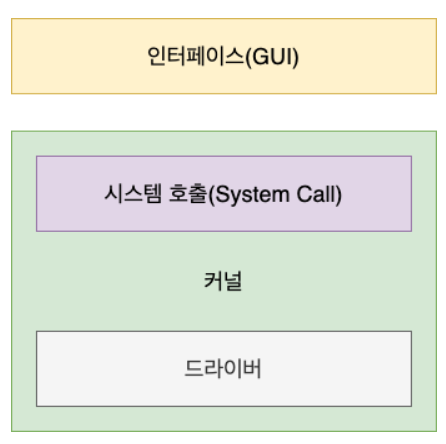
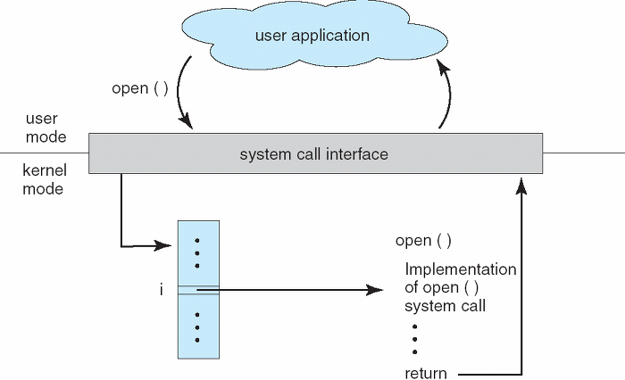

## 운영체제와 컴퓨터
- 운영체제(Operating System)은 사용자가 컴퓨터를 쉽게 다루게 해주는 인터페이스이다.
- 컴퓨터의 부적절한 사용을 막거나 사용자 프로그램의 실행을 제어한다.
- 한정된 메모리나 시스템 자원을 효율적으로 배분하는 참된 일꾼이다.
- **펌웨어**: 운영체제와 유사하지만 소프트웨어를 추가로 설치할 수 없는 것을 말한다. 모든 컴퓨터의 구성요소를 메모리(memory)에 저장하여 관리하게 해주는 프로그램입니다.
- **사용자 관점(User View)**: 사용자 관점에서 운영체제는 `서비스 제공자`가 된다. 운영체제는 사용자에게 응용프로그램, 네트워크 서비스, 계산 및 프린트 등 제공함.
- **시스템 관점(System View)**: 컴퓨터(시스템)의 관점에서 운영체제란 컴퓨터와 하드웨어의 연결을 맺어주는 `자원 할당자(Resource Allocator)`로 볼 수 있다. 
- 운영체제에 대한 또다른 시스템 관점으로 여러 가지 하드웨어 장치와 사용자의 장치를 제어할 필요성 때문에 제어 프로그램(Control Program)이 될 수 있다

 \* 컴퓨터 시스템은 일반적으로 **하드웨어(기본적으로 계산에 필요한 자원을 제공)**, **운영체제(사용자와 시스템간의 인터페이스를 제공)**, **응용 프로그램(사용자의 계산 문제를 시스템의 자원을 통해 해결하기 위해 정의된 프로그램)**, **사용자**로 나뉜다.

### 부트스트랩 프로그램(Bootstrap Program) == Firmware == PC의 BIOS
- 모든 컴퓨터의 구성 요소를 메모리에 저장하여 관리하게 해주는 프로그램이다.
-  **컴퓨터가 구동을 시작하기 위한 초기 프로그램**으로써 단순한 형태를 가지고 있으며, **시스템 초기화, 운영체제 로딩의 역할**을 한다
- 부트스트랩이 완료되면 init와 같은 초기 프로세스를 실행한 후 **시스템의 이벤트(인터럽트, Interrupt)를 기다리는 상태**가 된다.
- 하드웨어는 **시스템 버스**를 통해 프로세서(CPU)로 신호를 보내 인터럽트를 발생 시킬 수 있으며, 소프트웨어는 **시스템 콜(System Call)**을 통한 특별한 연산으로 인터럽트를 발생시킬 수 있다.
> **시스템버스** : 흔히 알고 있는 버스 처럼 시스템에서의 버스는 데이터의 교통수단이다. 컴퓨터 시스템 내 하드웨어 간에 정보를 전달하기 위한 일종의 통로이다.

추가 자료

[시스템 버스](https://velog.io/@hamsik2rang/%EC%BB%B4%ED%93%A8%ED%84%B0%EA%B5%AC%EC%A1%B0-%EC%8B%9C%EC%8A%A4%ED%85%9C-%EB%B2%84%EC%8A%A4)

### 컴퓨터 부팅 과정
1. 컴퓨터가 동작하기 위해 이루어 지는 과정을 부팅이라고 하는데, 부팅은 초기화 프로그램(initial program)에 의해 수행된다.
2. 컴퓨터에 전원이 들어오면, 초기화 프로그램은 `펌웨어(Bootstrap Program)`을 실행한다.
3. 다음으로 초기화 프로그램은 운영체제의 핵심인 `커널(kernel)`을 실행한다. 커널이란 컴퓨터 자원을 할당하고 프로그램을 관리하는 운영체제의 핵심이다.
4. 커널 수행이 완료되면, `쉘(shell)`이 실행되고 부팅 과정은 끝이 난다. 쉘이란 운영체제의 일부로서 커널에게 명령을 해석해 전달하는 역할을 한다. **(shell은 system call의 일종이다)**

추가 자료 - 컴퓨터 부팅 과정

[컴퓨터 부팅 과정](https://sedangdang.tistory.com/175)

#### 입출력 구조(I/O Structure)
- 입출력 방식에는 `인터럽트 기반 전송`과 `DMA 기반 전송` 두 가지가 있다.

추가 자료 - 입출력 시스템과 저장장치

[입출력 방식]https://danidanee.tistory.com/14)

#### 컴퓨터 시스템 구조
- 컴퓨터 시스템은 **사용된 프로세서의 수**에 따라 범주를 나눌 수 있다.
1. **단일처리기 시스템 (Single-Processor System)**: 사용자 프로세서의 명령어를 포함하여 범용 명령어 집합을 실행할 수 있는 **하나의 주 프로세서(CPU)**를 가진다.
2. **다중처리기 시스템 (Multiprocessor System)**: `병렬 시스템(Parallel System)`이라 불리기도 한다. **2개 이상의 프로세서(CPU)**로 구성된 하나의 시스템이다
> - 다중 처리 방식의 두가지 유형
> 1. 비대칭적 다중처리(asymmetric multiprocessing): 하나의 프로세서가 다른 프로세서와 주,종 관계로써 종 프로세서가 주 프로세서의 명령을 처리. 주 프로세서는 종 프로세서로 작업을 할당한다.
> 2. 대칭적 다중처리(symmetric multiprocessing): 모든 프로세서가 대등하다. 각 프로세서는 고유의 레지스터 집합과 지역적 성격의 캐시를 가지고 있다. (물리적 RAM은 공유한다)

### 1. 운영체제의 역할과 구조 

#### 운영체제의 역할
- 운영체제의 역할에는 크게 **네 가지**가 있다.
> 1. **CPU 스케줄링과 프로세스 관리**: CPU 소유권을 어떤 프로세스에 할당할지, 프로세스의 생성과 삭제, 자원 할당? 및 반환을 관리한다.
> 2. **메모리 관리**: 한정된 메모리를 어떤 프로세스에 얼만큼 할당해야 하는지 관리한다. -> *프로세스란 정확히 뭐지?*
> 3. **디스크 파일 관리**: 디스크 파일을 어떠한 방법으로 보관할지 관리한다.
> 4. **I/0 디바이스 관리**: I/O 디바이스들인 마우스, 키보드와 컴퓨터 간에 데이터를 주고받는 것을 관리한다.

#### 운영체제의 구조
- 운영체제의 구조는 맨위에 `유저 프로그램`이 있고, 그 다음 `GUI`, `시스템콜`, `커널`, `드라이버`가 있으며 가장 밑에 `하드웨어`가 있다.
- 여기서 `GUI`, `시스템콜`, `커널`, `드라이버` 부분을 운영체제를 지칭하는 것이다.
> - 참고로 **리눅스 서버**같이 GUI가 없고 CUI만 있는 경우도 있다.
> - `GUI(Graphical User Interface)`: 사용자가 전자장치와 상호 작용할 수 있도록 하는 사용자 인터페이스의 한 형태. 단순 명령어가 창이 아닌 아이콘을 마우스로 클릭하는 단순한 동작으로 컴퓨터와 상호 작용할 수 있도록 해준다.
> - `드라이버`: 하드웨어를 제어하기 위한 소프트웨어
> - `CUI(Character User Interface)`: 그래픽이 아닌 명령어로 처리하는 인터페이스

**인터럽트(Interrupt)와 트랩(Trap)의 차이점**
- 인터럽트란 어떤 신호가 들어왔을 때, CPU를 잠깐 정지 시키는 것을 말한다. 키보드, 마우스 등 IO 디바이스로 인한 인터럽트, 0으로 숫자를 나누는 산술 연산에서의 인터럽트, 프로세스 오류 등으로 발생한다.
- 인터럽트가 발생하면 `인터럽트 핸들러 함수`가 모여 있는 `인터럽트 벡터`로 가서 인터럽트 핸들러 함수가 실행된다.
- 인터럽트 간에는 우선순위가 있고, 우선순위에 따라 실행된다.

> **인터럽트(Interrupt)**
>- 하드웨어 인터럽트(Hardware Interrupt): 인터럽트는 `외부 인터럽트`, `내부 인터럽트`로 구분하는데, 외부 인터럽트를 `하드웨어 인터럽트`라고 한다.
>- 일반적으로 인터럽트라고 하면 `하드웨어 인터럽트`라고 한다.
>- `내부 인터럽트`는 `소프트웨어 인터럽트`와 같은 말이다. `외부 인터럽트`란 `프로그램 외부`에서 일어나는 인터럽트이다.
>- 하드웨어 인터럽트는 물리적 신호를 CPU로 직접 전송한다.
>

>
추가 자료 - 인터럽트

>

>
>[입출력 방식](https://zangzangs.tistory.com/106)
>

>

>
> **트랩(Trap)** 
> - `프로그램 내부`에서 일어나는 인터럽트이다. `소프트웨어 인터럽트(Software Interrupt)`라고도 한다.
> - `예외`와 `시스템콜`이 있다.
> - `예외(Exception)`: 메모리 참조 오류, 0으로 나누기, overflow, underflow 등의 경우에서 일어나는 인터럽트
> - `시스템콜(System call)`: 사용자가 의도적으로 일으킨 인터럽트

**이중 동작 모드(Dual-Mode Operation**
- 운영체제가 두 개의 독립된 동작모드인 `사용자 모드(User Mode)`와 `커널 모드(Kernel Mode, Supervisor Mode, Previleged Mode)`로 돌아가는 것을 말한다.
- 하드웨어의 `모드 비트(modebit)`가 있는데, 이것이 **1이면 사용자 모드, 0이면 커널 모드** 이다.
- 최초에 부팅시 하드웨어는 `커널모드`에서 시작하고, 운영체제가 올라가고 여기서 부터 `사용자 모드`가 시작된다.
- 인터럽트 / 트랩이 발생할 때마다 하드웨어는 modebit를 0으로 바꾸고 `커널 모드`로 전환한다.
- **이중모드가 필요한 이유**: 시스템 및 사용자를 보호하기 위해서. `시스템 콜(system call)`이라 불리는 막강한 커널 명령어는 사용자 서로에게 뿐만 아니라 시스템에도 치명적인 영향을 미칠 수 있다.
- 물론 커널 모드를 거쳐 운영체제를 통해 작동한다고 해도 완전히 보호는 할 수 없지만, 운영체제를 통해 작동하게 해야 막기가 쉽다.
- 만약 이렇게 `사용자 모드`에서 `특권 명령(privileged instruction, 시스템에 악영향일 끼칠수 있는 일부 명령)`을 실행하려고 시도하면 운영체제는 이를 실행하지 않고 트랩을 건다.
- 이를 위한 장치가 바로 `mode bit`이다.

**사용자 모드(User Mode)에서 trap이 걸리는 몇 가지 경우**
- 사용자 모드에서 특권 명령 실행 시도,
- 프로그램이 사용자 영역의 메모리 공간이 아닌 곳에 접근을 시도 등

**프로세스**
- `프로세스(Process)`란 실행중인 프로그램(Program)을 의미한다.
- ***프로그램이 실행중이다***는 의미:  보조기억장치(HDD)에 저장되어 있는 프로그램이 주기억장치(RAM)로 적재되었고 프로세서(CPU)가 주기억장치로 부터 해당 프로그램의 명령어를 읽어 실행 중이라는 의미
- 하나의 프로그램은 디스크에 저장된 파일의 내용과 같이 `수동적(Passive)`.
- 프로세스는 다음 실행할 명령의 위치를 가진, `프로그램 카운터(Program Counter, PC)`를 가진 `능동적(Active)`한 존재.

**시스템콜(System call)**
- `시스템콜`이란 운영체제가 커널에 접근하기 위한 `인터페이스`이다.
- 유저 프로그램이 운영체제의 서비스를 받기 위해 커널 함수를 호출할 때 쓴다.
- 커널 보호를 위해서 만든 인터페이스로 사용자나 프로그램이 직접적으로 컴퓨터 자원에 접근하는 것을 막는다. 따라서 사용자나 응용 프로그램이 컴퓨터의 자원을 사용하기 위해서는 **시스템 콜**을 사용해야한다.
- 보통은 함수 형태로 제공된다 (e.g printf(), write())
- 운영 체제에서 프로그램이 구동되는 것에 있어서, 일을 읽어 오거나, 파일을 쓰거나, 혹은 화면에 메시지를 출력하는 등 많은 부분이 커널 모드를 사용하는데, **시스템 콜은 이러한 커널 영역의 기능을 사용자 모드가 사용 가능하게, 즉 프로세스가 하드웨어에 직접 접근해서 필요한 기능을 사용할 수 있게 해준다.**
- 통상적으로 시스템 콜은 여러 종류의 기능으로 나뉘어져 있다. 각 시스템 콜에는 번호가 할당되고 시스템 콜 인터페이스는 이러한 번호에 따라 인덱스 되는 테이블을 유지된다.
 
- 위 그림 처럼 프로세스나 스레드에서 운영체제로 어떠한 요청을 할 때, `시스템콜`이라는 인터페이스와 커널을 거쳐 운영체제에 전달된다.

**드라이버(Driver)**
- 커널과 하드웨어의 인터페이스를 담당하는 `소프트웨어` 이다.
- 컴퓨터 하드웨어 종류는 다양하기 때문에, 운영체제가 각 하드웨어에 맞는 인터페이스 개발은 어렵기 때문에 하드웨어 제작자가 만든 소프트웨어를 설치해 하드웨어를 사용할 수 있게 해준다.
- 이 소프트웨어를 `디바이스 드라이버(device driver)`라고 한다.

**modebit**
- 시스템콜이 작동될 때, modebit를 참고해서 `유저모드`와 `커널모드`로 구분한다.
- modebit는 1과 0 값을 가지는 플래그 변수이다.

### 2. 컴퓨터의 요소
- 컴퓨터는 `CPU`, `DMA 컨트롤러`, `메모리`, `타이머`, `디바이스 컨트롤러` 등으로 이루어져 있다.

#### CPU(Central Processing Unit)
- CPU는 `산술논리연산장치(ALU)`, `제어장치(CU)`, `레지스터(Register)`로 구성되어 있는 컴퓨터 장치를 말한다.
- 인터럽트에 의해 단순히 메모리에 존재하는 명령어를 해석해서 실행하는 일꾼이다.
- 관리자 역할을 하는 운영체제의 커널이 프로그램을 메모리에 올려 프로세스를 만들면 일꾼인 CPU가 이를 처리한다.

**제어장치**
- 제어장치(CU, Control Unit)은 프로세스 조작을 지시하는 CPU의 한 부품이다. 
- 입출력장치 간 통신을 제어하고 명령어들을 읽고 해석하며 데이터 처리를 위한 순서를 결정한다.
- CPU에서 가장 중요한 부분. 메모리에서 받아와 ALU한테 계산을 명령한다. 

**레지스터 == L1 ~ L7 cache**
- 레지스터는 CPU안에 있는 매우 빠른 임시기억장치를 말한다. 
- CPU와 직접 연결되어 있어 연산속도가 메모리보다 수십 배에서 수백 배까지 빠르다. 
- CPU는 자체적으로 데이터를 저장할 방법이 없기 때문에 레지스터를 거쳐 데이터를 전달한다.

**산술논리연산장치(ALU, Arithmetic Logic Unit)**
- 덧셈, 뺄셈 같은 두 숫자의 산술 연산과 배타적 논리합, 논리곱 같은 논리 연산을 계산하는 디지털 회로이다.

**CPU의 연산처리**
- CPU에서 제어장치, 레지스터, 산술논리연산장치를 통해 연산하는 다음과 같다.
1. CU 제어장치가 메모리에 계산할 값을 로드한다.(레지스터에도 로드한다.)
2. 레지스터에 있는 값을 산술논리연산장치(ALU)를 통해 계산한다. (제어장치가 레지스터에 있는 값 계싼하라고 명령함)
3. 제어장치가 계싼된 값을 다시 레지스터에서 메모레로 계산한 값을 저장한다. 

#### DMA 컨트롤러
- DMA 컨트롤러는 I/O 디바이스가 메모리에 직접 접근할 수 있또록 하는 하드웨어 장치이다.
- CPU에만 너무 많은 인터럽트 요청이 들어오기 때문에 CPU 부하를 막아주는 CPU의 보조 일꾼이다.
- 하나의 작업을 CPU와 DMA 컨트롤러가 동시에 하는 것을 방지한다.
- 주변 장치가 직접 메모리에 접근 가능하게 하는 기능이다. 그 역할을 도와준다.

#### 메모리
- 데이터나 상태, 명령어 등을 기록하는 장치를 말한다.
- 보통 RAM(Random Access Memory)을 일컬어 메모리라고 한다.
- CPU는 계산을 담당하고, 메모리는 기억을 담당한다.
- 비유하자면 CPU는 일꾼이고, 메모리는 작업장이다.

#### 타이머
- 타이머는 운영체제가 무한 루프(infinite loop) 또는 프로세스가 시스템의 자원을 독차지 하는 것을 방지하기 위해 사용된다.
- 타이머는 지정된 시간 후 인터럽트를 발생시킬 수 있다.
- 몇 초 안에 작업이 끝나야 한다는 것을 정하고, 특정 프로그램에 시간 제한을 다는 역할.
- 시간 많이 걸리는 프로그램 동작 시 제한 걸기 위해 존재함.

#### 디바이스 컨트롤러
- 컴퓨터와 연결되어 있는 IO 디바이스들의 작은 CPU를 말한다.
- 소형 CPU로서 disk에서 buffer에다 올린 것을 감시해 interrupt 발생 시킨다.
- interrupt line을 통해서 CPU에게 interrupt가 일어났다는 것을 알려준다.

#### 번외 - 운영체제 설치법
1. 설치 디스크를 넣고 컴퓨터 재시작 한다 
2. 일반적으로 하드 드라이브를 먼저 부팅하기 때문에 BIOS에서 설정을 조정해 주어야 DVD/CD 드라이브가 먼저 부팅된다. (USB 드라이브로 설치를 할 경우, 드라이브를 삽입한 후 USB를 첫 번째 부팅 장치로 선택한다.)
3. 부팅시 지정된 설정키 눌러 BIOS 설정 열어본다.
4. 설치 디스크에 있는 운영체제 설정 키가 화면에 함께 나타난다 
5. 설치프로그램 로딩  -> 키 입력 -> 설치 ..

### Reference
- https://ardor-dev.tistory.com/22
- https://luckyyowu.tistory.com
- https://cloudstudying.kr/lectures/183
- https://ko.wikihow.com/%EC%BB%B4%ED%93%A8%ED%84%B0%EC%97%90-%EC%83%88%EB%A1%9C%EC%9A%B4-%EC%9A%B4%EC%98%81%EC%B2%B4%EC%A0%9C%EB%A5%BC-%EC%84%A4%EC%B9%98%ED%95%98%EB%8A%94-%EB%B0%A9%EB%B2%95