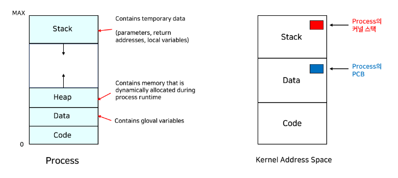
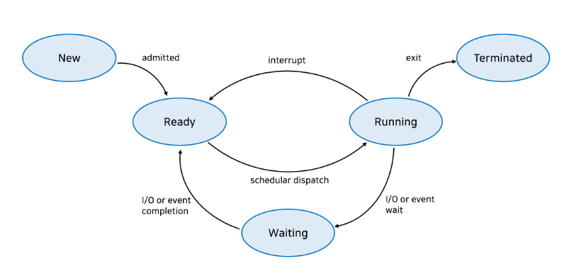
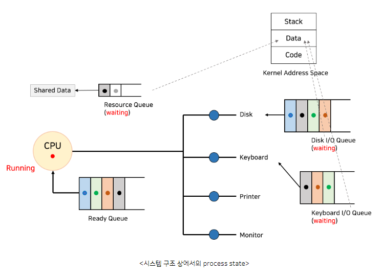
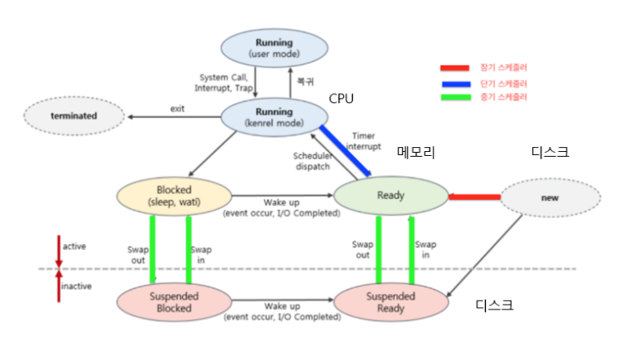
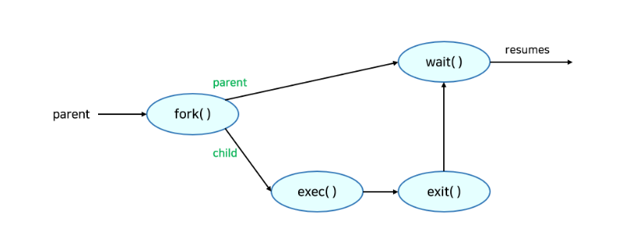
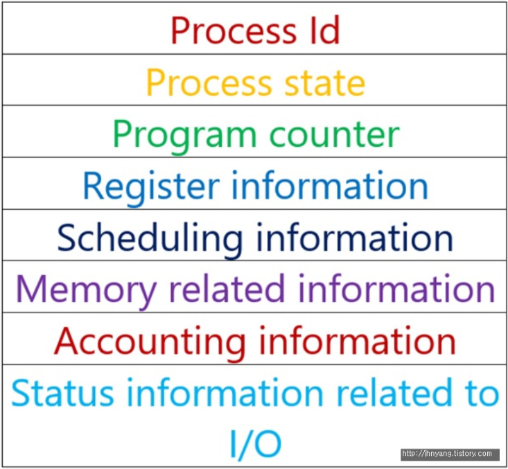

# 프로세스와 스레드
- 프로세스(process)는 **컴퓨터에서 실행되고 있는 프로그램**을 말하며 CPU 스케쥴링의 대상이 되는 작업이라는 용어와 거의 같은 의미로 쓰인다.
- 더 정확히는, **디스크에 있는 프로그램이 메모리에 로드되면 프로세스**가 된다.
- 스레드(Thread)는 프로세스 내 작업의 흐름을 지칭한다.
- 프로세스는 `스택(stack)`, `힙(heap)`, `데이터(data segment, BSS segment)`, `코드(code segment)`로 나뉜다.
- `프로세스 문맥(Process Context)`는 프로세스의 특정 시점의 상태를 표현하는 정보이다.
- `하드웨어 문맥(Hardware Context)`으로는 `프로그램 카운터(Program Counter)`, `각종 레지스터(Register)`가 있다. 이들을 이용해 해당 프로세스가 어디까지 실행되었는지를 알 수 있다.
> - 프로그램 카운터(Program Counter): CPU내부에 있는 레지스터 중 하나로서, 다음에 실행될 명령어의 주소를 가지고 있어 실행할 기계어 코드 위치를 지정한다. **명령어 포인터**라고도 한다.
- `프로세스 문맥`에 **주소공간(Address space)**도 포함되며, 프로세스 관련 커널 자료구조인 **PCB(Process Control Block)**, **프로세스 커널 스택(Process Kernel Stack)**도 포함된다.

## 프로세스 상태(Process State)
- 프로세스 상태는 여러가지 상태 값을 가지며 프로세스가 실행됨에 따라 달라진다.
1. New(생성): 프로세스가 처음 생성된 상태
> - 생성 상태는 프로세스가 생성된 상태를 의미하며, `fork()`, `exec()`함수를 통해 생성한다. 이때 PCB가 할당된다.
> - `fork()`: 부모 프로세스의 주소 공간을 그대로 복사하며, 새로운 자식 프로세스를 생성하는 함수이다. 주소 공간만 복사할 뿐, 부모 프로세스의 비동기 작업 등을 상속하지는 않는다.
> - `exec()`: 새롭게 프로세스를 생성하는 함수이다.
2. Ready(대기): 프로세스가 CPU에 할당되기를 기다리는 상태 (메모리 등 다른 조건 모두 만족)
> - 대기상태는 메모리 공간이 충분하면 메모리를 할당 받고, 아니면 아닌 상태로 대기하고 있으며, CPU 스케줄러로 부터 CPU 소유권이 넘어오기를 기다리는 상태이다.
3. Running(실행): 프로세스가 할당되어 CPU를 잡고 명령을 수행 중인 상태
4. Waiting(중단): 프로세스가 어떠한 이벤트가 발생하기를 기다리는 상태. CPU에 할당해도 당장 명령을 수행할 수 없는 상태
> - 자의적 wait: 할일이 없다 -> e.g) shell이 기다리는 것
> - 타의적 wait: 남이 쓰고 있따 -> e.g) resource 사용해야 하는데, 현재 내 차례가 아님.
5. Terminated(종료): 프로세스가 실행을 마쳤을 때, 아직 완전히 프로세스가 제거되진 않은 상태

- 프로세스가 만들어지는 과정의 상태가 new이고, 프로세스가 다 수행되어 종료할 때 잠시 생기는 상태가 terminated이다.
- 즉 new와 terminated 상태는 운영체제가 프로세스를 만들거나 종료시킬 때 잠시동안 임시적으로 있는 상태이고, running, waiting, ready 세 상태가 돌아가며 프로세스가 수행된다.

### 스케줄러(Scheduler)
1. 장기 스케줄러(Long-term scheduler)
- 메모리는 한정되어 있는데, 많은 프로세스들이 한꺼번에 메모리에 올라올 경우, 대용량 메모리(일반적으로 디스크)에 임시로 저장한다.
- 이 pool에 저장되어 있는 프로세스 중 어떤 프로세스에 메모리를 할당해 `ready queue`로 보낼지 결정하는 역할을 한다.
> - **Ready Queue**란: CPU는 컴퓨터에서 가장 비싼 연산 장치중 하라고, 본래 CPU는 ready queue에서 instruction을 하나씩 실행하는 것이 역할인데, **ready queue는 현재 메모리 내부에 있으면서 CPU요청을 기다리는 프로세스의 집합**이다.
> - new(disk) -> ready(memory)로 갈 프로세스를 스케줄링
> - 프로세스에 메모리 및 각종 리소스를 할당
> - `degree of multiprogramming(메모리에 올라간 프로세스의 수)`에 관여한다.
> - `멀티프로그래밍(Multiprogramming)`의 목적은 CPU를 최대한 사용하기 위해 몇몇 프로세스를 항상 실행시키는 것이다.
> - 하지만 요즘은 잘 안쓰고, 생성되면 바로 ready queue로 간다.
> - degree of multiprogramming은 중기 스케줄러가 조절한다,

2. 단기 스케줄러(Short-term scheduler or CPU scheduler)
> - CPU와 메모리 사이의 스케줄링을 담당(ready -> running -> waiting -> ready)의 스케줄링을 담당
> - `Ready Queue`에 있는 프로세스 중 어떤 프로세스를 running 시킬지 결정한다.
> - 실제 프로세스에 CPU 할당하는 것은 `Dispatcher`가 수행한다.
> - `Dispatch`: ready 상태에 있던 프로세스를 running 상태롤 만드는 것.

3. 중기 스케줄러(Mid-term scheduler or Swapper)
> - 여유공간(메모리)를 마련하기 위해서 프로세스를 통째로 메모리에서 디스크로 쫓아냄 (swapping)+
> - 프로세스에게서 메모리를 할당 해제(ready -> suspended)
> - 현 시스템에서 메모리에 너무 많은 프로그램이 동시에 올라가는 것을 조절한다. (메모리에 올라온 수, degree of multiprogramming) 조절함.
> - 중기 스케줄러에 의해 프로세스의 suspended(stopped)라는 상태를 추가적으로 나타낼 수 있다.
> - ***Suspended(stopped)** 외부적인 이유로 프로세스가 메모리에서 디스크로 내려간 상태(swap out), 스스로 event를 다시 기다리는 waiting 상태와 달리 외부적인 요인으로 인해 정지 되었기 때문에 스스로 다시 동작할 수 없다.

### CPU 스케줄러
- `Ready Queue`에 있는 프로세스들을 스케줄링하는 스케줄러(ready -> new)
- CPU 스케줄링에 사용되는 두가지 방식으로, `비선점형 방식`과 `선점형 방식`이 있다. 
1. `비선점형 방식`: 임의의 프로세스가 CPU를 할당 받으면 해당 프로세스가 terminated 될 때까지 cpu를 점유한다.
2. `선점형 방식`: 어떤 프로세스가 CPU를 할당 받더라도 우선순위가 더 높은 프로세스가 ready queue에 들어오거나 입출력이나 이벤트 대기, time out이 발생하는 경우 프로세스가 종료되지 않아도 다른 프로세스에 의해 CPU를 선점당할 수 있다.(다른 프로세스에게 CPU를 넘겨주고 대기상태가 된다.)
- 우선 순위가 가장 높은 프로세스에게 CPU를 할당하는 스케줄링인 우선순쉬 스케줄링과 알고리즘은 다음 내용에서 다루자..

### 프로세스를 스케줄링 하기 위한 세 가지 종류의 Queue
- `Job Queue`: 현재 시스템 내에 있는 모든 프로세스의 집합
> - 하드디스크에 있는 프로그램이 실행되기 위해 메인 메모리의 할당 순서를 기다리는 큐
> - 프로세스가 어떤 상태에 있는것과 관련없이 시스템 내의 모든 프로세스를 관리하기 위한 큐이다. 
> - ready queue, device queue에 대한 모든 프로세스가 속해있따.
> - 하지만 job queue에 있다고해서 모드 자신의 메모리 영역을 가지는 것은 아니다.

- `Ready Queue`: 현재 메모리 내에 있으면서 CPU를 기다리는 프로세스의 집합
> - 프로세스가 ready인 상태의 프로세스들이 cpu의 제어권을 얻기 위해서 대기하는 queue이다. 
> - 순서 결정은 어떤 cpu 스케줄링 방식을 선택하느냐에 따라 달라짐.
> - ready queue에서 차례까 발생되어 프로세스 다음 명령어 수행하다 device에 대한 작업 발생하면 device queue로 넘어감.

- `Device Queue`: Device I/O 작업을 대기하고있는 프로세스의 집합
> - 프로세스가 cpu 외의 자원을 기다리는 큐이다. 
> - 또한 기다리는 자원들마다 큐가 다르다.
> - device queue에서 해당 자원 사용하고 난 뒤 인터럽트 발생시키고, device queue 빠져나와 ready queue로 간다.

### 프로세스 관리 (Process Management)
- 대부분의 시스템에서 프로세스는 동시에 실행될 수 있고, 이들은 동적으로 생성되거나 삭제될 수 있다.
1. Process Creation(프로세스 생성)
- 프로세스는 부모 프로세스가 자식 프로세스를 생성하는 방식이다.
- 프로세스는 **트리(계층)**구조로 되어 있다.
- 프로세스는 PCB에 저장되어 있는 pid(process identifier) 값을 통해서 식별 되고 관리된다. 
- 프로세스는 자원이 필요한데, 자원은 운영체제로 부터 받거나 부모와 공유한다.
- 프로세스는 다음과 같이 각 특성마다 분류가 된다.
> - 자원 공유 (resource sharing option)
>   - 부모와 자식이 모든 자원 공유하는 모델 / 부모와 자식이 자원 일부 공유하는 모델 / 전혀 공유 하지 않는 모델
> - 수행 (Exection)
>   - 부모와 자식이 공존하며 동시에 수행되는 모델 / 자식이 종료될 때 까지 부모가 기다리는 모델
> - 주소 공간 (Address space)
>   - 자식이 부모의 공간을 복제하는 모델 / 자식이 해당 공간에 새로운 프로그램을 올리는 모델

- `fork()`: 프로세스 생성에 이용되는 시스템 콜. 부모를 그대로 복사하며 현재 프로세스와 pid만 다른 프로세스를 생성한다.
  - 같은 동작을 하는 프로세스가 두 개 존재하게 되며, 새로운 프로세스는 원래 프로세스 주소 공간의 복사본을 포함한다.
  - 두 프로세스는 fork() 뒤의 명령어들을 계속 수행한다. 이때 현재 프로세스가 부모 프로세스인지 자식프로세스인지는 fork()의 반환 값으로 구분한다.
  - 부모는 fork()의 반환값으로 0보다 큰 수(자식 프로세스의 pid)를 갖고, 자식은 fork()의 반환 값으로 0을 갖는다.
  - fork()는 heavy-weight한 시스템 콜이다. 부모 프로세스의 전체 복사본 생성하고 이를 자식 프로세스로 실행시키기 때문이다. 
  - 따라서 수행에 필요한 노력을 줄이기 위해 copy-on-write 기술을 사용한다
    - `copy-on-write`는 복사하는 작업을 부모나 자식이 page에 쓰기 작업을 하기 전까지 copy 작업을 지연시킴으로써 효율성을 높여주는 기술
    - 부모 프로세스가 fork 하여 생긴 자식 프로세스의 page를 공유하다가 자식이 page에 쓰기 작업을 할 때 해당 page만을 copy 하는 방식이다. 이를 통해 전체가 복사되는 현상을 방지한다.
    - `copy-on-write` 기술의 단점은 많은 양의 RAM이 사용되며 COPY를 하는데 시간이 오래 걸린다. 그리고 프로세스를 copy하자마자 exec를 통해 새로운 프로그램을 로드하는 경우 단점이 극대화된다.
    - 이러한 단점을 커널이 프로세스의 전체 주소 공간이 아니라 오직 page table만 복사함으로써 극복한다
  - vfork()라는 시스템콜도 존재하지만 fork에 copy-on-write 기술 사용하기 때문에 vfork가 특별히 유용하지 않고 잘 쓰지도 않는다.
  
- `exec()`: `fork()`다음에 이어지는 `exec()` 시스템 콜은 새로운 프로그램을 메모리에 올려 실행시킨다.
  - 어떤 프로그램이 완전히 새로운 프로세스로 태어나도록 하는 역할을 하며, 프로세스는 `exec()` 시스템콜을 통해 다른 프로그램을 수행할 수 있다.
  - 따라서 기존엔 부모 프로세스를 그대로 복사한 상태지만, exec() 시스템콜로 인해 다른 새 프로그램으로 덮어씌워진다.
  - fork 함수의 반환 값을 이용해서 만약 child인 경우 새로운 프로그램을 실행시키고 싶다면 exec( ) 시스템 콜을 사용하면 된다. exec( ) 시스템 콜을 사용하는 경우, 그 뒤의 명령어는 수행하지 않는다.

  - `wait()`: `wait()`시스템 콜은 만약 프로세스 A가 `wait()`를 호출하면 커널은 자식이 종료될 때까지 A를 sleep(blocked)시킨다.
    - 그리고 자식 프로세스가 종료되면 커널이 A를 깨워 ready 상태로 만든다. 

  
### Process Termination(프로세스의 종료)
1. 자발적 종료
  - 현재 프로세스가 마지막 statement를 수행하면, 운영체제에 exit() 명령어를 통해서 이를 알려준다.
  - 그러면 부모 프로세스가 현재 프로세스의 실행을 종료시키고, wait를 통해 자식으로부터 상태 값(status value)을 수집한다. 프로세스의 각종 자원들은 운영체제에 반납된다.
2. 비자발적 종료(kill)
  - 부모 프로세스가 자식 프로세스의 수행을 종료시킬 수도 있다. 
  - 자식이 할당된 자원의 한계치를 넘어서거나, 자식에게 할당된 작업이 더 이상 필요하지 않거나, 부모 프로세스가 종료되는 경우이다.
  - 프로세스의 비정상적인 종료로 인해 Zombie process나 Orphan process 같은 유형의 프로세스가 존재할 수 있다.
> - `Zombie process`: 실행이 끝났지만 프로세스 테이블에 엔트리(Entry)를 가지고 있는, 정보가 메모리에 남아있는 프로세스
> - `Orphan process`: 부모가 wait를 호출하지 않고 종료되었을 때의 자식 프로세스를 의미한다.
>   - 즉, 부모는 종료되었지만 자식은 수행 중인 경우이다. 
>   - 이런 경우엔 init process가 orphan process들의 새로운 부모로 할당되고, init process가 주기적으로 wait를 호출해서 orphan process들의 exit status를 수집한다.

## 프로세스의 메모리 구조
- 파일 시스템에 있는 실행 파일이 메모리에 적재될 때, 실행 파일 전체가 메모리에 올라가지 않는다.
- 일부분만 메모리에 올라가고 나머지는 디스크의 특정영역인 스왑 영역에 존재한다.
- 프로세스의 주소 공간은 `코드`,`데이터`,`스택`,`힙`의 영역으로 구분된다.
- 이러한 주소 공간을 우리는 가상 메모리 or 논리적 메모리라고 부른다

1. 코드 영역: 사용자가 작성한 프로그램 함수들의 코드가 CPU에서 수행할 수 있는 기계어 명령 형태로 변환되어 저장되는 공간
   - 파일(compile) 타임에 결정되고 중간에 코드를 바꿀 수 없게 Read-Only 로 되어있다.
2. 데이터 영역: 전역 변수 또는 static 변수 등 프로그램이 사용하는 데이터를 저장하는 공간
   - 전역 변수또는static 값을 참조한 코드는 컴파일이 완료되면 data 영역의 주소값을 가르키도록 바뀐다.
   - 전역변수가 변경 될 수도 있어 Read-Write로 되어있다.
3. 스택 영역: 호출된 함수의 수행을 마치고 복귀할 주소 및 데이터(지역변수, 매개변수, 리턴값 등)를 임시로 저장하는 공간
   - 이 영역은 함수 호출시 기록하고 함수의 수행이 완료되면 사라진다.
   - 메커니즘은 자료구조(stack)에서 배운 LIFO(Last In First Out) 방법을 따른다.
   - 컴파일 시 stack 영역의 크기가 결정되기 때문에 무한정 할당 할 수 없다. (stack overflow)
4. 힙 영역: 프로그래머가 필요할 때마다 사용하는 메모리 영역
   - heap 영역은 런타임에 결정된다.
   - 자바에서는 객체가 heap영역에 생성되고 GC에 의해 정리된다.

## 프로세스의 컴파일 과정
- 프로세스는 프로그램으로부터 인스턴스화된 것을 말한다. (예를 들어 프로그램은 구글 크롬 프로그램과 같은 실행파일, 그리고 클릭해 실행하면 프로세스가 시작되는 것)
- `Compile(컴파일)`: 인간이 이해할 수 있는 언어로 작성된 소스코드를 CPU가 이해할 수 있는 언어로 번역 하는 작업을 말한다.
- 소스코드는 컴파일을 통해 기계어로 이루어진 실행파일이 실행된다. 이 파일을 실행하면 실행 파일 내용이 운영체제의 Loader를 통해 메모리에 적재되어 프로그램이 동작한다.
- 컴파일 과정은 **4가지 단계(전처리 - 컴파일 - 어셈블리 - 링킹)**로 나누어 진다.
- 이 4가지 단계를 묶어 컴파일 과정, 빌드 과정이라고 부르기도 하고, 컴파일 과정과 링킹 과정을 따로 나눠 부르기도 한다.
- `build(빌드) 과정`: 컴파일 과정보다 넓은 의미로 사용됨. (build = compile + linking)

1. 전처리 과정(pre-processing)
   - preprocessor(전처리기)를 통해서 소스코드 파일을 전처리된 소스코드 파일로 변환하는 과정
     - **주석제거**: 소스코드에 주석을 전부 제거함
     - **헤더파일 삽입**: #include 지시문 만나면 해당하는 헤더 파일을 찾아 헤더 파일에 있는 모든 내용을 복사해 소스코드에 삽입힌다.
       - 헤더 파일에 있는 모든 내용을 복사해 소스코드에 삽입한다.
       - 헤더 파일은 컴파일에 사용되지 않고 소스 코드 파일 내에 전부 복사된다.
       - 헤더 파일에 선언된 함수 원형은 후에 링킹 과정을 통해 실제로 함수가 정의되어 있는 오브젝트 파일(컴파일된 소스 코드 파일)과 결합한다.
     - **매크로 치환 및 적용**:  #define 지시문에 정의된 매크로를 저장하고 같은 문자열을 만나면 #define 된 내용으로 치환한다. 간단하게 말해 매크로 이름을 찾아서 정의한 값으로 전부 바꿔준다.
2. 컴파일 과정(Compilation)
   - `컴파일(Compilation)`과정은 컴파일러를 통해 전처리된 소스파일을 어셈블리어 파일로 변환하는 과정이다.
   - 이 과정에서 우리가 일반적으로 컴파일하면 생각하는 언어의 문법 검사가 이루어진다. 또한 static한 영역(Data, BSS영역)들의 메모리 할당을 수행한다.
   > - 기계어는 다른말로 명령어라고 부르는데, 명령어는 이진수로 이뤄진 숫자로 CPU 종류마다 고유한 내용을 가지고 있다.
   > - 어셈블리어는 이런 명령어를 사람이 이해할 수 있게 부호화한 것으로, CPU 명령어(기계어)와 1대 1로 매칭된다.

3. 어셈블리 과정
   - 어셈블리 과정은 어셈블러를 통해 어셈블리어 파일을 오브젝트 파일로 변환하는 과정이다.
   > - 어셈블리 코드는 이제 더 이상 사람이 알아볼 수 없는 기계어로 변환되는데, 이를 **오브젝트 코드**라고 한다.
   > - 오브젝트 파일이란?: 오브젝트 코드로 구성된 파일을 **오브젝트 파일**이라 부르며 이 오브젝트 파일은 특정한 파일 포멧을 가진다(PE(Portable Executable - Window), ELF(Executable and Linking Format - Linux))
   > - 오브젝트 파일을 실행하기 위해서는 라이브러리의 함수를 구현한 오브젝트 파일을 연결시키는 작업이 필요한데, 그것을 링킹이라고 부른다.

4. 링킹(Linking) 과정
- 링커(Linker)를 통해 오브젝트 파일을 묶어 실행 파일로 만드는 과정이다.
- 이 과정에서 오브젝트 파일들과 프로그램에서 사용하는 라이브러리 파일들을 링크하여 하나의 실행 파일을 만든다.
- 라이브러리를 링킹하는 방법에 따라서 `정적 링킹(Static Linking)`과 `동적 링킹(Dynamic Linking)`으로 나뉜다.
- 링커의 역할은 크게 **심볼 해석**과 **재배치**로 나눌 수 있다.
    1. **심볼해석**: 각 오브젝트 파일에 있는 심볼 참조를 어떤 심볼 정의에 연관시킬지 결정하는 과정.
       - 여러 개의 오브젝트 파일에 같은 이름의 함수 또는 변수가 정의되어 있을 때 어떤 파일의 함수를 사용할지 결정
    2. **재배치(Relocation)**: 오브젝트 파일에 있는 데이터의 주소나 코드의 메모리 참조 주소를 알맞게 배치하는 과정
       - 링커가 컴파일러가 생성한 오브젝트 파일을 모아서 하나의 실행 파일을 만들 때, 각 오브젝트 파일에 있는 데이터의 주소나 코드의 메모리 참조 주소가 링커에 의해 합쳐진 실행 파일에서의 주소와 다르기 때문에 그것을 알맞게 수정해줘야 한다.

## PCB(Process Control Block)
- PCB란 운영체제에서 프로세스에 대한 메타데이터를 저장한 데이터를 말한다.
- 프로세스 제어 블록이라고도 한다.
- 프로세스가 생성되면 운영체제는 해당 PCB를 생성한다.
- 프로그램이 실행되면 프로세스가 생성되고 프로세스 주소 값들에 메모리가 할당된다. 이 프로세스의 메타데이터들이 PCB에 저장되어 관리된다.
- PCB는 프로세스의 중요한 정보를 포함하고 있기 때문에 일반 사용자가 접근하지 못하도록 커널 스택의 가장 앞부분에 관리된다.
> **메타데이터**: 데이터에 관한 구조화된 데이터이자 데이터를 설명하는 작은 데이터.

프로세스를 프로그램을 실행 시키는 실헹 주체인 인스턴스라고 표현을 하지만, 다음과 같이 표현할 수도 있다.
> 프로세스는 프로세서에 의해 수행되는 프로그램 단위로 현재 실행중이거나 곧 **실행가능한 PCB(Process Control Block)을 가진 프로그램**이다.

그래서 PCB란 무엇인가..?

PCB란 운영체제가 프로세스를 제어하기 위해 정보를 저장해 놓은 곳으로, 프로세스의 상태 정보를 저장하는 구조체이다.
- 프로세스 상태 관리와 문맥 교환(Context Switching)을 위해 필요하다.
- PCB는 프로세스 생성 시 만들어지며 주 기억장치 (RAM)에 유지된다.

인터넷을 하면서 음악도 듣고, 채팅도 할 수 있는 등 동시에 많은 일을 컴퓨터는 동시에 처리하는 것이 아니라, `Time Sharing`이라 해서 짧을 시간 동안 왔다갔다 번갈아 가면서 처리해 주는데,
이 방법이 효율적이고 빨라서 느끼지 못하는 것이다. 이 것을 운영체제가 해준다.

이 과정에 있어서, 프로세스들이 교체되어 수행되고 나면, 다시 다른 프로세스를 불러와야 하는데, 이 말은 **이전 작업에 대한 내용을 기억하고 있다**는 이야기다.

이것은 **이전 작업에 대한 내용을 기억하고 있다**는 말인데, **프로세스 단위로 정보를 저장해주는 BLOCK**이 있는데 이것이 바로 PCB이다.

운영체제는 하드웨어가 효율적으로 동작할 수 있도록 관리해주는 결국 소프트웨어, 프로그램이다.

운영체제라는 프로그램이 프로세스를 하나 만들어 실행하려면, 프로세스와 관련된 데이터 구조가 있어야 한다.
그 프로세스에 대한 기본적인 정보, 메타데이터를 PCB라고 한다.

프로세스에 저장되어야 할 데이터들을 하나의 Structure로 만들어 놓은 것을 뜻하기 때문에, 이런 블럭들이 있어 스위칭 되어도 기억을 하고 이어서 실행 할 수 있다.

### PCB에서 유지되는 정보

- PID: 프로세스 고유 번호
- 상태: READY, WAITING, RUNNING 등의 프로세스 상태
- 포인터: 다음 실행될 프로세스의 포인터
- Register save area: 레지스터 관련 정보
- Priority: 스케줄링 및 프로세스 우선순위
- 할당된 자원 정보
- Account: CPU 사용시간, 실제 사용된 시간
- 입출력 상태 정보

### Context Switching의 수행 과정과 PCB의 역할
- RUNNING 상태의 프로세스 정보는 CPU의 내부인 레지스터에서 저장하고 있다. (따라서 이까지는 정보를 담는 저장소 레지스터가 있으니 PCB라는 저장공간이 따로 필요 없다.)
- 레지스터 내부에는 PC(Program Counter), 스택 포인터 등이 있다.
> - `스택포인터(Stack Pointer)`: 중앙처리 장치 안에는 스택에 데이터가 채워진 위치를 가리키는 레지스터인 `스택 포인터(SP)`가 있다.
>   - 스택 포인터가 가리키는 곳까지가 데이터가 채워진 영역이고, 그 이후부터 스택 끝까지는 비어있는 영역이다.

그러면 PCB는 언제 필요한 것일까?

Process A가 수행되고 있을 때, CPU의 레지스터들은 A의 상태로 수행이 되고 있다.

그러다가 interrupt나 system call이 발생하면, 운영체제가 지금 수행되는 것을 먼저 저장한다.

그러면 프로세스 상태가 WAITING으로 변하게 되는데, 변하면 CPU가 다른 프로세스를 RUNNING으로 바꿔 올려버린다. 

그리고 레지스터의 저장 값이 앞으로 수행할 프로세스에 관한 정보로 교체될 것이다. 

CPU는 레지스터에 있는 정보를 보고 처리작업을 수행하기 때문에 당연히 새 프로세스 실행을 위해 기존 프로세스 정보는 다른데로 가야하는데, 
이 CPU의 레지스터들의 값이 다른 것으로 바뀌기 전에 어딘가에 저장을 하고 나가는데, 이때 PCB에 CPU에서 수행되던 레지스터 값들이 저장된다.

즉, 내가 수행하던 프로세스가(Interrupt가 발생하고 WAITING으로 넘어가는 프로세스) 어디까지 실행되었는지 기록하는 PC, 스택 포인터의 위치,
그 외 register들의 집합 정보를 잠시 PCB에 저장한다.

따라서, Process B를 수행하기 위해서 PCB0에다 Process A에 대한 정보를 저장하고,
레지스터에 PCB1에 저장되어 있던 Process B에 대한 정보를 가져와 Process B를 수행시킨다.

이러한 저장공간을 PCB라고 하고, 이렇게 수행중인 프로세스를 변경할 때 레지스터에 프로세스의 정보가 바뀌는 것을 **Context Switching**이라고 한다.

이러한 Context Switching은 interrupt가 발생하거나, 실행 중인 프로세스가 CPU사용을 허가받은 시간(Time Quantum)을 모두 소모하거나,
I/O 입출력을 위해 대기해야 하는 경우에 발생한다.

즉, 프로세스가 READY -> RUNNING, RUNNING -> READY, RUNNING -> WAITING으로 상태 변경시 발생한다.

### 문맥교환의 Overhead

- Administrative Overhead
  > `Overhead`란 말은 부정적인 의미로, 과부하, 부하 정도로 이해하면 된다.

Process A가 수행되다가 Process B로 넘어가는 Context Switching이 일어나면, 지금 현재 수행되는 것을 메모리에다가 저장해야 하고,
그 다음 메모리에 있는 것을 다시 CPU로 넣어야 하는데, 이 작업이 사실은 Context Switching이 없으면 할 필요 없는데, 왜 이렇게 시간이 더 많이 드는 일을 할까

프로세스가 I/O 이벤트가 디스크에 명령을 내렸는데 끝날때까지 기다려야하는데 다른 프로세스로 안바꾸고 그냥 
CPU가 가만히 있으면 CPU가 낭비되는 것이기 때문에, 다른 프로세스로 바꾸면서까지 CPU를 써먹는게 더 이익이다.

**즉, 이정도의 Overhead를 치르면서도 기존 프로세스를 새 프로세스로 바꾸는 것이 더 낫다는 것이다.**

Context Switching이 일어날 때, 앞의 그림처럼 `유휴 시간(idle time)`이 발생 하는 것을 볼 수 있다. 
> - **IDLE**: 프로세스가 실행하고 있지 않은 상태를 말한다.  

## Reference:
- [프로그램 카운터](https://ko.wikipedia.org/wiki/%ED%94%84%EB%A1%9C%EA%B7%B8%EB%9E%A8_%EC%B9%B4%EC%9A%B4%ED%84%B0)
- [운영체제 - 프로세스](https://rebro.kr/172)
- [프로세스 상태](https://jhnyang.tistory.com/7)
- [운영체제 - 스케줄러](https://velog.io/@byunji_jump/%EC%9A%B4%EC%98%81%EC%B2%B4%EC%A0%9C-%EC%8A%A4%EC%BC%80%EC%A4%84%EB%9F%AC)
- [CPU 스케줄링 - ready queue](https://www.oowgnoj.dev/post/os-cpu-sched)
- [프로세스 스케줄링](https://velog.io/@asdfg5415/%EC%9A%B4%EC%98%81%EC%B2%B4%EC%A0%9C-%ED%94%84%EB%A1%9C%EC%84%B8%EC%8A%A4-%EC%8A%A4%EC%BC%80%EC%A4%84%EB%A7%81)
- [프로세스의 컴파일 과정](https://bradbury.tistory.com/226#:~:text=%EC%BB%B4%ED%8C%8C%EC%9D%BC%20%EA%B3%BC%EC%A0%95%EC%9D%80%204%EA%B0%80%EC%A7%80,%EB%94%B0%EB%A1%9C%20%EB%82%98%EB%88%A0%EC%84%9C%20%EB%B6%80%EB%A5%B4%EA%B8%B0%EB%8F%84%20%ED%95%9C%EB%8B%A4.)
- [PCB와 Context Switching](https://jhnyang.tistory.com/33)
- [IDLE 상태](https://boradol0902.tistory.com/35)