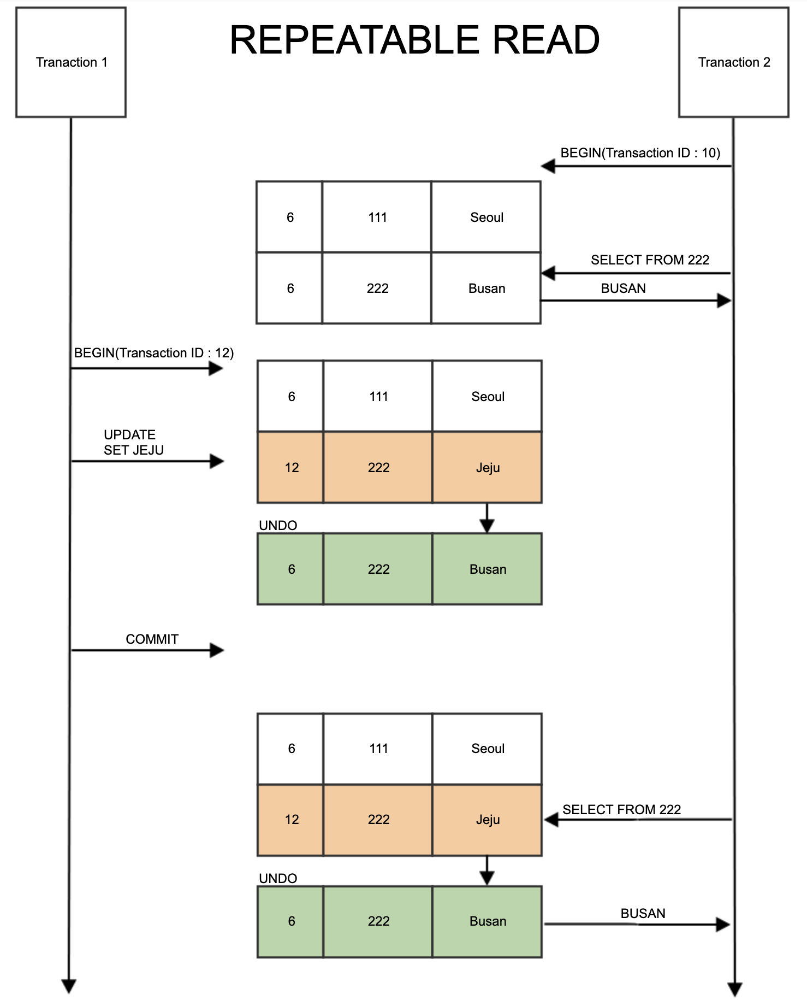
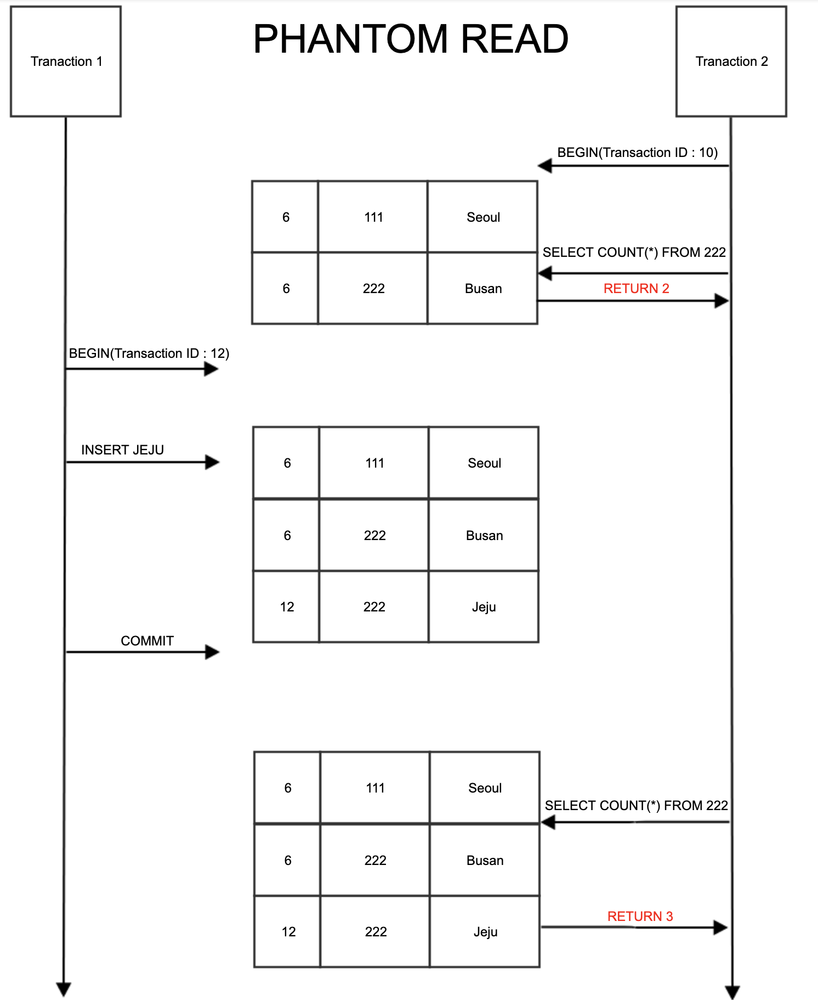

## 트랜잭션과 무결성

우리가 솔직히 말해서 DB를 사용하는 이유가 뭘까? 생각해볼 필요가 있다. 실제로 그냥 문서에 저장해서 데이터만 끌어오면 read/write과정이 더 빠르지 않을까? 하고 생각할 수 있다.

**그런데도 우리가 DB를 사용하는 이유는 바로 트랜잭션이라는 친구 때문이다.**

### 트랜잭션이 뭔가?

> - 트랜잭션 : 그대로 번역하면 거래이다. 데이터베이스에서 하나의 거래를 안전하게 처리하도록 보장해주는 것을 뜻하는 것이다.
> - 실제 의미 : 트랜잭션(Transaction 이하 트랜잭션)이란, 데이터베이스의 상태를 변화시키기 해서 수행하는 작업의 단위를 뜻한다.

그래서 트랜잭션을 사용하는 이유는 안전하게 거래를 해줄 수 있도록 보장해주기 위해서 존재하는 친구이다. 

보통 가장 많이 나오는 예시로 은행의 계좌 2개를 예시로 든다.

> 사용자 A, 사용자 B가 있는데 거래를 하려고 한다. A의 계좌에서 B의 계좌로 5000원을 보낸다는 작업을 하였을 때, A계좌에서 
> 5000원을 빼고 B에 5000원을 추가시켜야 한다. 이런 과정을 보장해주는 것이 트랜잭션이다.

수행하는 작업의 단위라고 했는데 다음과 같은 행위들이다.

- SELECT
- INSERT
- DELETE
- UPDATE

작업의 단위가 질의어 한문장이 아니라는 점이다. select, insert, delete 여러개 뭉쳐서 한 작업단위라고도 할 수 있다.

### 트랜잭션의 특징

크게 4가지로 구분된다. ACID라고 불린다.

- 원자성(Atomicity) : 트랜잭션이 데이터베이스에 모두 반영되던가, 아니면 전혀 반영되지 않아야 한다. 
- 일관성(Consistency): 트랜잭션의 작업 처리 결과가 항상 일관성이 있어야 한다는 것이다.
- 독립성(Isolation) : 어떤 하나의 트랜잭션이라도, 다른 트랜잭션의 연산에 끼어들 수 없다는 점을 가리킨다.
- 지속성(Durability) : 트랜잭션이 성공적으로 완료됬을 경우, 결과는 영구적으로 반영되어야 한다는 점이다. 중간에 시스템에 문제가 발생해도 데이터베이스 로그 등을 사용해서 성공한 트랜잭션 내용을 복구해야 한다.

### 트랜잭션의 Commit, Rollback 연산

- Commit : 하나의 트랜잭션이 성공적으로 끝났고, 데이터베이스가 일관성에 있는 상태일 때 하나의 트랜잭션이 끝났다는 것을 알려주는 연산이다.

쉽게 정리하면 Commit이 되면 정상적으로 하나의 트랜잭션이 끝난다는 말로도 쓰인다.

- Rollback : 하나의 트랜잭션 처리가 비정상적으로 종료되어 트랜잭션의 원자성이 깨진경우, 트랜잭션을 처음부터 다시 시작하거나, 트랜잭션의 부분적으로만 연산된 결과를 다시 취소시킨다.

Rollback을 통해 취소가 될 때 하나의 묶음인 과정(트랜잭션)을 일어나기 전으로 돌리는 것이다. 

이런 커밋과 롤백 덕분에 데이터의 무결성이 보장이 된다!

### 중요하게 봐야할 독립성(Isolation)

여기서 다른 원자성, 일관성, 지속성은 어찌보면 당연한 말일 수도 있지만 여기선 격리성(isolation)이 엄청 중요하다.

왜냐하면 트랜잭션이 원자,일관,지속성은 **보장**을 하지만 **격리성**을 보장을 하기 위해서는 트랜잭션을 거의 순서대로 진행을 시켜줘야한다. 그런데 그렇게 진행을 시킬 경우에는 생각해 볼 수 있는 것이 동시성 문제이다.

너무 성능이 나빠진다. 왜냐하면 순서대로 진행을 하면 뒤에 있는 작업들은 다 대기한 상태로 있어야 하기 때문이다. 뒤에 10만명이 대기하고 있으면 너무 별로이다.

그래서 ANSI 표준에서 트랜잭션의 격리 수준을 4단계로 나누어서 설명을 해준다.

### 트랜잭션 격리수준
1. READ UNCOMMITED(커밋되지 않은 읽기)   
2. READ COMMITTED(커밋된 읽기) 
3. REPEATABLE READ(반복 가능한 읽기) 
4. SERIALIZABLE(직렬화 가능) 

1단계에서 4단계로 갈수록 격리성이 올라가고 동시성이 떨어진다. 그래서 성능면으로 따지면 1단계가 제일 빠르다.

### READ UNCOMMITTED

- 말 그대로 커밋되지 않은 읽기이다. 
- 쉽게 생각해서 트랜잭션 A, B가 있다고 하자. 그렇게 A에서 어떤 값을 갱신하였다. 그런데 그 때 아직 커밋이 되지 않은 상태일때 B가 다시 데이터를 조회하면?
커밋이 되지 않은 갱신된 값이 B에게 보여진다. 이런 것을 `Dirty Read`라고 한다.

> Dirty read: 반복 가능하지 않은 조회와 유사, 한 트랜잭션이 실행 중일 때 다른 트랜잭션에 의해 수정되었지만 아직 '커밋되지 않은' record를 읽을 수 있을 때 발생한다.

그런데 사실 `정합성의 문제가 많은 격리 수준이기 때문에 RDBMS 표준에서는 격리수준으로 인정하지 않습니다.` 격리가 어찌보면 잘 안되는 친구이기에 다음과 같은 말이 나온 거 같다.

### READ COMMITTED

- 이 격리 수준은 반드시 커밋이 되야만 다른 트랜잭션에서 조회할 수 있는 것이다. 대부분 RDBMS은 이 격리 수준을 사용한다. 
- `Dirty read`문제가 해결된 격리 수준이다.
-  트랜잭션에서 조회를 할 시 `undo log`를 활용하여 백업된 레코드 값을 가져온다.
- read committed도 사실 단점이 존재한다.
  -  하나의 트랜잭션내에서 똑같은 SELECT 쿼리를 실행했을 때는 항상 같은 결과를 가져와야 하는 REPEATABLE READ의 정합성에 어긋난다.
  -  트랜잭션 A에서 커밋이 된 후에 B에서 값을 조회하면 B에서 가지고 있던 트랜잭션에서의 결과가 아닌 다른 값이 된다는 것이다. 
  -  위 문제를 `Non-Repeatable-Read`라고 부른다.
> undo log: 실행 취소 로그 레코드의 집합으로 Transaction 실행후 Rollback 시 Undo Log 를 참조해 이전 데이터로 복구할수 있도록 로깅 해놓은 영역이다.
> **트랜잭션에서 다음 유형별로 하나씩 최대 4개의 Undo Log 가 할당된다.**
> - 사용자정의 테이블에 INSERT 할때
> - 사용자정의 테이블에 UPDATE, DELETE 할때
> - 사용자정의 임시테이블에 INSERT 할때
> - 사용자정의 임시테이블에 UPDATE, DELETE 할때

그래서 계속 작업을 할 때 undo log를 활용하여 값을 바꾸고 하는 작업들을 진행한다. 

### REPEATABLE READ

- 트랜잭션이 시작되기 전에 COMMIT된 내용에 대해서만 조회할 수 있는 격리 수준이다.
- MySQL에서는 트랜잭션마다 트랜잭션 ID를 부여하여 트랜잭션 ID보다 작은 트랜잭션 번호에서 변경된 것만 읽는다.
- 변경되기 전 레코드는 Undo 공간에 백업해두고 실제 레코드 값을 변경한다(백업된 레코드가 많아지면 MySQL의 성능이 저하된다)
- MySQL 의 InnoDB라는 스토리지 엔진에서 기본적으로 사용되는 격리 수준이다.
    - 트랜잭션이 Rollback 될 경우를 대비하여 변경 전 데이터를 언두(UNDO) 에 백업해두고 실제 레코드 값을 변경 하게 됩니다. 그리고 트랜잭션이 COMMIT 을 하기전에 다른 세션에서 해당 데이터를 조회시 언두를 참조하여 이전 값을 보여주는 것을 MVCC 라고 합니다
    - read committed에서도 일어나긴 하지만 여기서는 더 세부적인 버전관리를 더 해준다고 이해를 하면 된다.
- `Phantom Read`라는 문제가 발생한다.
  - 

  - Non-Repeatable Read의 한 종류로 조회해온 결과의 행이 새로 생기거나 없어지는 현상이다.
  - 이 작업을 해결하기 위해선 write Lock을 걸어줘야 한다고 한다.

### SERIALIZABLE
- 가장 단순하지만 엄격한 격리수준이다.
- 성능 측면에서 가장 느리다. 
- 선착순대로 트랜잭션을 처리한다고 생각하면 된다.

### 데이터 무결성

> 무결성 : 데이터의 정확성, 일관성, 유효성을 유지하는 것을 말한다.
(무결성-데이터가 정확하고 완전해야 함을 의미)
> 
무결성이 유지된다는 것은 DB에 저장된 데이터 값과 그 값에 해당하는 현실 세계의 실제 값이 일치하는지에 대한 신뢰가 생긴다.

- 개체 무결성 : 기본키로 선택된 필드는 빈 값을 허용하지 않습니다.
- 참조 무결성 : 서로 참조 관계에 있는 두 테이블의 데이터는 항상 일관된 값을 유지해야 한다.
- 고유 무결성 : 특정 속성에 대한 고유한 값을 가지도록 조건이 주어진 경우 그 속성 값은 모두 고유한 값을 가진다.
- NULL 무결성 : 특정 속성 값에 NULL이 올 수 없다는 조건이 주어진 경우 그 속성 값은 NULL이 될 수 없다는 제약 조건이다.

### 데이터 정합성
> 데이터 정합성 : 어떤 데이터들이 값이 서로 일치함.
- 중복 데이터를 많이 사용하면 데이터끼리 정합성을 맞추기 어렵다.
- 비정규형을 사용해 아노말리(Anomaly : 이상현상)가 발생하면 정합성이 깨진다.
- 정합성은 데이터가 서로 모순 없이 일관되게 일치해야 함을 의미

### 무결성 vs 정합성

- 무결성의 정의가 정합성보다 넓은 범위이다.
- 어떤 데이터가 정합성에는 이상이 없어도 무결성은 훼손이 될 수 있다. (중간에 변화를 주었다가 다시 돌이킨 경우)
- 무결성이 지키는 것이 제일 좋다. 자동적으로 정합성도 지켜지기 때문에

### 출처
- https://nesoy.github.io/articles/2019-05/Database-Transaction-isolation
- https://akasai.space/db/about_isolation/
- https://hoing.io/archives/4080
- https://hudi.blog/transaction-isolation-level/
- https://mommoo.tistory.com/62
- https://www.inflearn.com/course/%EC%8A%A4%ED%94%84%EB%A7%81-db-1/unit/110082?tab=curriculum