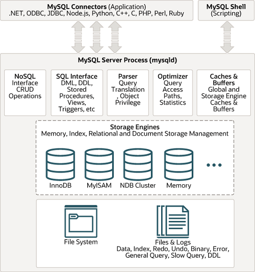

## 데이터베이스 종류

### 관계형 데이터베이스
> 관계형 데이터베이스(RDB)는 테이블, 행, 열의 정보를 구조화하는 방식입니다. RDB에는 테이블을 조인하여 정보 간 관계 또는 링크를 설정할 수 있는 기능이 있어, 여러 데이터 포인트 간의 관계를 쉽게 이해하고 정보를 얻을 수 있습니다. 

### 관계형 데이터베이스의 이점

- 유연성 : 필요할 때마다 간편하게 테이블, 관계를 추가 삭제를 할 수 있다.
- ACID 규정 준수 : ACID라는 트랜잭션의 특징을 준수하기 때문에 잠재적인 오작동 관계없이 데이터 유효성 검사가 가능하다.
- 사용 편의성 : 기술자가 아닌 사용자도 SQL을 통해 복잡한 쿼리를 쉽게 실행할 수 있다.
- 공동 작업 : 여러 사용자가 동시에 데이터 운영 및 액세스할 수 있다. 기본 제공되는 `잠금` 기능으로 업데이트 도중 데이터에 동시 액세스 할 수 없다. 
- 내장된 보안 기능 : 역할 기반 보안을 통해 데이터 액세스가 특정 사용자로 제한된다.
- 데이터베이스 정규화 : 정규화 설계 기법을 사용하기에 데이터 무결성을 개선시켜준다.

### 관계형 데이터베이스 종류(인기 순)

- Oracle
  -  Oracle Database는 관계형 모델을 객체-관계형 모델로 확장하여 복잡한 비즈니스 모델을 관계형 데이터베이스에 저장할 수 있도록 합니다.
- MySQL 
  - 무료이다.
  - MySQL 소프트웨어는 오픈 소스입니다.
  - MySQL 데이터베이스 서버는 매우 빠르고 안정적이며 확장 가능하고 사용하기 쉽습니다.
  -  MySQL Server는 클라이언트/서버 또는 임베디드 시스템에서 작동합니다.
- SQL Server
  - C 및 C++로 작성되었다.
  - SQL Server는 Azure SQL Server로 Microsoft Azure 클라우드의 일부이기도 한다.
- PostgreSQL
  - 가장 복잡한 데이터 워크로드를 안전하게 저장하고 확장하는 많은 기능과 결합된 SQL 언어를 사용하고 확장하는 강력한 오픈 소스 객체 관계형 데이터베이스 시스템이다.
  - SQL 뿐만 아니라 JSON을 이용해 데이터에 접근할 수 있다.
  - 지정 시간에 복구하는 기능, 로깅, 접근 제어, 중첩된 트랜잭션, 백업 등을 할 수 있다.
- MariaDB
    - MySQL의 원래 개발자가 만들었고 오픈 소스를 유지하도록 보장한다.
    - 주목할만한 사용자로는 Wikipedia, WordPress.com 및 Google이 있다.
    -  빠르고 확장 가능하며 견고하며 스토리지 엔진, 플러그인 및 다양한 사용 사례에 매우 다재다능하게 만드는 기타 여러 도구의 풍부한 생태계를 갖추고 있기 때문에 사용된다.

이외에도 여러가지 RDBMS들이 많지만 실제로는 MySQL을 가장 많이 사용하는 거 같아 조금 더 깊게 알아보려고 한다. 

### MySQL 스토리지 엔진 구조

https://dev.mysql.com/doc/refman/8.0/en/pluggable-storage-overview.html

우선 그림으로 보면 위와 같은 구조로 구성이 되어져 있다. 우리가 흔히 MySQL 서버라고 부르는 친구는 **MySQL 엔진 + 스토리지 엔진**이라고 볼 수 있다.

그 중 mysql 엔진에서 MySQL 엔진은 클라이언트로부터 오는 요청 처리(요청된 SQL 문장을 분석, 최적화, ...)를 담당하고, 스토리지 엔진은 실제 데이터를 디스크 스토리지에 저장하거나 조회하는 부분을 담당한다.

위 그림에서 나온 것처럼 InnoDB가 현재에는 기본 스토리지 엔진으로서 작동하고 있다. MySQL5.5버전 이후부터이다. 그 이전에는 MyISAM이 담당을 했었다고 한다.

--- 

### NoSQL이란?
> "Not only SQL"로, SQL만을 사용하지 않는 데이터베이스 관리 시스템(DBMS)을 지칭하는 단어이다. 관계형 데이터베이스를 사용하지 않는다는 의미가 아닌, 여러 유형의 데이터베이스를 사용하는 것이다

### NoSQL 특징

- RDBMS와 달리 데이터 간의 관계를 정의하지 않는다.
  - RDBMS는 데이터 관계를 외래키 등으로 정의하고 JOIN 연산을 수행할 수 있지만, NoSQL은 JOIN 연산이 불가능하다.
- RDBMS에 비해 대용량의 데이터를 저장할 수 있다.
  - 페타바이트 급의 대용량 데이터를 저장할 수 있다.
- 분산형 구조이다.
  - 여러 곳의 서버에 데이터를 분산 저장해 특정 서버에 장애가 발생했을 때도 데이터 유실 혹은 서비스 중지가 발생하지 않도록 한다.
- 고정되지 않은 테이블 스키마를 갖는다.
  - RDBMS와 달리 테이블의 스키마가 유동적이다. 데이터를 저장하는 칼럼이 각기 다른 이름과 다른 데이터 타입을 갖는 것이 허용된다.

### NoSQL이 RDBMS에 비해 가지는 특징
- 유연성
  - SQL 데이터베이스를 사용하면 데이터가 저장되는 방식이 훨씬 더 엄격하고 설정됩니다.
  - NoSQL을 사용하면 엄격한 스키마를 따르지 않고도 덜 구조화된 방식으로 데이터를 저장할 수 있습니다. 
  - 이 디자인을 통해 새로운 아이디어를 제시하고 응용 프로그램을 빠르게 만들 수 있습니다. 
  - 개발자는 스키마에 대해 걱정할 필요 없이 고객에게 더 도움이 되는 시스템을 만드는 데 집중할 수 있습니다.
- 고성능
  - NoSQL 데이터베이스는 매일 테라바이트의 데이터를 수집하고 고도의 대화식 사용자 경험이 필요한 애플리케이션에 활용됩니다. 
  - NoSQL 데이터베이스도 데이터를 수집하고 빠르고 안정적으로 전달할 수 있기 때문에 이러한 데이터베이스는 데이터를 수집하는 앱에 사용됩니다.
- 고수준
  - NoSQL 데이터베이스는 저장할 수 있는 데이터 양에 대한 요구 사항이 매우 높은 분산 데이터 저장소를 위해 특별히 개발되었습니다. 
  - 이 때문에 NoSQL은 대용량 데이터, 실시간 웹 앱, 온라인 쇼핑, 온라인 게임, 사물 인터넷, 소셜 네트워크를 처리하는 애플리케이션에 가장 적합한 옵션입니다.
- 확장성 
  -  확장을 위해 더 많은 서버를 추가하는 대신 NoSQL 데이터베이스는 확장을 위해 저렴한 하드웨어를 사용할 수 있습니다. 
  - 이렇게 하면 다운타임 없이 수요를 따라갈 수 있도록 더 많은 트래픽을 처리할 수 있습니다. 
  - NoSQL 데이터베이스는 확장을 통해 더 크고 강력해질 수 있으므로 항상 변경되는 데이터 세트에 가장 적합한 선택입니다.

### NoSQL이 RDBMS에 비해 가지게 되는 단점
- 데이터 업데이트 중 장애가 발생하면 데이터 손실 발생 가능
- 많은 인덱스를 사용하려면 충분한 메모리가 필요. 인덱스 구조가 메모리에 저장
- 데이터 일관성이 항상 보장되지 않음

### NoSQL의 저장방식에 따른 종류들

NoSQL은 저장방식에 따라 사용하는 DBMS의 종류가 다르다. 각각의 방식에 따른 DBMS는 다음과 같다.

- Key-value 저장 : 기본적인 패턴으로 KEY-VALUE 하나의 묶음(Unique)으로 저장되는 구조로 단순한 구조이기에 속도가 빠르며 분산 저장 시 용이하다.
  - Ex) Redis, Oracle NoSQL Database, VoldeMorte
- Documented : 테이블의 스키마가 유동적, 즉 레코드마다 각각 다른 스키마를 가질 수 있다.
보통 XML, JSON과 같은 DOCUMENT를 이용해 레코드를 저장한다. 트리형 구조로 레코드를 저장하거나 검색하는 데 효과적이다.
  - Ex) MongoDB, CouchDB, Azure Cosmos DB

- Graph : 데이터를 노드로(그림에서 파란, 녹색 원) 표현하며 노드 사이의 관계를 엣지(그림에서 화살표)로 표현 일반적으로 RDBMS 보다 성능이 좋고 유연하며 유지보수에 용이한 것이 특징. Social networks, Network diagrams 등에 사용할 수 있다.
  - Ex)  Neo4j, BlazeGraph, OrientDB 
  - 딱 봐도 페이스북이나 LinkedIn같이 서로의 친구끼리의 연관을 표현한 SNS에서 꼭 사용할 거 같다.

- Columnor : 행마다 키와 해당 값을 저장할 때마다 각각 다른값의 다른 수의 스키마를 가질 수 있다.
  - Ex) Hbase, GoogleBigTable, Vertica

### Redis

- Redis는 모든 데이터를 메모리에 저장하고 조회하는 인메모리 데이터베이스, 메모리 기반의 key-value 구조의 데이터 관리 시스템이다.
- 트랜잭션 지원
- 서버 복제 지원
- 위치기반 데이터 타입 지원
- 싱글스레드
  - 한 번에 1가지 일만 처리한다
  - Keys(저장된 모든키를 보여주는 명령어)나 flushall(모든 데이터 삭제)등의 명령어를 사용할 때, 맴캐쉬드의 경우 1ms정도 소요되지만 레디스의 경우 100만건의 데이터 기준 1초로 엄청난 속도 차이가 있다.

사실 Redis라는 친구가 있으면 같이 나오는 말이 MemCached라는 친구도 나온다. 왜냐하면 이 친구도 같은 인메모리 DB이기 때문이다.

그래서 이 2 친구를 비교하는게 많이 물어보신다고 한다. 그래서 표로 정리를 하면

| 분류        | Redis     | Memcached |
|-----------|-----------|-----|
| 처리속도      | 데이터가 디스크와 메모리에 저장되는데 Memcached와 성능 차이가 없음, 빠름 | 데이터가 메모리에만 저장, 빠름 |
| 데이터 저장 방식 | 데이터가 디스크에도 저장이 되기 때문에 데이터 복구 가능 | 데이터가 메모리에만 저장되기 때문에 프로세스가 죽거나, 장애 발생시 데이터 사라짐 |
| 만료일 지정 방식 | 만료일을 지정하면 만료된 데이터는 캐시처럼 사라짐 | 이하동문|
| 메모리 재사용   | 메모리를 재사용하지 않음, 명시적으로만 데이터 제거 가능 | 저장소 메모리를 재사용. 만료전에 더 이상 데이터를 넣을 메모리가 없으면 LRU 알고리즘에 따라 데이터 삭제  |
| 데이터 타입    | 다양한 데이터 타입 지원 | 문자열만 지원    |

- 맴캐쉬드는 명료하고 단순함을 위하여 개발된 반면,
- 레디스는 다양한 용도에 효과적으로 사용할 수 있도록 많은 특징을 가지고 개발되었다.
- Redis 사용사례
좋아요 처리, 사용자 세션관리, 유저 인증 토큰 저장, 메세지 큐잉, 최근 검색 목록 등.
 

### MongoDB(documented), Neo4j(graph), Hbase(columnor) 관련 특징 추가하기

### 출처
- https://code-lab1.tistory.com/53
- https://sudo-minz.tistory.com/101#:~:text=%F0%9F%93%8D%20%EB%A0%88%EB%94%94%EC%8A%A4%20%EB%8C%80%ED%91%9C%EC%A0%81%EC%9D%B8%20%ED%8A%B9%EC%A7%95,%EB%A5%BC%20%EC%A7%80%EC%9B%90%ED%95%9C%EB%8B%A4%EB%8A%94%20%EC%A0%90%EC%9D%B4%EB%8B%A4.
- https://dev.mysql.com/doc
- https://cloud.google.com/learn/what-is-a-relational-database?hl=ko#section-4
- https://www.tutorialspoint.com/difference-between-nosql-and-rdbms