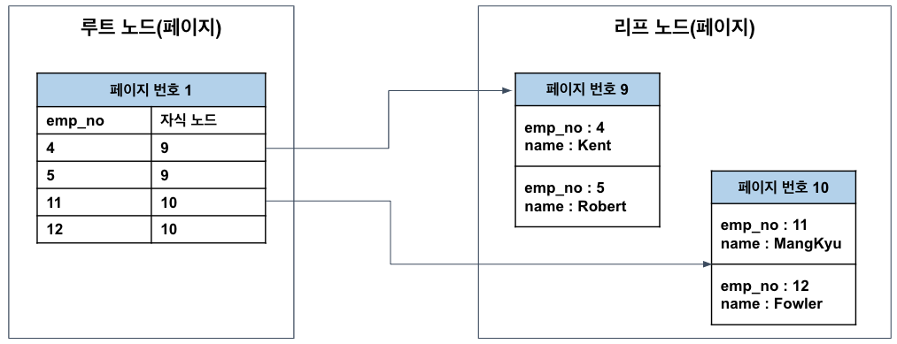
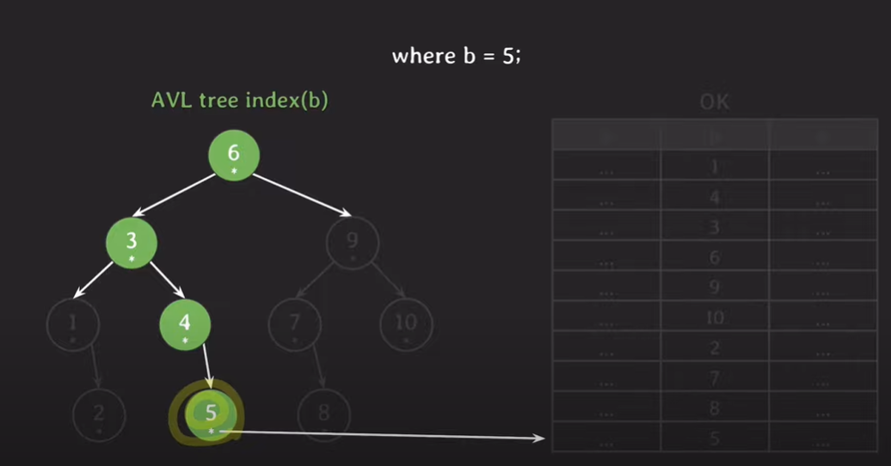
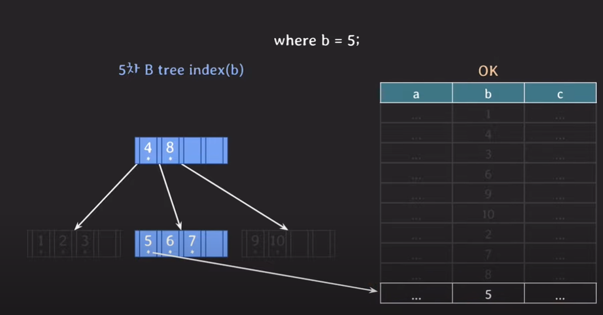

## 인덱스

> INDEX : 인덱스란 추가적인 쓰기 작업과 저장 공간을 활용하여 데이터베이스 테이블의 검색 속도를 향상시키기 위한 자료구조이다.

인덱스를 이용하는 이유는 더 빨리 읽기 위해서이다. 시간 복잡도 상으로 얘기를 해보자면 O(N)의 방식이 일반적인 방식이지만, 인덱스를 활용하여 B-Tree방식을 활용하면 O(logN)만에 조회를 할 수 있다.

인덱스를 사용하는 방법은
```mysql
CREATE INDEX 인덱스 이름 ON 테이블명 (attributes)
CREATE UNIQUE INDEX 인덱스 이름 ON 테이블명 (attributes)
```

위에 1번째는 속성이 1개일 경우 2번째의 경우에는 중복 없는 유니크한 속성을 지정할 때 들어가게 하는 것이다. 

Table 생성부터 바로 인덱스를 생성하는 방법은 다음과 같다.
```mysql
CREATE TABLE PLAYER{
    .
    .
    .
    INDEX 인덱스 이름 (속성)
    
    }
```

어떤 인덱스가 있는지 확인하고 싶으면 아래 구문을 사용하면 된다.
```mysql
SHOW INDEX FROM 테이블명;
```

위에서 아까 얘기한 대로 B-Tree를 기반으로 한 인덱스를 이용하면 조회를 하는데 O(logN)안에 찾을 수 있다고 했다. 어떻게 찾는 것일까?

**Attendance**

| id  | check |
|-----|:-----:|
| 1   |  yes  |
| 2   |  yes  |   
| 3   |  yes  |
| 3   |  no   |

**INDEX(id)**

| id | ptr  |
|---|:----:|
| 1 | 주소1  |
| 2 | 주소2  |   
| 3 | 주소3  |
|3|주소4|

항상 INDEX를 선언하게 되면 해당 값을 정렬을 하게 된다고 한다. 이럴 때 Binary Search방식으로 해서 검색을 하는 것이다. 그렇게 하면 WHERE = 3 해서 찾게 되는 경우라고 치면
3번을 확인해야 할 작업을 2번만에 확인 할 수 있다.

그런데 만약 여기서 추가로 `WHERE id=3 AND CHECK=YES` 면 어떻게 해야 될까? 위 테이블을 예시로 들면 일단 id에 해당하는 값을 찾고 기존의 테이블로 다시 돌아가서 check에 대한 답을 확인해야 한다. 
이렇게 하는 것은 거의 완전히 다 탐색하는 거랑 별반 다를게 없어지는 것이다.(FULL SCAN)

그러면 여기서 INDEX를 복합 INDEX로 하여서 INDEX(id, check)로 하게 된다면?

| id | check | ptr |
|---|:-----:|:---:|
| 1 |  yes  | 주소1 |
| 2 |  yes  | 주소2 |   
| 3 |  no   | 주소4 |
|3|  yes  | 주소3 |


여기서 숫자가 아니라서 정렬이 어떻게 되어있는지는 안 보이지만 id에 대한 것은 정렬순으로 되었지만 check에 대한 것은 id 가 정렬되고 그 이후에 그 id안에서 정렬이 또 되어있기에 yes보다 no가 먼저 온것이다.
**중요한 것은 INDEX를 선언하는 순서에 따라서 정렬되는 요소도 다르기 때문에 잘 확인하고 순서를 정해야 한다.**


그래서 항상 index를 사용할 때에도 query에 알맞게 선언해야지만 query가 빠르게 처리될 수 있다. 그런데 만약 위와 같은 INDEX들이 여러 개 있는 경우에는 SELECT나 다른 작업을 할 때 어떤 INDEX를 사용해서 값을 조회를 할 지 누가 정할까?

앞 챕터에서 MySQL의 Optimizer가 뭐가 더 빠르게 조회하는지 판단해서 선택을 한다고 한다. 그렇지만 이것이 우리의 의도와는 다른 INDEX를 선택할 수 있기 때문에 EXPLAIN이라는 것을 앞에 붙여서 실행계획을 확인하고 우리가 직접 지정할 때도 있다고 한다.

지정하는 방법은 다음과 같다.
```mysql
SELECT * FROM player USE INDEX (특정 index) 특정 인덱스 사용을 권장
SELECT * FROM player FORCE INDEX (특정 index) 특정 인덱스 무조건 사용
SELECT * FROM player IGNORE INDEX (특정 index) 특정 인덱스 무시하고 선택
```


### 인덱스를 남발하면 안되는 이유

- Index에 해당하는 TABLE의 write가 발생할때마다 오버헤드가 일어남.
- 추가적인 저장 공간을 차지한다.
- 불필요한 index는 안 만드는게 좋다.

### Covering INDEX

위 말 뜻 그대로 해석하면 어떤걸 커버를 쳐주는 것인데 그게 INDEX가 커버가 될 수 있다는 것이다. 앞선 테이블 예시를 들어서 INDEX(id, check)를 한 뒤에 WHERE id = 1 AND check= yes라고 했을 때 INDEX 테이블만 참고를 하여도 바로 주소도 알기에 레코드를 조회할 수 있다.

쉽게 말하면 본래의 테이블을 참고하지 않아도 INDEX 테이블 만으로도 바로 확인할 수 있으면 이 INDEX는 Covering INDEX가 되는 것이다.


### 사실 B-Tree 말고 Hash INDEX도 있다.

B-Tree를 대부분 많이 쓰긴 하지만 Hash INDEX라는 방법도 있다. 이 친구는 (key, value)방식으로 값을 찾는데 이 친구의 시간 복잡도는 O(1)이다.

더 빠른데 왜 이 친구를 사용하지 않을까?

- rehashing(해시 테이블이 늘어나는 것)에 대한 부담
- equality 비교만 가능, range 비교는 불가능
- multicolumn index의 경우 전체 attributes에 대한 조회만 가능

### INDEX보다 FULL SCAN이 좋은 경우

- TABLE에 데이터가 조금 있을 때
- 조회하려는 데이터가 테이블의 상당 부분을 차지할 때

라고 하는 큰 기준이 있지만 사실 이것을 결정하는 친구는 Optimizer가 선택한 후 우리에게 보여준다.

### 이것 외에 부분

- order by, group by에도 index를 사용할 수 있다.
- foreign key 에서는 index가 자동으로 생성되지 않는다.(join 관련)
- 데이터가 몇 백만건 있는 테이블에서는 인덱스 생성 시 시간이 몇 분 이상 소요가 되어서 DB 성능상으로는 좋지 않다.
  - 어쩔 수 없이 이런 작업 해야되면 트래픽이 적은 시간에 진행을 하는 것이 좋다.
- SQL 명령문 동장 방식이 RDBMS마다 다르기에 Optimizer도 어떻게 판단할지도 다르다. 그렇기에 EXPLAIN을 활용하여서 실행계획을 확인하고 그에 최적화된 INDEX를 사용하는지 확인하는 것이 좋다.


## 조금 더 깊게


### INDEX의 작업

- INSERT : 새로운 데이터에 대한 인덱스 추가작업
- DELETE : 삭제하는 데이터 INDEX를 사용하지 않는 작업을 진행
- UPDATE : 기존 INDEX를 사용하지 않는다고 하고, 갱신된 데이터 INDEX를 추가한다.


### INDEX 장,단점
- 장점
  - TABLE 조회 속도가 빨라진다.
  - 시스템 부하가 적어진다.
- 단점
  - INDEX 관리를 위해 DB의 약 10퍼센트의 저장공간이 필요로 한다.
  - INDEX 관리 때문에 추가적인 작업을 해야 한다.
  - 잘못 쓰면 성능이 오히려 하락된다. 
    - INSERT,UPDATE,DELETE 가 빈번한 친구한테 사용하면 크기가 너무 커져서 성능이 저한된다.
      - UPDATE, DELETE를 많이 하면 실제 데이터가 10만개인 친구의 인덱스 테이블은 100만개가 될 수도 있다.


### 언제 INDEX를 사용하면 좋은가?

- 규모가 작지 않은 테이블
- INSERT, UPDATE, DELETE를 자주 사용하지 않는 친구에게 사용
- WHERE, JOIN, ORDER BY 자주 사용되는 친구에게
- 데이터 중복도가 낮은 컬럼에게

### 인덱스 자료구조
- Hash Table
  - key value 형식
- B+Tree
  - B-Tree의 발전 구조
  - 리프 노드만 인덱스와 함께 데이터를 가지고 있고 나머지 노드들은 데이터를 위한 index만 있다.
  - Linked List로 연결되어있다.
  - 데이터 노드 크기가 인덱스 노드의 크기와 같지 않다. 
  - 장점
    - 순차 검색에 용이하게 인덱스가 최적화 되어 있다.
  - 단점
    - Best Case의 경우에도 리프 노드까지 탐색을 해줘야 한다. 
  - InnoDB에서는 같은 레벨의 노드 끼리 Double Linked List방식으로 되어 있다.
  - 자식 노드 끼리는 Single Linked List로 되어 있다.

### PK가 엄청 중요하다!

왜냐하면 PK를 활용해서 MySQL에서는 레코드의 저장 위치를 결정하기 때문이다.
그래서 PK가 유사한 레코드들끼리 **묶어서 저장**을 한다 : `클러스터링`


### PK == (클러스터 인덱스)



이런 식으로 연결이 되어서 저장을 하기 때문에 일반적으로 PK는 클러스터 인덱스라고도 불린다. 그 외의 일반적인 인덱스는 논클러스터 인덱스로 불린다.

이러한 클러스터링 특성 때문에 레코드의 저장이나 PK의 변경은 처리 속도가 느리다. 

레코드를 추가하기 위해서는 PK 기반의 레코드의 저장 위치를 탐색해야 하기 때문이다. 애초에 PK를 건드는 작업을 한다는 것은 레코드가 저장된 물리적인 위치를 변경하는 작업이 수반되기 때문에 느린 것이다. 

그렇지만 이렇게 하는데도 사용하는 이유는 쓰기 작업을 희생을 하더라도 빠르게 읽기 작업을 처리하기 위해서 사용하는 것이다. 
비율로 따지자면 **읽기 : 쓰기  = 9: 1** 정도 된다고 한다.


### 페이지가 그 페이지인가?

>페이지 : 페이지는 디스크와 버퍼풀에 데이터를 읽고 쓰는 최소 작업 단위이다.

전반적인 인덱스들과 테이블은 모두 페이지 단위로 관리가 된다. 1개의 레코드를 읽고 싶어도 결국 하나의 페이지를 읽어야 하는 것이다. 
페이지에 저장되는 개별 데이터의 크기를 최대한 작게, 그리고 많은 데이터를 저장할 수 있도록 하는 것이 중요하다. **페이지에 저장될 데이터가 커지면 다음과 같은 문제가 생기기 때문이다.**

- 디스크에 I/O가 많아진다. -> 페이지가 많으면 한 번 읽는데 1개의 페이지가 아닌 2개의 페이지를 왔다 갔다 읽어야 한다는 것이다.
- 메모리에 캐싱할 수 있는 페이지의 수가 줄어든다.  -> 메모리 공간을 그만큼 차지하기 때문에 그런 것이다.


### 클러스터링 테이블 저장하는 방식?

클러스터링 테이블은 클러스터 인덱스를 가지는 테이블인데 MySQL에서는 기본적으로 PK가 클러스터 인덱스이다. 

그런데 PK가 없으면 내부적으로 PK를 만들어내서 모든 테이블이 클러스터링 테이블이라고 볼 수 있다.

이는 별도의 자료구조에서 관리가 되어지는데 위 그림과 같이 루트 노드에서 값이 다 있는 것이 아니라 실제로는 리프 노드까지 가서 확인을 해줘야 실제로 어떤 값이 들어있는지 확인할 수 있었다.

### PK 인덱스 사이의 관계

PK가 실제 레코드 주소를 가리키고 있다면? 이것이 아닌 다른 인덱스들이 그 값을 찾기 위해서는 반드시 PK를 거치고 들어가야 할 것이다.

그래서 거쳐가는 것이

**INDEX 키 -> PK -> 물리적인 주소** 

순서가 되어진다. 그래서 인덱스는 PK에 의존적이라고 말할 수가 있다. 그러면 당연히 여기서 생각해볼 수 있는 것은 PK로 값을 다 찾아내는 것이 한 번에 바로 값을 찾을 수 있다는 것이다.

웬만한 인덱스 테이블로 가봤자 어짜피 PK를 거쳐서 가야 하기 때문에 2번의 작업을 해야하는 것이다.


### 클러스터 인덱스의 장 단점
- 장점
  - PK로 검색할 때 처리가 매우 빠르다.
  - 연속되는 PK로 조회 시 **랜덤 I/O가 아닌 순차 I/O**를 사용하여 처리 속도가 훨씬 빠르다.
  - 인덱스의 PK값을 가지므로 인덱스로 PK 값만 조회하는 경우 효율적으로 처리될 수 있다.(커버링 인덱스)
- 단점
  - 모든 인덱스가 PK에 의존하므로 PK 값이 클 경우 전체적으로 인덱스의 크기가 커지고, 페이지 양이 많아진다.
  - 인덱스를 통해 검색할 때 PK로 다시 한 번 검색해야 하므로 처리 성능이 느리다.
  - INSERT 시에 PK에 의해 레코드의 저장 위치가 결정되기 때문에 처리 성능이 느리다.
  - PK를 변경할 때 레코드를 DELETE 및 INSERT를 해야 하므로 처리 성능이 느리다.


### 랜덤 I/O가 아닌 순차 I/O?

- 랜덤 I/O : 읽어야 하는 데이터가 물리적으로 불연속적으로 있기에 디스크 헤더를 이동 시킨 다음 데이터를 읽는 것.
- 순차 I/O : 읽어야 하는 데이터가 순차적으로 있어서 쭉 읽기만 하는 경우 

그래서 차이점은? -> 디스크 헤더를 이동시키는 시간만큼 차이가 나게 된다. 이것을 `Seek time`이라고 부른다. 

그 만큼 시간 차이가 있기에 전체 처리율(throughoutput)이 떨어지게 되는 것이 있다.

그래서 웬만해서 쿼리를 튜닝한다고 했을 때 랜덤 I/O를 줄이는 것이 좋다!


### 그런데 만약 PK가 없다면? 클러스터 인덱스도 없나?

그건 아니다. 왜냐하면 MySQL에서 테이블은 PK 기반으로 저장이 되기에 필수적이긴 하지만 스토리지 엔진에서 별도의 처리를 통해 PK를 설정하기 때문이다.

순서상으로는 다음과 같다.
1. PK를 클러스터링 키로 선택한다.
2. PK가 없다면 NOT NULL 옵션의 유니크 인덱스 중에서 첫 번째 인덱스를 클러스터링 키로 선택한다.
3. 후보군이 없다면 내부적으로 자동 증가 유니크 컬럼을 추가한 후 클러스터링 키로 선택한다.

3번의 경우에는 사용자에게는 노출이 되지 않기에 쿼리에서 사용할 수가 없다. 클러스터 인덱스는 테이블 당 하나만 가질 수 있기 때문에 반드시 생성해주는 것이 유리하다.


### DB는 Secondary-Storage(디스크)에 주로 저장된다.

- 결국 DB에서 데이터를 조회할 때 secondary storage에 최대한 적게 접근하는 방법이 좋은 것이다.
- block 단위로 읽고 쓰기 때문에 연관된 데이터를 모아서 저장하는 것이 효율이 좋다.
  - block(페이지)에 만약 연관되지 않은 친구가 있으면 메모리로 올렸을 때 그다지 그 친구를 사용 안할 걸 올린 격이기 때문이다.


### INDEX를 B-tree구조로 저장하는 이유

1부터 10까지의 범위를 가진 컬럼을 각각의 구조로 저장했을 때를 비교해보자.


우선 B-Tree는 다음과 같은 조건을 만족해야 한다.

M차 B-Tree라고 했을때를 가정한다.

**B-Tree의 주요한 네 가지 파라미터**(root node, leaf node일 때는 제외가 된다)
- 각 노드의 최대 자녀 노드 수 : M
- 각 노드의 최대 키의 갯수 : M-1
- 각 노드의 최소 자녀 노드의 갯수 : M/2한 값의 올림 수
- 각 노드의 최소 키의 갯수 : M/2-1의 올림 수  

**B-Tree 알고가야 할 점**
- internal 노드의 key 수가 x개라면 자녀 노드의 수는 언제나 x+1이다. 
- 노드가 최소 하나의 key는 가지기에 몇 차 B-tree 인지와 상관없이 internal 노드는 최소 2개의 자녀를 가진다.


**AVL tree index**


총 4번의 secondary storage에 접근을 해야 데이터에 도달할 수 있다.

**B-Tree**


단 2번만의 접근으로 데이터에 도달할 수 있다.


위 2개의 그림을 비교해봤을 때 가장 중요한 것은 또 연관되어있는지에 대한 것이다. 애초에 b-tree방식으로 설계를 하게 되면 당연히 그 데이터와 연관된 데이터들이 정렬된 순서대로 올 수 있으므로 블록을 메모리에 올리면 그와 연관된 데이터를 또 찾을때 secondary storage로 가지 않아도 된다!


자식 노드의 갯수를 비교해 봤을 때 다음과 같다.
- AVL-Tree : 1~2개 
- B-Tree : 2~4개

이런 경우는 우선 작은 데이터들을 담는 경우에야 예시이다. **B-Tree는 실제로 많은 데이터를 담을 수 있을 때 그 효과를 발휘한다.**


`101차 B-Tree`일 경우를 생각해보자.
차수 : N(루트 노드에서는 제외되는 조건)
- 루트 노드의 최소 key 수 : 1
- 루트 노드의 최소 자녀 수 : 2
- 최대 자녀 수 : N
- 최대 key 수 : 100
- 최소 자녀 수 : 51
- 최소 key 수 : 50


이 경우 101차 B-Tree에 저장할 수 있는 데이터의 갯수의 범위는 어떻게 될까?(level 3기준)

**최대의 경우**
- level 0 : 100
- level 1 : 101 * 100
- level 2 : 101 ^ 2 *100
- level 3 : 101 ^ 3 * 100

다 더하면 : 대략 1억이 나온다.

**최소의 경우**()
- level 0 : 1 최상위 키 갯수(2~100)
- level 1 : 1 * 2 * 50
- level 2 : 2 * 51 * 50
- level 3 : 2 * 51 ^ 2 * 50

다 더하면 대략 : 약 26만개

그러면 범위가 26만개 < N < 1억개 를 저장하게 된다. 그러면 level이 3 결국 아무리 많이 디스크에 접근을 한다고 해도 4번이 최대로 접근하는 경우라는 것이다. 그런데 데이터가 저장이 엄청 많이 된다는 것을 알 수 있다. 

이렇게 되면 결론은 이렇게 내릴 수 있다. AVL트리는 기본적으로 값을 많이 저장하려고 하면 level이 엄청 높아진다. 그렇다는 말은 디스크에 접근을 많이 해야 한다는 의미이다. 그렇지만 B-Tree에서는 접근을 많이 하지 않고도 루트 노드에서 리프노드까지 엄청 적게 디스크에 접근하면서
데이터를 찾을 수 있다는 것이다. 그러니까 DB에서 INDEX를 저장하는 자료구조를 B-Tree를 사용한다는 것을 알 수 있다. 

결론은 CS적인 측면에서 살펴봤을때도 INDEX의 자료구조를 B-Tree구조로 해야지 엄청난 이득을 본다는 것을 알 수 있다. 그리고 심지어 B-Tree의 경우에는 관련이 있는 것을 블록으로 묶여있기 때문에 랜덤 I/O가 덜 발생하고
순차 I/O를 할 가능성이 높기 때문에 성능적으로도 향상이 된다는 것을 알 수 있다.


### 출처

- https://www.youtube.com/watch?v=bqkcoSm_rCs&ab_channel=%EC%89%AC%EC%9A%B4%EC%BD%94%EB%93%9C
- https://hudi.blog/storage-and-random-sequantial-io/
- https://tecoble.techcourse.co.kr/post/2021-09-18-db-index/
- https://mangkyu.tistory.com/96
- https://mangkyu.tistory.com/286
- https://mangkyu.tistory.com/285


