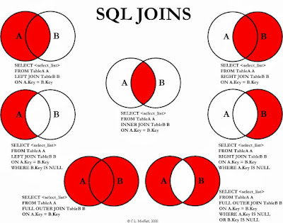

## Join, Join 원리

> Join : 둘 이상의 테이블을 연결해서 데이터를 검색하는 방법

이 테이블들은 서로 이런 조건을 갖추고 있어야 한다.
- 적어도 하나의 컬럼을 공유하고 있어야 한다.
- 일반적인 경우 행들은 PRIMARY KEY(PK)나 FOREIGN KEY(FK) 값의 연관에 의해 JOIN이 성립된다. 
- 하지만 어떤 경우에는 이러한 PK, FK의 관계가 없어도 논리적인 값들의 연관만으로 JOIN이 성립 가능하다.

MongoDB에서는 Join을 lookup이라는 되도록 사용하지 말아야 한다. 왜냐하면 여러 벤치마크 테스트에서 성능이 많이 떨어지기 때문이다.
그래서 여러 테이블을 조인하는 작업이 많다면 MongoDB보다 RDBMS를 사용해야 한다.


### Explicit join(명시적 조인) 
> From 절에 Join 키워드와 함께 joined table들을 명시하는 방식

```mysql
SELECT * FROM employee INNER JOIN department ON employee.DepartmentID = department.DepartmentID;
```


### Implicit Join(암시적 조인)
> SELECT 구문의 FROM 절에서 그것들을 부리하는 컴마를 사용해서 단순히 조인을 위한 여러 테이블을 나열한다.

```mysql
SELECT * FROM employee, department WHERE employee.DepartmentID = department.DepartmentID;
```


### Join의 종류

JOIN의 종류를 다음과 같이 비교를 한다.



각각 하나씩 요소들을 알아보자.

### INNER JOIN

- 두 table에서 join condition을 만족하는 tuple들로 result table을 만드는 join이다.
- 교집합이다. 공통적인 부분만 SELECT

### FULL (OUTER) JOIN(UNION JOIN)

- A테이블 B테이블 가지고 있는거 둘 다 SELECT가 되는 것이다.
- 합집합이라고 보면 된다.

### LEFT (OUTER) JOIN

- 조인 기준 왼쪽에 있는거 '전부' SELECT(공통적인 부분 + LEFT에 있는 것만)
- 왼쪽 요소 + 교집합
- 보통 많이 쓴다. 

### RIGHT JOIN

- 조인 기준 오른쪽에 있는 부분 '전부' SELECT
- 오른쪽 요소 + 교집합
- 실제로는 안 쓴다. 왜냐? 순서를 바꾸면 되기 때문에


### UNION 관련 찾아보기

### SELECT - 연산

- 그림에서 보면 LEFT JOIN을 하는데 교집합은 빠진 부분이 있는데 이럴 때는 SELECT A-B, B-A 등으로 표현하여 Join을 한다.

```mysql
SELECT A.ID, A.ENAME, A.KNAME FROM A LEFT OUTER JOIN B ON A.ID=B.ID; WHERE B.ID IS NULL
```

위 코드에서는 NULL을 통해서 빼기 연산을 해준 것이다. 똑같이 RIGHT에도 적용이 된다.

### EQUAL JOIN(equi join)

- 비교자 기반의 조인이며, 조인 구문에서 동등비교만을 위해 사용한다.
- 다른 비교 연산자(<와 같은)를 사용하는 것은 동등 조인으로서의 조인의 자격을 박탈하는 것

### NATURAL JOIN

- 동등 조인의 한 유형
- 동일 컬럼명을 가진 2개의 테이블에서 모든 컬럼들을 비교함으로써 암시적으로 일어나는 구문
- 결과적으로 나온 조인된 테이블은 동일한 이름을 가진 컬럼의 각 쌍에 대한 단 하나의 컬럼만 포함하고 있음.
- join condition을 따로 명시하지 않는다. 

### USING

// 추가 

### CROSS JOIN

- 조인되는 두 테이블에서 곱집합을 반환한다.
- 즉, 두 번째 테이블로부터 각 행과 첫 번째 테이블에서 각 행이 한번씩 결합된 열을 만들 것이다.
- join condition이 없다.

### FULL OUTER JOIN

- 양쪽 테이블 모두 OUTER JOIN이 필요할 때 사용한다. 
- 주의할 점!
    - MySQL말고 POSTGRE에서 사용 가능


### Self JOIN

- tuple 이 자기 자신에게 join을 하는 경우이다.


### 만약 JOIN시 attribute의 이름이 같으면? 

- **Using 키워드를 사용하면 된다.**
- 두 table이 equi join 할 때 join하는 attribute의 이름이 같다면, USING으로 간단하게 작성할 수 있다.
- 그래서 모양이 Using attributes, a attributes, b attributes순으로 나중에 보이게 된다.


### JOIN 원리

대표적으로 3가지가 있다.

- 중첩 루프 조인(NLJ)
- 정렬 병합 조인
- 해시 조인


### 중첩 루프 조인

- for문과 같은 원리로 조건에 맞는 조인을 하는 방법.
- 랜덤 접근에 대한 비용이 많이 들어 대용량 테이블에선 하지 않음.
- 두 테이블 중 작은 테이블을 선행 테이블로 정하는 것이 유리함.
- 보통 MySQL에서는 기본으로 사용한다.

### 정렬 병합 조인

- 각 테이블을 조인할 필드 기준으로 정렬한 후 조인 수행.
- 적절한 인덱스가 없고 대용량 테이블을 조인하거나 비교 연산자가 조인 조건일 때 사용됨.

### 해시 조인

- 조인을 수행할 테이블의 조인 컬럼을 기준으로 해시 함수를 수행해 동일한 해시값을 가지는 것들끼리 비교.
- 해시 함수를 이용하여 조인하므로 ==(Equal) 조건을 적용할 때 사용가능.
- 해시 테이블을 메모리에 생성하므로 행의 수가 적은 테이블을 선행 테이블로 하는 것이 좋음.
- 해시 조인은 MySQL 8.0.18 릴리스와 함께 이 기능을 사용할 수 있게 되었다.


### 빌드, 프로브 단계
해시조인은 빌드 단계(Build-phase)와 프로브 단계(probe-phase)로 나눌 수 있다.

- 빌드 단계
    - 조인 대상 테이블 중 레코드가 적어서 해시 테이블로 만들기 용이한 테이블을 골라서 메모리에 해시 테이블을 생성(빌드)하는 작업
    - 빌드 단계에서 해시테이블을 만들기 위해 사용되는 원본 테이블을 빌드 테이블이라 한다.

- 프로브 단계
    - 빌드테이블이 아닌 나머지 테이블의 레코드를 읽어 해시 테이블과 일치하는 레코드를 찾는 과정
    - 나머지 테이블을 프로브 테이블이라고 한다.


### 출처

- https://velog.io/@ragnarok_code/DataBase-%EC%A1%B0%EC%9D%B8Join%EC%9D%B4%EB%9E%80#:~:text=%EB%95%8C%20%EA%B3%A0%EB%A0%A4%EC%82%AC%ED%95%AD-,%EC%A1%B0%EC%9D%B8%EC%9D%B4%EB%9E%80,%EA%B2%B0%EA%B3%BC%20%EC%85%8B%EC%9D%84%20%EB%A7%8C%EB%93%A4%EC%96%B4%20%EB%82%B8%EB%8B%A4.
- https://pearlluck.tistory.com/46
- https://www.geeksforgeeks.org/implicit-join-vs-explicit-join-in-sql/
- https://javarevisited.blogspot.com/2012/11/how-to-join-three-tables-in-sql-query-mysql-sqlserver.html#axzz7u1NngGTi
- https://dataonair.or.kr/db-tech-reference/d-guide/sql/?mod=document&uid=345