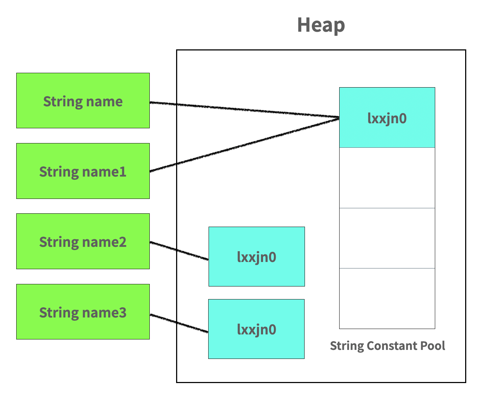
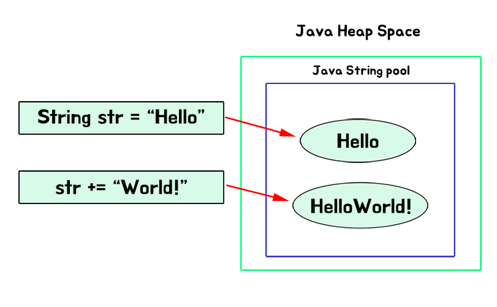

## String에 대해서

```java
 String name = "lxxjn0" // 문자열 리터럴
 String name1 = "lxxjn0"; // new 로 생성
 String name2 = new String("lxxjn0"); // 문자열 리터럴
 String name3 = new String("lxxjn0"); // new 로 생성
```

위 2개의 코드만 보면 둘 다 `lxxjn0`라는 문자열을 만든 것이다. 그렇지만 표현 방법에서부터 다르게 된다면 분명히 뭔가가 다를 거다.


### 메모리 할당 방식의 차이

위 코드는 애초에 메모리의 heap 영역에 저장이 된다. 그러면 도대체 어떻게 저장이 되길래 서로 다른 형태를 띄는 것일까?



위 그림처럼 저장이 된다. 그림을 보면서 이해를 해보자.

문자열 리터럴의 형태로 String을 만들게 되면 그림에 보이는 String Constant Pool이라는 곳에 저장이 된다. 그와는 다르게 new 연산을 통해 생성된 String들은 Heap영역에 저장되어있기는 하지만 각각의 다른 공간을 가리키고 있다.

이것을 통해 알 수 있는 것은 다음과 같았다.
- 리터럴을 통해서 생성하게 되면 String Constant Pool에 저장을 한다.
- 그 안에 있는 요소를 보고 만약 동일한 내용이 있다면 그것의 주소를 가리키게 된다.


### String에서의 equals()

그러면 우리가 보통 `==` 연산으로 같은지 아닌지 비교를 하지만 String에서는 `equals()`를 주로 사용을 하였다. 왜 그렇게 하였을까?

기본적으로 `==` 연산은 메모리의 주소값을 비교를 하게 된다. 그러면 위에서 작성한 코드의 2개의 new 연산자로 생성된 친구는 주소가 다르므로 같지가 않다고 한다.

물론 우리가 의도적으로 주소 공간을 비교할 때는 `==`연산을 사용하는 것이 맞긴 하지만 대부분의 경우라면 두 개의 문자열이 같은지를 비교하기 위해서 사용을 한다. 그래서 Object에서의 equals와는 다르게 String 에서의 equals는 다음과 같이 되어있다.

```java
/**
 * Compares this string to the specified object.  The result is {@code
 * true} if and only if the argument is not {@code null} and is a {@code
 * String} object that represents the same sequence of characters as this
 * object.
 *
 * @param  anObject
 *         The object to compare this {@code String} against
 *
 * @return  {@code true} if the given object represents a {@code String}
 *          equivalent to this string, {@code false} otherwise
 *
 * @see  #compareTo(String)
 * @see  #equalsIgnoreCase(String)
 */
public boolean equals(Object anObject) {
    if (this == anObject) {
        return true;
    }
    if (anObject instanceof String) {
        String anotherString = (String) anObject;
        int n = value.length;
        if (n == anotherString.value.length) {
            char v1[] = value;
            char v2[] = anotherString.value;
            int i = 0;
            while (n-- != 0) {
                if (v1[i] != v2[i])
                        return false;
                i++;
            }
            return true;
        }
    }
    return false;
}

```

위 코드를 해석해보면 다음과 같다.
1. 우선 메모리 주소가 같은지 비교해본다. 같으면 true를 반환한다, 아니면 다음단계로 간다.
2. 서로의 문자열이 같으면 true를 반환한다. 

그래서 문자열이 같은지 확인할 때는 equals()를 사용하자.

### 문자열 리터럴의 intern()

우리가 그러면 보통 값을 꺼내올 때 new는 주소가 다르다고 치면 리터럴은 어떻게 주소를 참조해서 끌고 올까?

바로 `intern`이라는 메서드를 활용해서 끌고온다고 한다. 

```java
    /**
     * Returns a canonical representation for the string object.
     * <p>
     * A pool of strings, initially empty, is maintained privately by the
     * class {@code String}.
     * <p>
     * When the intern method is invoked, if the pool already contains a
     * string equal to this {@code String} object as determined by
     * the {@link #equals(Object)} method, then the string from the pool is
     * returned. Otherwise, this {@code String} object is added to the
     * pool and a reference to this {@code String} object is returned.
     * <p>
     * It follows that for any two strings {@code s} and {@code t},
     * {@code s.intern() == t.intern()} is {@code true}
     * if and only if {@code s.equals(t)} is {@code true}.
     * <p>
     * All literal strings and string-valued constant expressions are
     * interned. String literals are defined in section 3.10.5 of the
     * <cite>The Java&trade; Language Specification</cite>.
     *
     * @return  a string that has the same contents as this string, but is
     *          guaranteed to be from a pool of unique strings.
     * @jls 3.10.5 String Literals
     */
    public native String intern();
```

**이렇게 생겼는데 String Constant Pool에 있는 해당 항목이 있으면 그 주소에 해당하는 값을 꺼내오고 만약 없다면 새로 객체를 생성하고 그 주솟값을 반환한다고 한다.**


### Immutable한 특징이 있다.

문자열 리터럴은 상수여서 불변한 특성을 가지고 있다. 앞선 위의 코드에서의 똑같은 리터럴 문자를 다른 String에 넣는다고 해도 결국 String Constant Pool에 있는 똑같은 값이 있는지 확인하고 있으면 재사용, 없으면 새로 생성하는 구조를 가진다는 것을 알아봤었다.

이렇게 때문에 `thread-safe`하다. 여러 사람들이 똑같은 레퍼런스를 사용하더라도 서로 영향이 없기 때문이다. 


---


## String이 가지는 Immutable한 특징

자바에서 문자열을 사용할 때 다루는 String은 불변이다. 더 풀어서 얘기하면 문자열이 할당된 메모리 공간은 변하지 않는다는 말이다.


### String +에 의해 생길 수 있는 문제

```java
String str = "Hello";
str+="World!";
```

이렇게 하면 



다음과 같은 형태로 저장이 되는데 우리의 생각과는 다르게 또 다른 HelloWorld!라고 메모리를 할당해버렸다. 

**str += "world!"; 연산이 실행되면 앞서 String str = "Hello,";로 초기화했던 str 객체는 버려져 Garbage Colletion, 이하 GC의 대상이 된다.**

```java
public String plusString() {
String temp = "";
for (int i = 1; i <= 1000; i++) {
temp += i;
}
return temp;
}
```
위와 같은 반복문 1000번 돌리면? + 1000번 하면 GC활동도 1000번 한다는 것이다. 

**GC는 하면 할수록 시스템의 CPU를 사용하고 시간도 많이 소요되기 때문에 GC의 대상이 되는 객체를 최소화해야 한다. 즉 이러한 작업은 쓸데없이 메모리를 많이 사용하고 GC에 의해 응답 속도에 많은 영향을 미치게 된다.**

**그러면? 당연히 느려지는 것이다!**


### StringBuffer, StringBuilder

그래서 항상 나는 궁금했던 것이 String이 아닌 StringBuffer와 StringBuilder는 왜 있는 것인지 궁금했다.

StringBuffer, StringBuilder는 위에 말했던 +연산과 관련된 문제를 해결하기 위해서 나온 친구이다. 두 객체의 `append`, `insert`메소드를 활용하면 버려지는 객체 없이 변경할 수 있다.

### StringBuffer, StringBuilder 차이

쉽게 보면 동기화를 시켜주냐 시켜주지 않냐이다.

```java
// StringBuffer의 append 메서드 
@Override
public synchronized StringBuffer append(String str) {
    toStringCache = null;
    super.append(str);
    return this;
}

// StringBuilder의 append 메서드
@Override
public StringBuilder append(String str) {
    super.append(str);
    return this;
}
```

`synchronized` 키워드의 차이가 있는 것이다. 즉, 동기화 여부에 따라 다른 것이다. 그러면 이런 생각이 든다. **무조건 StringBuffer**를 쓰면 멀티스레드에서도 안전하게 사용할 수 있으니 무조건 StringBuffer만 사용하면 되냐? 그건 또 아니다.

### StringBuffer만 남발하면 안되는 이유

synchronized를 사용한 동기화는 lock을 걸고 푸는 오버헤드가 있어서 속도가 느리다. 즉 StringBuilder가 StringBuffer보다 빠르다. 그래서 상황마다 잘 판단하고 어떤 것을 사용할 지 잘 선정해야 한다.

>String, StringBuilder, StringBuffer 각각의 객체가 문자열 더하는 라인을 100만 번씩 실행한 결과는 다음과 같다.
속도는 String을 기준으로 StringBuffer가 약 367배 빠르고, StringBuilder는 약 512배 빠르다.
메모리는 StringBuffer와 StringBuilder가 똑같이 사용하고 String은 약 3,390배 더 사용한다.  이상민, 자바 성능 튜닝 이야기, 인사이트(2013), p52

### JDK 5.0 이후...

이후에는 String에 +를 사용하여도 알아서 컴파일시 StringBuilder로 변환되서 연산을 수행한다. 하지만 그렇다고 해서 + 연산을 1000번을 또 한다고 하면? 미리 StringBuilder를 생성하지 않고 사용하였기에 변환된 StringBuilder들이 또 1000번씩 버려져야 한다. 그러면 똑같은 실수를 또 일으키는 것이랑 똑같은 작업을 하는 것이다.


### StringBuffer 와 StringBuilder의 사용시기

- StringBuilder
  - 스레드에 안전한지의 여부와 전혀 관계없는 프로그램을 개발할 때
  - 메서드 내에서 지역 변수로 StringBuilder를 사용할 때
- StringBuffer
  - 멀티 스레드 환경에서 안전한 프로그램이 필요할 때
  - static으로 선언된 문자열을 변경할 때
  - singleton으로 선언된 클래스의 문자열을 변경할 때


### 출처

- https://tecoble.techcourse.co.kr/post/2020-06-15-String-vs-StringBuilder-vs-StringBuffer/
- https://tecoble.techcourse.co.kr/post/2020-09-07-dive-into-java-string/
- https://madplay.github.io/post/java-string-literal-vs-string-object