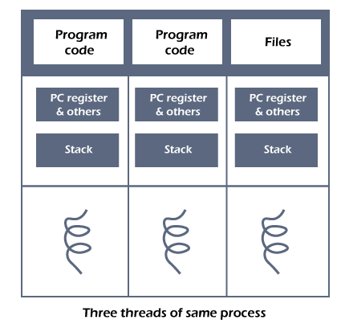

# 멀티스레딩

멀티 스레딩이라는 것에 대해서 알아보려고 하는데 그 전 스레드가 뭔지부터 보자.

## 스레드

> 프로세스 내에서의 실행 흐름의 단위이다.
> 한 프로세스는 여러개의 스레드를 가질 수 있다!
> 경량 프로세스라고도 불린다.

프로세스는 여러개의 스레드로 나뉠 수 있는데 예시로 MS word를 들 수 있다.

MS word에서 예를 들자면 다음의 스레드들이 있다.
- text를 formatting하는 thread
- 입력을 하는 thread

## 스레드의 구성요소

- PC(Program Counter)
- 레지스터 세트
- 스택 공간

## 스레드의 필요성

- 시스템의 향상된 처리량: 프로세스가 여러 스레드로 분할되고 각 스레드가 작업으로 처리되면 단위 시간에 수행되는 작업 수가 증가합니다. 이것이 시스템의 처리량도 증가하는 이유입니다.
- 다중 프로세서 시스템의 효과적인 활용: 한 프로세스에 둘 이상의 스레드가 있는 경우 둘 이상의 프로세서에서 둘 이상의 스레드를 예약할 수 있습니다.
- 더 빠른 컨텍스트 전환: 스레드 간의 컨텍스트 전환 기간은 프로세스 컨텍스트 전환보다 짧습니다. 프로세스 컨텍스트 전환은 CPU에 더 많은 오버헤드를 의미합니다.
- 응답성: 프로세스가 여러 스레드로 분할되고 스레드가 실행을 완료하면 해당 프로세스에 가능한 한 빨리 응답할 수 있습니다.
- 통신: 다중 스레드 통신은 스레드가 동일한 주소 공간을 공유하기 때문에 간단합니다. 프로세스에서는 두 프로세스 간의 통신을 위해 몇 가지 배타적인 통신 전략만 채택합니다.
- 리소스 공유: 코드, 데이터 및 파일과 같은 프로세스 내의 모든 스레드 간에 리소스를 공유할 수 있습니다. 참고: 스택과 레지스터는 스레드 간에 공유할 수 없습니다. 각 스레드에 대한 스택 및 레지스터가 있습니다.

## 스레드의 유형

스레드에는 커널 레벨 스레드, 유저 레벨 스레드가 있다.

### User-Level-Thread

> user level 라이브러리에 의해 관리 및 예약되고 커널과 독립적입니다. 커널 수준 스레드보다 생성 및 관리가 빠르지만 하나의 user-level-thread가 차단되면(I/O 인터럽트) 전체 프로세스가 차단되고
> 모든 스레드가 영향을 받는다.

### User-Level-Thread 의 장단점

- 장점
  - user thread가 kernel thread보다 쉽게 구현이 가능하다
  - user thread는 kernel level thread를 지원하지 않는 운영체제에서도 적용이 가능하다.
  - 더 빠르고 효율적이다.
  - context-switching 시간이 커널 수준보다 짧다.
  - OS를 수정할 필요가 없다.
  - user-level-thread의 표현은 매우 간단하다. 레지스터, PC, 스택 및 미니 스레드 제어 블록은 사용자 수준 프로세스의 주소 공간에 저장됩니다.
  - 프로세스의 개입 없이 간단하게 스레드를 생성, 전환 및 동기화 할 수 있다.

- 단점
  - user-level-thread는 스레드와 커널 간 조정이 부족하다.
  - thread가 페이지 오류를 일으키면 전체 프로세스가 차단되버린다.

### Kernel-Level-Thread

> OS의 커널에서 관리하고 스케줄링을 한다. 한 스레드가 차단이 되어도 OS에서 다른 스레드를 계속 실행하고 스케줄링 할 수 있도록 해준다.

### Kernel-Level-Thread의 장단점

- 장점
  - 커널 수준 스레드는 모든 스레드를 완전히 인식한다.
  - 스케줄러는 스레드가 많아지는 과정에서 더 많은 CPU 시간을 사용할 수 있도록 결정할 수 있다.
  - 주파수를 차단하는 응용 프로그램에 적합하다.
- 단점
    - 커널 스레드는 모든 스레드를 관리하고 예약한다.
    - 커널 스레드는 구현이 어렵다
    - 커널 스레드는 사용자 스레드보다 더 느리다.

### User-Kernel Thread간의 관계

1. Many-to-One Model : 하나의 커널 스레드에 여러 유저 스레드를 연결하는 모델 
  - 유저 공간의 스레드 라이브러리를 통해서 관리되서 되게 효율적이다.
  - 한 유저 스레드만 커널에 접근할 수 있어서 병렬적인 수행이 잘 되지 않아 요즘에 잘 사용되지 않는다.
  - 한 유저 스레드의 system call 때문에 block되면 프로세스 전체가 block이 된다.
2. One-to-One Model : 하나의 커널 스레드에 하나의 유저 스레드가 대응하는 모델 : java가 이 모델
  - 동시성(Concurrency)가 높아지고 멀티 프로세서 시스템에서 동시에 여러 스레드를 수행할 수 있도록 해준다.
  - 유저 스레드를 늘리면 커널 스레드도 같이 늘어나는데 -> 커널 스레드 생성 비용이 커서 성능 저하가 일어날 수 있다.
3. Many-to-Many Model : 여러 유저 스레드에 더 적거나 같은 수의 커널 스레드가 대응하는 모델
  - 1번의 모델에 비해 더 높은 동시성을 가지고 2번의 커널 스레드 생성의 오버헤드를 걱정할 필요가 없다.
4. Two-level Model : Many-to-Many Model에서 확장된 개념 
  - 특정 유저 스레드를 위한 커널 스레드를 별도로 제공, 점유율이 높아야 하는 유저 스레드를 더 빠르게 처리한다.

## Multi-Threading

> 멀티스레딩은 프로세스 내 작업을 여러 개의 스레드, 멀티스레드로 처리하는 기법이며 스레드끼리 서로 자원을 공유하기 때문에 효율성이 높다.

그런데 이렇게 multi가 생긴 것은 그러면 single의 관점 thread의 단점이 있었기 때문에 생긴 것이다.

single로 작업을 진행한다면 A->B->C 순서대로 진행이 될거다.
multi로 하면 A,B,C를 동시에 진행을 할 수가 있을 것이다.

그래서 이런 병렬성(Parallelism)을 높이기 위해서 사용하기도 하고 호율이 좋다는 측면에 있어서 사용한다. 그리고 위에서 설명한대로 작업을 
순차적으로 진행하지 않고 동시성(Concurrency)을 높일 수 있기 때문에 하는 것이다. 

### Multi-Threading의 장점

- 응답성(Responsiveness) : 싱글 스레드보다 작업을 분리해서 수행하니까 실시간으로 사용자에게 응답할 수 있다.
- 자원 공유(Resource sharing) : 자신이 속한 프로세스 내의 스레드들과 메모리나 자원을 공유하여 효율적으로 사용할 수 있다.
- 경제성(Economy) : 비용적으로 엄청 싸다. 예를 들면 Solaris에서 프로세스 생성은 스레드 생성보다 30배 느리고, switching은 5배 느리다.
- 확장성(Scalability) : 한 프로세스를 여러 프로세서에서 수행할 수 있어서 효율적이다.

### Multi-Thread 시 고려해야 할 것들이 있다.

1. Semantics of fork() and exec() system calls
  - fork 이후 바로 exec해서 복제를 하면 전체 프로세스가 대체되기 때문에 모든 스레드를 복제하는게 불필요한 과정일 수 있다.
  - 그래서 UNIX 시스템에서 두가지 버전의 fork()를 통해 복사를 한다. 

2. Signal Handling
  - signal: 특정한 사건이 발생했다고 프로세스에게 알려주기 위해 UNIX 시스템에서 사용하는 것
  -  Synchronous signals : 시그널을 일으킨 작업을 수행한 프로세스에 전달된다. (ex. division by 0, illegal memory access)
  -  Asynchronous signals : 수행중인 프로세스의 외부 사건에 의해 만들어진다. (ex. Ctrl+C과 같은 특정 키 입력으로 인한 종료, 타이머 종료)
  - 시그널을 다루는 방법이 다양한데 멀티 스레드에서는 시그널을 제공한 친구한테만 갈 수도, 프로세스 내의 모든 스레드에게 전달 될 수도 있다. 

3. Thread Cancellation
  - 스레드가 끝나기 전 종료시키는 방식
    - Asynchronous cancellation : 목표 스레드(Target thread)를 즉시 종료시킨다.
    - Deferred cancellation : 목표 스레드가 종료되어야 하는지 주기적으로 체크한다.

4. Thread Pools
  - 스레드를 매번 생성, 수행, 삭제하면 성능이 저하되기 때문에 미리 thread pool이라고 만들어놓고 필요할 때마다 할당시켜주는 방식으로 사용한다.

5. Thread Local Storage
  - 각각의 스레드들이 자신의 영역을 만들어 관리할 수 있도록 해주는 것이다.
  - static data와 유사하다.

### 출처 
> - https://www.javatpoint.com/threads-in-operating-system(스레드)
> - https://rebro.kr/174