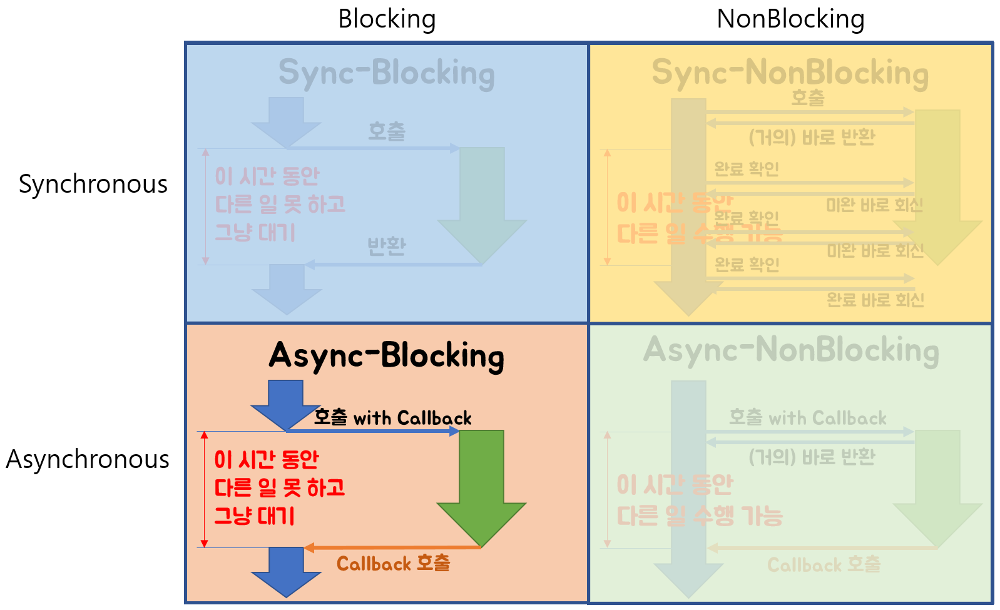

## Blocking vs Non-Blocking

대부분 이 파트에서 다음과 같은 것으로 비교를 많이 해 놓는다. 어떻게 처리를 하냐에 따라서 나뉘는 방식인데 우선 살펴봐야 할 것이 있다.

### Sync vs Async

> -  Sync(동기): 서버에서 요청을 보냈을 때 응답이 돌아와야 다음 동작을 수행할 수 있다. A, B작업이 있다고 했을 때 A 작업이 모두 진행되고 난 다음에야 B작업을 실행할 수 있다는 것이다.
> - Async(비동기) : 서버에서 요청을 보냈을 때 응답 상태와 관계없이 다음 동작을 하는 것이다. A 작업을 한다고 해도 동시에 B 작업을 하는 것이다. 이때 A 작업은 결과값이 나오는대로 출력이 된다.

예시로 나와 있는 코드이다. 

```javascript
console.log("1st");
console.log("2nd");
console.log("3rd");
```


위와 같이 실행하게 되면 

```javascript
'1st'
'2nd'
'3rd'
```

순서로 나오게 되는데 위에서부터 차례로 코드를 호출한대로 나오게 되는 것이 동기적인 처리라고 부르게 된다.


```javascript
console.log("1st");
setTimeout(() => {
  console.log("2nd");
}, 0);
console.log("3rd");
```

setTimeout()이라는 메서드를 사용을 하였는데 첫번째 인자로 콜백함수를 사용하고, 두번째 파라미터는 지연시간이다. 지연시간을 0으로 했으니 당연히 바로 나와야 할 것이다.

```javascript
'1st'
'3rd'
'2nd'
```

결과는 다음과 같이 나오게 된다. 이것을 어떻게 해석했냐를 알아보면 다음과 같다고 한다. 

> - 첫번째 줄에서 console.log()를 만나고 출력을 한다.
> - 두번째 줄에서 setTimeout을 만났기 때문에 비동기적 메소드여서 이를 처리하는 다른 프로그램에 맡기게 된다.
> - 그 이후 곧바로 아래의 console.log()를 찍게 된다. 
> - 그 작업 이후 setTimeout() 메소드를 위임받아서 처리한 프로그램은 **비동기적 API를 제외한 모든 코드가 실행된 이후**에 결과를 콘솔에 찍는다.

그래서 위와 같이 동기적으로 실행한 코드가 끝난 이후에서야 비동기적 API인 setTimeout에서 실행한 메서드의 결과값이 나오는 것이다.

자바스크립트는 다음과 같은 방식으로 처리를 한다고 한다.


### 그런데 갑자기 위와 같은 예시를 든 이유?

우리가 동기적 처리는 일반적으로 모르고는 있지만 흔히 사용하고 있는 방식이다. 그렇지만 **비동기**적인 처리 방식을 알아야 한다. **왜냐하면 jquery의 ajax 통신과 같이 원하는 데이터를 서버로부터 받아오는 방식을 취하는 어플리케이션을 만들 경우가 오기 때문이다.**


### Ajax 통신

> ajax : Ajax는 JavaScript의 라이브러리중 하나이며 Asynchronous Javascript And Xml(비동기식 자바스크립트와 xml)의 약자입니다. 브라우저가 가지고있는 XMLHttpRequest 객체를 이용해서 전체 페이지를 새로 고치지 않고도 페이지의 일부만을 위한 데이터를 로드하는 기법 이며 Ajax를 한마디로 정의하자면 JavaScript를 사용한 비동기 통신, 클라이언트와 서버간에 XML 데이터를 주고받는 기술이라고 할 수 있겠습니다.

여기서 키워드는 Asynchronous이다. 비동기적인 방식으로 통신을 한다는 것이다. 이것에 대한 이유는 ajax를 사용하는 이유를 보면 알 수 있다.


### Ajax 통신 사용 이유

- 기본적으로 HTTP프로토콜은 클라이언트쪽에서 Request를 보내고 Server쪽에서 Response를 받으면 이어졌던 연결이 끊기게 된다. Stateless한 상태를 가져야 하기 때문이다.
- 기존 방식이면 화면의 일부만 고치기 위해서 페이지 전체를 다시 갱신해야 하는 작업을 해야 한다.(너무 부담스러운 작업이다)
- ajax는 html 페이지 전체가아닌 일부분만 갱신할수 있도록 XML HttpRequest객체를 통해 서버에 request를 한다.
- 이 경우 Json이나 xml형태로 필요한 데이터만 받아 갱신하기 때문에 그만큼의 자원과 시간을 아낄 수 있다.


위에서 ajax 통신을 사용하는 이유는 일부를 고치는데 굳이 페이지 전체를 고치지 않고 일부만 갱신할 수 있도록 ajax통신을 사용하는데 `비동기` 방식이라고 아까부터 했었다. 코드가 다음과 같다고 해보자.

 
### 그래서 데이터 통신을 할 때는 비동기방식으로 하는게 좋다.

예를 들어서 위와 같은 ajax 통신으로  데이터를 서버에서 받아오는 어플리케이션 하나를 만든다고 가정을 해보자.

서버로부터 데이터를 받아와 해당 데이터를 처리하는 과정이 있어야 하는데 만약 이 데이터의 크기가 엄청 크다면? 시간이 많이 걸려서 동기적인 방식으로 처리를 한다고 하면 뒤에 있는 코드를 실행하지 못하고 계속 기다려야 한다. 

위와 같은 상황이 되면 사용자는 데이터를 조회하는 버튼만 눌렀을 뿐인데도 엄청난 시간을 인내해야 될 수도 있다. 

그러면 이 사용자는 더 이상 우리 어플리케이션을 사용하지 않을 것이다. **그래서 비동기적으로 처리하는 방식으로 처리하여 그 데이터 처리는 다른 친구에게 위임하여 처리하게 하고 우리는 우리의 코드를 동시에 처리하게 하는 방식으로 가는 것이 좋을 것이다.**

---

### Blocking vs Non-blocking 

비동기 동기와 같이 거의 함께 나오는 친구이다. 그래서 위의 개념들을 보고 이 비교를 보면 좋을 거 같다.

`동기와 비동기 blocking, non-blocking은 절대 같은 친구가 아니다. 헷갈리면 안 된다!` 이 말을 꼭 명심하자.


|           |  동기  | 비동기 |
|-----------|:----:|:----:|
| Block     | Java |  ?  |
| Non-Block |  ?   |  JavaScript  |   
 
### Blocking vs Non-Blocking 은 제어권에 따라서 구분된다

Blocking과 Non-Blocking은 주로 IO의 read,write에서 주로 사용되는 용어이다.

**Blocking**
- 요청한 작업을 마칠 때까지 계속 대기한다.
- 제어권이 호출된 친구에게 넘어가서 그 작업을 끝날때까지 가지고 있는다.
- return 값을 받아야만 끝나는 작업방식이다.
- Thread 관점에서는, 요청한 작업이 끝날 때까지 계속 대기해야 하는 방식이다.

**Non-Blocking**

- 요청한 작업을 즉시 마칠 수 없다면 즉시 return 한다(완료되지 않았다는 상태와 함께)
- 제어권을 호출자에게 바로 넘겨준다.
- 이전에 호출하고 결과를 기다리는 것이 아니라 다른 친구에게 작업을 시키고 호출자의 입장에서는 계속 다른 작업을 수행한다.
- Thread 관점으로 보면 하나의 Thread가 여러 개의 IO를 처리 가능하다.

여기서 보면 제어권이 Blocking에서는 계속 호출당한 친구에게 있고 Non-Blocking에서는 호출당한 친구에게 갔다가 바로 다시 돌아온다.


여기서 계속 제어권이라는 말이 나오는데 제어권은 `권한을 가진 사장님!`이라고 이해하면 좋겠다. 주도적으로 그 작업을 진행할 수 있는 사람이라고 생각하면 좋을 거 같다. 

그래서 Non-blocking과 같은 경우에는 사장님이 부하 직원에게 생산하라는 직업을 시키고 다시 돌아와서 사무실에서 다른 일을 하는 것과 같은 상태라고 이해하니 쉬웠다.


### 그러면 동기/비동기, Blocking/Non-blocking의 차이는?

비슷해 보이지만 다른 것이다. **관심사가 애초에 다른 종목이다.**

**Blocking/Non-Blocking**은 애초에 호출되는 함수가 바로 제어권을 반환하냐? 에 관심이 있다.

- Non-blocking: **호출한** 함수가 **호출된** 함수에게 제어권을 작업 완료와 상관없이 바로 리턴받는 것
- Blocking : **호출한** 함수가 **호출된** 함수의 작업이 다 끝나고 제어권을 리턴받는 것

**동기/비동기**는 작업 완료여부를 누가 신경 써주냐? 에 따라서 달라진다.

- 동기 : **호출한 함수**가 **호출된 함수의**결과값을 다 확인하고 신경 쓰는 경우
- 비동기 : **호출한 함수**가 **호출된 함수의**결과값을 신경쓰지 않는 경우


이렇게 말만 보면 잘 이해가 안된다. 그림으로 한 번 알아보자.


일반적으로 쉽게 우리가 이해할 수 있는 2 가지의 경우이다. 

- **Sync + Blocking** : 결과가 완료될때까지 **호출된** 함수에게 **제어권**이 있고 **호출한** 함수가 결과값을 담당한다, 끝날때까지 보고 기다린다.

- **Async + Non-Blocking** : 결과가 완료되든 아니든 **호출한** 함수에게 **제어권**이 있고 **호출한** 함수는 결과값(최종 결과)이 나오든 나오지 않든 신경쓰지 않고 다른 일을 하다가 결과가 완료되면 **간접적으로(callback)**으로 결과값을 받는다.


### Non-Blocking + Sync


**Non-Blocking + Sync** : 결과가 완료되든 아니든 **호출한** 함수에게 **제어권**이 있고 **호출한** 함수가 최종 결과를 담당하기에 지속적으로 결과가 끝났는지 확인한다.


### Blocking + Async


**Blocking + Async** : 결과가 완료될때까지 **호출된** 함수에게 **제어권**이 있고 **호출한** 함수는 최종결과를 담당하고 있지 않는다. 그렇기에 보조 일꾼에게 일을 시키는데 그 일이 끝날 때까지는 다른 작업을 하지는 못한다. **이후 결과가 완료되면 간접적으로 결과를 받는다.(callback)**

그런데 사실 이 작업은 딱히 이점이 없다. 그래서 사용을 안 한다.


### 그래서 알고 가야 할 것은?

사실 개념적으로 너무 말 장난하는것 같은 느낌이 많이 들고 모호한 개념을 다루다보니 엄청 헷갈린다. 결론은 핵심으로 알아야 할 것은 다음이다.

> **동기/비동기는 : 결과값을 호출한 친구가 담당하느냐? Blocking/Non-Blocking은 : 제어권이 어느 친구한테 있냐?**

이 두 가지 관점으로 보고 구분을 해야 할 것 같다.


### 출처

- https://www.youtube.com/watch?v=IdpkfygWIMk&ab_channel=%EC%9A%B0%EC%95%84%ED%95%9C%ED%85%8C%ED%81%AC
- https://velog.io/@wonhee010/%EB%8F%99%EA%B8%B0vs%EB%B9%84%EB%8F%99%EA%B8%B0-feat.-blocking-vs-non-blocking
- https://jh-7.tistory.com/25
- https://coding-factory.tistory.com/143
- https://private.tistory.com/24
- https://www.youtube.com/watch?v=oEIoqGd-Sns&ab_channel=%EC%9A%B0%EC%95%84%ED%95%9C%ED%85%8C%ED%81%AC
- https://pro-self-studier.tistory.com/89