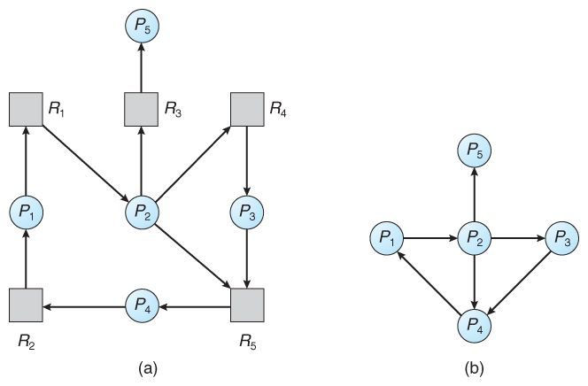

# 교착상태

> 교착상태(Dead Lock)은 상호 배제에 의해 나타나는 문제점으로, 둘 이상의 프로세스들이 자원을 점유한 상태에서 서로 다른 프로세스가 점유하고 있는 자원을 요구하며 무한정 기다리는 현상을 의미합니다.

## 교착상태가 발생하기 위한 필요 충분 조건
> - 상호배제(Mutual Exclusion) : 한 번에 한 개의 프로세스만이 공유 자원을 사용할 수 있어야 한다.
> - 점유와 대기(Hold and Wait) : 최소한 하나의 자원을 점유하고 있으면서 다른 프로세스에 할당되어 사용하고 있는 자원을 추가로 점유하기 위해 대기하는 프로세스가 있어야 한다.
> - 비선점(Non-preemption) : 다른 프로세스에 할당된 자원은 사용이 끝날 때까지 강제로 빼앗을 수 없어야 한다.
> - 환형 대기(Circular Wait) : 공유자원과 공유자원을 사용하기 위해 대기하는 프로세스들이 원형으로 구성되어 있어 자신에게 할당된 자원을 점유하면서 앞이나 뒤에 있는 프로세스의 자원을 요구해야 한다.

## 데드락의 해결방법
크게 3가지가 있다.

- 데드락이 발생하지 않도록 예방/회피
- 데드락 발생을 허용하지만 데드락을 탐지하여, 데드락에서 회복하기
- 교착상태 무시
    - 너무 드물게 일어나기 때문에 매번 예방 탐지 해서 성능 저하시키는 것보다 교착 상태가 발생하도록 하고 필요에 따라 재부팅하는게 빠를 수 있다는 것이다.(Unix 및 window를 포함한 대부분의 운영체제가 사용하는 방법)

## 데드락 예방하기!

앞서 위에서 말한 필요 충분 조건에 방지(부정)하여 만든 예방법이다.
데드락의 발생조건 4가지 중 하나라도 발생하지 않게 하는 것이다.

- 자원의 상호 배제 조건 방지 : 한 번에 여러 프로세스가 공유 자원을 사용할 수 있게 하는 것이다.
    - 그러나 추후 동기화 관련 문제 발생 가능성이 있다.
- 점유 대기 조건 방지 : 프로세스 실행에 필요한 모든 자원을 한꺼번에 요구하고 허용할 때까지 작업을 보류해서, 나중에 또 다른 자원을 점유하기 위한 대기 조건을 성립하지 않도록 한다.
- 비선점 조건 방지 : 이미 다른 프로세스에게 할당된 자원이 선점권이 없다고 가정할 때, 높은 우선순위의 프로세스가 해당 자원을 선점할 수 있도록 합니다.
- 순환 대기 조건 방지 : 자원을 순환 형태로 대기하지 않도록 일정한 한 쪽 방향으로만 자원을 요구할 수 있도록 한다.

**그런데!!! 예방하는 방법들이 시스템의 처리량이나 효율성을 떨어뜨릴 수 있다는 단점이 있기에 회피법을 통해 예방법의 단점을 일부 해결했다고 한다.**

## 데드락 회피!

데드락 회피에서는 Safe sequence, Safe state가 중요한 단어이다.

회피한다는 말 처럼 시스템의 프로세스들이 요청하는 모든 자원을, 데드락을 발생시키지 않으면서 차례로 모두에게 할당해 줄 수 있다면 안정 상태(safe state)에 있다 말한다.

그리고 특정한 순서로 프로세스들에게 자원을 할당, 실행 및 종료 등의 작업을 할 때 데드락이 발생하지 않는 순서를 찾을 수 있다면 그것은 안전 순서(safe sequence)라고 부르기로 했다.

이와 반대인 상황이 불안정 상태인데 데드락 발생 가능성이 있는 상황이며, 데드락이 이런 불안정 상태일때 발생할 수 있다.

글에서 말한 것처럼 불안정 상태일때가 교착 상태보다 더 큰 집합이다. 

이러한 것처럼 회피 알고리즘은 항상 safe state하게 있을 수 있도록 할당을 허용하자는 것이 기본 특징이다.

이것 중 대표적인것이 
은행원 알고리즘(Banker's Algorithm)
- 다익스트라가 제안
- 어떤 자원의 할당을 허용하는지에 관한 여부를 결정하기 전에, 미리 결정된 모든 자원들의 최대 가능한 할당량을 가지고 시뮬레이션 해서 Safe state에 들 수 있는지 여부를 검사.

대기중인 다른 프로세스들의 활동에 대한 교착 상태 가능성을 미리 조사하는 것이다.

그런데 위의 말한 것처럼 어찌보면 은행원 알고리즘은 미리 최대 자원 요구량을 알아야 하고, 할당할 수 있는 자원 수가 일정해야 하는 등 사용에 있어 제약조건이 많고, 그에 따른 자원 이용도 하락의 단점이 존재한다.

## 데드락 탐지(Detection) 및 회복(Recovery)

### 데드락 탐지
만약 위 같이 데드락 예방이나 회피법이 어찌보면 자원의 낭비가 되는 단점이 있어서 사용을 하지 않았을 경우에는 데드락이 발생할 수 있기 때문에 데드락을 탐지하고, 회복하는 알고리즘이 나오게 됬다.

- 탐지 기법
    - Allocation, Request, Available 등으로 시스템에 데드락이 발생했는지 여부를 탐색한다. 은행원 알고리즘과 비슷한 형태이다.
      - 이 외에 자원 할당 그래프, 대기 그래프를 통해 탐지하는 방법도 있다.

왼쪽이 자원 할당, 오른쪽이 대기 그래프이다.

> 사진 출처 : https://yoongrammer.tistory.com/67

### 데드락 회복
- 회복 기법 :  데드락을 탐지 기법을 통해 탐지하면, 순환 대기 에서 벗어나 데드락으로부터 회복하기 위한 방법을 사용한다.
  - 단순히 프로세스를 1개 이상 중단시키는 방법 : 계속 연산중이던 프로세스들도 모두 일시에 중단되어 부분 결과가 폐기될 수 있는 부작용 발생
    - 교착 상태에 빠진 모든 프로세스를 중단시키기 : 매번 탐지 알고리즘을 호출 및 수행해야 하므로 부담이 되는 작업일 수 있다.
    - 프로세스를 하나씩 중단 시킬 때마다 탐지 알고리즘으로 데드락을 탐지하며 회복
  - 자원 선점하기
     - 프로세스에 할당된 자원을 선점해서, 교착 상태를 해결할 때까지 그 자원을 다른 프로세스에 할당해 주는 방법
     - 여기서 고려할 점 3가지가 있다.
        - 1. 희생자 선택(selection of a victim)
            - 최소의 피해를 줄 수 있는 프로세스 선택
        - 2. 롤백(rollback)
            - 선점 된 프로세스를 문제 없던 이전 상태로 롤백해야함.
            -  보통 가장 안전한 방법은 프로세스를 중지시키고 재시작하는 것
        - 3. 기아 상태(starvation)
            - 한 프로세스가 계속 선점되어 기아상태가 되는 것을 방지
            - 한 가지 방법은 우선 순위를 사용하여 선점 될때마다 프로세스 우선순위를 높이는 것

### 출처
- https://coding-factory.tistory.com/311
- https://chanhuiseok.github.io/posts/cs-2/
- https://yoongrammer.tistory.com/67