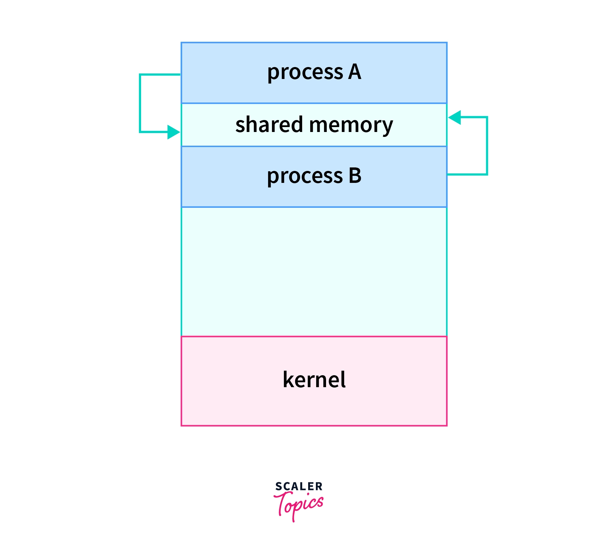
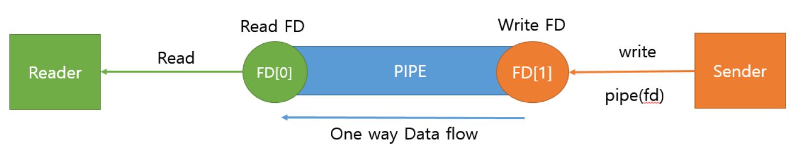
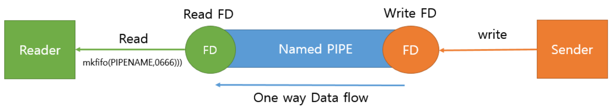
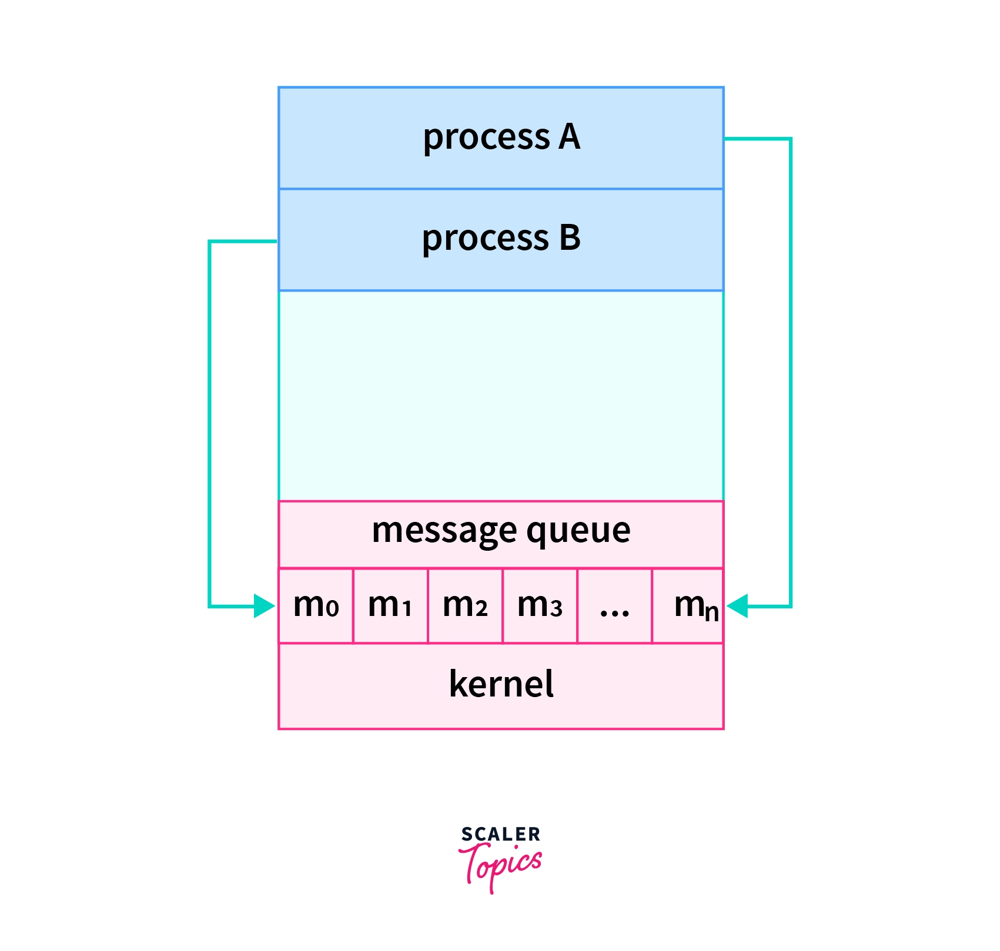
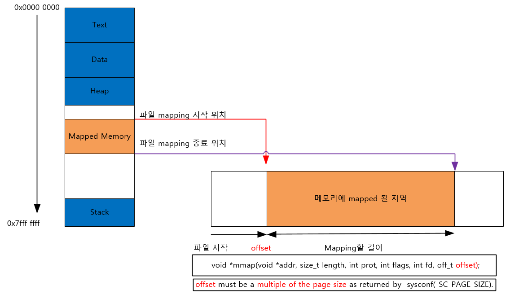

# 멀티프로세싱

> - 가정 : 1대인데 프로세서는 2개 이상이다.
> - 여러 개의 프로세서가 서로 협력적으로 일을 처리하는 것

## 대표적인 멀티 프로세스 구조 : 웹 브라우저

대표적으로 멀티 프로세스 구조를 웹 브라우저들이 가지고 있다. 
그런데 왜? 멀티 프로세스로 구성이 되어있을까?

### 멀티 프로세스로 한 이유

- 싱글 프로세스로 했다면 브라우저의 탭이 여러 개일 경우 하나의 잘못된 페이지에 접근해서 랜더링 문제가 일어났을 때 브라우저가 전체적으로 종료될 수 있기 때문
- 프로세스 분리를 통해 프로세스가 접근 가능한 메모리 범위를 격리하고 보호할 수 있기 때문

###  웹 브라우저 프로세스의 종류

- 브라우저 프로세스 : 주소 표시줄, 북마크 막대, 뒤로가기 버튼, 앞으로 가기 버튼 등을 담당, 네트워크 요청이나 파일 접근 같은 권한 담당
- 랜더러 프로세스 : 웹 사이트가 '보이는' 부분의 모든 것을 제어
- 플러그인 프로세스 : 웹 사이트에서 사용하는 플러그인을 제어한다.
- GPU 프로세스 : GPU를 이요해서 화면을 그리는 부분을 제어

등등 더 많은 프로세스 들이 있다.

어떤 프로세스들이 작동하고 있는지 보기 위해서 **Chrome 기준  Chrome 맞춤설정 및 제어 버튼을 클릭하고 메뉴에서 도구 더보기 > 작업 관리자를 선택한다.** 그러면 현재 실행 중인 프로세스 목록과 사용 중인 CPU, 메모리의 양이 표시된 창이 열린다.

크롬의 예제를 통해 보게되면 최근까지 Chrome은 탭마다 프로세스를 할당했다. 이제는 (iframe에 있는 사이트 포함)마다 프로세스를 할당한다고 한다.

그러면 이런 프로세스들끼리는 각각의 맡은 역할이 있는데 서로 필요한 정보가 있기 위해서는 통신을 해야하는데 어떻게 통신할까?

## IPC(Inter Process Communication)

> IPC란 (커널 영역에서)프로세스들 사이에 서로 데이터를 주고받는 행위 또는 그에 대한 방법이나 경로를 뜻한다.

### IPC가 왜 필요할까?

- 프로세스 간 통신 및 작업을 동기화 할 수 있게 도와준다.
- 권한을 분리할 수 있다
- 모듈성
- 계산 속도를 향상
- 정보 및 데이터를 공유할 수 있다

효율적으로 정보를 주고 받기 위한 통신의 일종이라고 생각하면 되는데 인터넷 통신도 IPC의 확장으로 보면 된다.

프로세스가 통신이 된다는 건 동시에 접근 가능한 메모리 즉, 프로세스들이 공유할 수 있는 메모리가 필요하다.

> 여기서 잠깐! 스레드 통신보다 프로세스의 통신이 어려운 이유가 있다!
> - 스레드는 메모리 공간을 공유한다. 그렇지만 프로세스는 그렇지 않다.
> - 프로세스가 통신할 수 있는 공간이 없기에 통신을 위한 별도의 공간을 만들어줘야 한다.

그래서 보게 되면 커널 영역에 IPC를 제공하여 프로세스 커널이 제공하는 IPC설비를 통해 프로세스간 통신을 할 수가 있다.

아래는 IPC의 종류이다.

### 공유 메모리

> 사진출처 : https://www.scaler.com/topics/operating-system/inter-process-communication-in-os/
- 공유 메모리는 커널을 사용하지 않습니다.
- 공유 메모리가 데이터 자체를 공유하도록 지원하는 설비, 프로세스간 메모리 영역을 공유해서 사용할 수 있도록 허용한다.
    - 위에서 말했던 다른 프로세스 끼리 공유할 수 있는 메모리가 있어야 한다는 것에서 나온 것이다.
- 프로세스가 공유 메모리 할당을 커널에 요청하면 커널은 해당 프로세스에 메모리 공간을 할당하고 어떤 프로세스건 해당 메모리 영역에 접근할 수 있다.
    - 각 프로세스가 공유 메모리에 attach하는 방식으로 작동한다.
- 다른 프로세스간 Read,Write를 필요로 할 때 사용한다.
- 대량의 정보를 다수의 프로세스에게 배포가 가능하다.
- 중개자 없이 곧바로 메모리에 접근할 수 있어서 모든 IPC 중에서 가장 빠르게 작동한다.

### 소켓

> 사진 출처 : https://doitnow-man.tistory.com/110

- 동일한 호스트 운영 체제에서 실행되는 프로세스간 데이터를 교환하기 위한 데이터 통신 엔드 포인트이다.
- 네트워크 소켓 통신을 통해 데이터를 공유
- 클라이언트 서버가 소켓을 통해서 통신하는 구조, 원격에서 프로세스 간 데이터를 공유할 때 사용
- 전이중(Full Duplex, 양방향) 통신이 가능하다.
- 중대형 애플리케이션에서 주로 사용하는 방식이다.

## 파이프
통신을 위한 메모리 공간(버퍼)를 생성해서 프로세스가 데이터를 주고 받게 하는 방식이다. 그 안에는 
- 익명 파이프
- 명명된 파이프 

2가지가 존재한다.

### 익명 파이프

> 사진 출처 : https://doitnow-man.tistory.com/110

- 익명의 PIPE를 통해서 동일한 PPID를 가진 프로세스들 간 통신
- 통신할 프로세스가 명확하게 알 수 있는 경우 사용
- 생성된 PIPE에 대하여 Write 또는 Read만 가능
- FIFO 구조
- 부모 자식 프로세스간 통신 할 때 사용한다.
- 쌍방 통신을 위해서는 Write, Read Pipe를 만들어야 한다.
- 단방향 통신이다.

### 명명된 파이프

> 사진 출처 : https://doitnow-man.tistory.com/110

- 이름을 가진 PIPE를 통해서 프로세스들 간 양 방향 통신을 지원
- 서로 다른 프로세스들이 PIPE의 이름만 알면 통신이 가능하다.
- FIFO 구조이다.
- 연관이 전혀 없는 프로세스간 통신을 할 때 사용
- 양방향 통신이다.

### 메시지 큐

> 사진 출처 : https://www.scaler.com/topics/operating-system/inter-process-communication-in-os/

OS의 커널에 메시지를 저장하기 위한 연결 목록이 있고 "메시지 대기열 식별자"를 사용하여 메시지 대기열을 식별.

- IPC에서는 통신 및 동기화 프로세스에서 사용된다.
- 공유 메모리 기술보다 느리다.
- 프로세스는 공유 변수 없이 통신할 수 있으므로 네트워크의 분산 환경에서 사용할 수 있습니다.
- 메시지 보내는 작업(고정 크기 메시지) 및 받기 두 가지 작업을 통해 이루어진다.

### 메모리 맵

> 사진 출처 : https://doitnow-man.tistory.com/110

- 파일을 프로세스의 메모리에 일정 부분 맵핑 시켜 사용한다.
- 파일로 대용량 데이터를 공유 할 때 사용
- FILE IO가 느릴때 사용하면 좋음
- 대부분의 운영 체제에서 프로세스를 실행할 때 실행 파일의 각 세그먼트를 메모리에 사상하기 위해 메모리 맵 파일을 이용.

### IPC 별 사용 시기 및 특징

위 내용을 요약하면 다음과 같다.

|  IPC 종류  |       PIPE        |     Named PIPE     |   Message Queue    |   Shared Memory    |    Memory Map     |      Socket       |
|:--------:|:-----------------:|:------------------:|:------------------:|:------------------:|:-----------------:|:-----------------:|
|   사용시기   | 부모 자식 간 단 방향 통신 시 | 다른 프로세스와 단 방향 통신 시 | 다른 프로세스와 단 방향 통신 시 | 다른 프로세스와 양 방향 통신 시 | 다른 프로세스와 양방향 통신 시 | 다른 시스템간 양 방향 통신 시 |
|  공유 매개체  |        파일         |         파일         |        메모리         |        메모리         |      파일+메모리       |        소켓         |
|  통신 단위   |      Stream       |       Stream       |        구조체         |        구조체         |        페이지        |      Stream       | 
|  통신 방향   |       단 방향        |        양 방향        |    단 방향        |        양 방향        |       양 방향        |       양 방향        |
| 통신 가능 범위 |      동일 시스템       |       동일 시스템       |동일 시스템       |       동일 시스템       |동일 시스템       |     동일+외부 시스템     |

### 출처
- [IPC관련](https://dar0m.tistory.com/233)
- [IPC관련2](https://www.scaler.com/topics/operating-system/inter-process-communication-in-os/)
- [브라우저 프로세스](https://d2.naver.com/helloworld/2922312)
- [웹브라우저 스레드](https://thiluxan.medium.com/how-web-browsers-use-process-threads-a5e560d42037)
- [IPC관련3](https://doitnow-man.tistory.com/110)
- [멀티프로세싱](https://www.tutorialspoint.com/what-is-a-multiprocessing-operating-system)