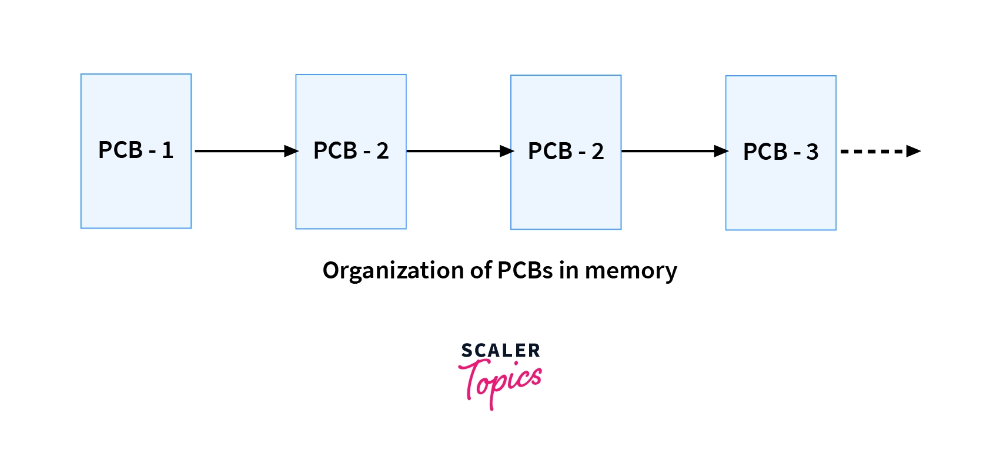
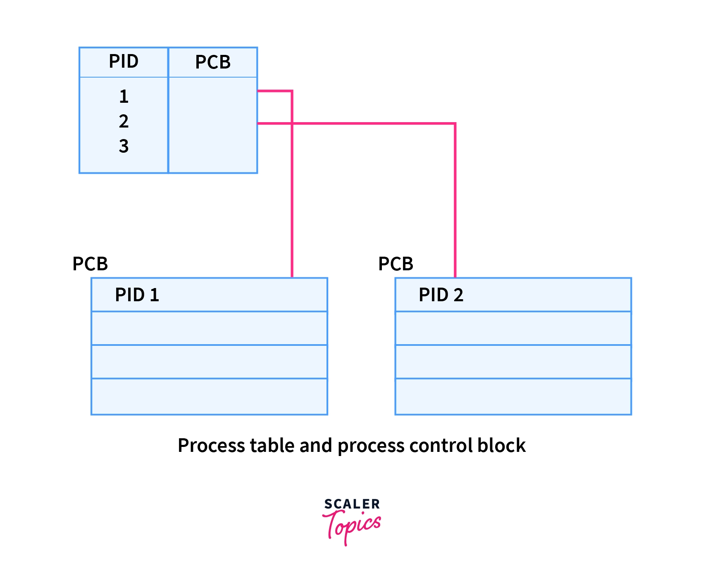

# PCB

> PCB(Process Control Block)은 운영체제에서 프로세스에 대한 메타데이터를 저장한 '데이터'를 말합니다.

> 메타 데이터 : 데이터에 관한 구조화된 데이터이자 데이터를 설명하는 작은 데이터이다. 일정한 규칙에 따라 콘텐츠에 대해 부여되는 데이터이다.

프로세스가 생성이 되면 운영체제는 해당 PCB를 생성을 하게 된다. 그니까 즉 PCB는 운영체제에게 Process에 대한 정보들을 제공하기 위해 있는 블록이라고 생각하면 될 거 같다.

### PCB의 생성, 삭제 시점
- 생성 : 각 프로세스가 생성될 때마다
- 삭제 : 프로세스가 완료가 되면 없어진다.

### PCB의 구조 

다음 그림과 같이 생겼는데 하나씩 뭘 저장하는지 알아보자.

> - Pointer – 프로세스의 현재 위치를 유지하기 위해 프로세스가 한 상태에서 다른 상태로 전환될 때 저장해야 하는 스택 포인터입니다.
> - Process State – 프로세스 의 각 상태를 저장합니다.
> - Process Number – 모든 프로세스에는 프로세스 식별자를 저장하는 프로세스 ID 또는 PID라는 고유한 ID가 할당됩니다.
> - Program Counter – 프로세스에 대해 실행될 다음 명령의 주소를 포함하는 카운터를 저장합니다.
> - Registers – 누산기, 베이스, 레지스터 및 범용 레지스터를 포함하는 CPU 레지스터입니다.
> - Memory Limits – 이 필드에는 운영 체제에서 사용하는 메모리 관리 시스템에 대한 정보가 포함되어 있습니다. 여기에는 페이지 테이블, 세그먼트 테이블 등이 포함될 수 있습니다.
> - Open files list - 이 정보에는 프로세스를 위해 열린 파일 목록이 포함됩니다.
> - Miscellaneous accounting and status data (기타 계정 및 상태 데이터) – 이 필드에는 사용된 CPU 양, 시간 제약, 작업 또는 프로세스 번호 등에 대한 정보가 포함됩니다
 
위 정보들을 보면 저장하는 내용들이 다 process를 사용하기 위하여서 필요한 내용이자 거의 신분증과 같은 친구라고 볼 수 있었다.

### PCB를 정의하는 많은 글들

> - 특정한 프로세스를 관리할 필요가 있는 정보를 포함하는, 운영체제 커널의 자료구조입니다. PCB는 운영 체제가 프로세스를 표현한 것이라 할 수 있습니다.
> - 운영체제가 프로세스 스케줄링을 위해 프로세스에 관한 모든 정보를 가지고 있는 데이터베이스를 PCB라 합니다.

### 어떨 때 PCB를 참고할까?

쉽게 생각해보면 우리가 앞에서 했던 여러가지의 프로세스의 상태 중에 중간에 인터럽트 같은 일들이 일어나서 도중에 block이 되거나 중단이 되버리면 다른 작업들을 수행하고 다시 프로세스를 실행해야하는데 그럴 때 PCB를 참고하여 이전까지 했던 프로세스의 상태나 내용들을 저장할 것이다.

그리고 또 뒤에 나오는 context-switching이라는 것을 통하여서 프로세스들을 switching을 해야 하는 상황 속에서도 진행하기 위한 프로세스로 넘어가기 전에 저장을 하는 곳으로 사용이 될 수도 있다.

### PCB는 어디에 위치해 있을까?

> PCB는 정상적인 프로세스 액세스로부터 보호되는 메모리 영역에 보관되어야 합니다. 일부 운영 체제에서 PCB는 프로세스 스택의 맨 아래에 배치됩니다.

즉, PCB에 대한 내용은 엄청나게 프로세스의 상태에 대한 정보들이 있기 때문에 일반적으로 접근이 가능한 영역이 아닌 접근을 못하도록 하는 영역에 위치하게 된다. 

### PCB가 저장되는 구조

일단 위의 그림처럼 pcb는 linkedList의 구조로 메모리에서 저장이 되는데 이것을 찾을 때는 해당하는 Process Table 즉 해당하는 PID가 들어있는 곳을 참조하는데 그 때 PID와 함께 PCB의 레퍼런스가 함께 들어있어서 그때 그 정보를 같이 살펴볼 수 있도록 한다고 한다.

### 출처
> - https://jwprogramming.tistory.com/16
> - https://www.geeksforgeeks.org/difference-between-process-and-thread/
> - https://www.guru99.com/difference-between-process-and-thread.html
> - https://velog.io/@dbstjrwnekd/프로세스와-PCB
> - https://www.scaler.com/topics/operating-system/process-control-block-in-os/