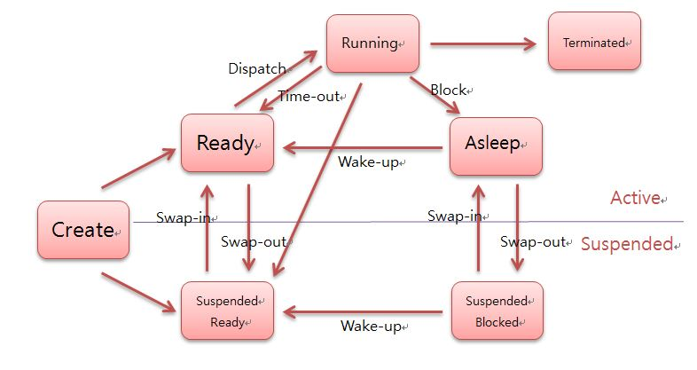

# 프로세스

> 프로세스(process)는 컴퓨터에서 연속적으로 실행되고 있는 컴퓨터 프로그램을 말한다. 종종 스케줄링의 대상이 되는 작업(task)이라는 용어와 거의 같은 의미로 쓰인다.

즉 컴퓨터에서 실행되고 있는 프로그램을 프로세스라고 부른다.

프로그램이 메모리에 올라가면 프로세스가 되는 인스턴스화가 일어나고, 이후 운영체제의 CPU 스케줄러에 따라 CPU가 프로세스를 실행한다.

> CPU 스케줄러 : CPU를 선점한 프로세스가 대기하는 시간을 보다 효율적으로 사용하기 위하여 사용한다.

이 정도만 알고 가면 좋을 거 같다. 뒤에 나오기 때문에 나중에 뒤에 챕터에서 알아보자.

> 멀티 태스킹 :  운영체제(OS)를 통해 여러 프로세스(프로그램)를 실행하고 관리하는 작업

## 프로세스의 컴파일 과정

위에서 프로세스는 컴퓨터에서 실행되고 있는 프로그램을 프로세스라고 했다. 예를 들면 크롬 프로그램이 있으면 그것을 더블 클릭하여 실행시키면 크롬 프로세스가 시작되는 것이다.

이런 프로그램은 컴파일러로 인하여 컴파일 과정을 거쳐 컴퓨터가 이해할 수 있는 기계어로 번역되어 실행될 수 있는 파일이 되는 것을 말한다.

위의 프로그램은 C언어 기반의 프로그램이며 컴파일 과정 없이 한 번에 한 줄씩 실행하는 인터프리터 언어(파이썬)으로 되는 프로그램과는 다르다.

순서로 보자면 다음과 같다. 

p.159 의 그림을 참고하자.

> 소스 코드 파일 -> 전처리 -> 컴파일러 -> 어셈블리어로 변환 -> 어셈블러 -> 목적코드 -> 라이브러리 + 목적코드 -> 링커 -> 실행 가능 파일(.exe) 와 같은 파일이 된다.

### 전처리

> 전처리(Pre-processing) 과정은 전처리기(Preprocessor)를 통해 소스 코드 파일(*.c)을 전처리된 소스 코드 파일(*.i)로 변환하는 과정이다.

전처리 과정에서는 3가지를 수행한다고 한다.

> 1. 주석 제거 : 소스 코드의 주석을 전부 제거한다. 굳이 컴퓨터가 알 필요는 없기 때문이다.
> 2. 헤더 파일 삽입 : #include 지시문을 만나면 해당하는 헤더 파일을 찾아 헤더 파일에 있는 모든 내용을 복사해서 소스 코드에 삽입한다. 즉, 헤더 파일은 컴파일에 사용되지 않고 소스 코드 파일 내에 전부 복사된다. 헤더 파일에 선언된 함수 원형은 후에 링킹 과정을 통해 실제로 함수가 정의되어 있는 오브젝트 파일(컴파일된 소스 코드 파일)과 결합한다.
> 3. 매크로 치환 및 적용 : #define 지시문에 정의된 매크로를 저장하고 같은 문자열을 만나면 #define 된 내용으로 치환한다.

### 컴파일러

> 컴파일(Compilation) 과정은 컴파일러(Compiler)를 통해 전처리된 소스 코드 파일(*.i)을 어셈블리어 파일(*.s)로 변환하는 과정이다.
이 과정에서 우리가 일반적으로 컴파일하면 생각하는 언어의 문법 검사가 이루어진다. 또한 Static한 영역(Data, BSS 영역)들의 메모리 할당을 수행한다.

여기서 컴파일러의 구조를 완전 자세히는 아니여도 살펴보면 3가지의 영역으로 나뉜다.

> 1. 프론트엔드 : 언어 종속적인 부분 처리
> 2. 미들엔드 : 아키텍쳐 비종속적 최적화를 수행 -> CPU 아키텍쳐가 무엇이든(arm, x86 등) 상관없이 할 수 있는 최적화를 말한다.
> 3. 백엔드  : 백엔드에서는 아키텍쳐 종속적인 최적화를 수행한다. ->
아키텍쳐 종속적인 최적화란 아키텍쳐 특성에 따라 최적화를 수행하는 것을 말한다. 같은 기능을 수행하는 명령어여도 CPU 아키텍처별로 더욱 효율적인 명령어로 대체하여 성능을 높이는 작업을 예를 들 수 있다.

### 어셈블러

> 어셈블리어는 목적 코드로 변환을 시켜준다. 이때 확장자가 운영체제마다 다른데 리눅스에서는 .o라고 되어있다.

### 오브젝트 파일?
>어셈블리 코드는 이제 더 이상 사람이 알아볼 수 없는 기계어로 변환되는데 이를 오브젝트 코드라 부른다.
오브젝트 코드로 구성된 파일을 오브젝트 파일(Object File)이라 부르며 이 오브젝트 파일은 특정한 파일 포맷을 가진다.

그런데 이렇게까지 바꾸고 막 했는데 지금의 상태에서는 c언어로 예를 들면 printf를 사용할 수가 없다. 왜냐하면 <stdio.h>라고 하는 곳에 있는 printf라는 구현한 내용이 없기 때문이다.

printf함수의 원형만 복사를 해온거지 구현이 되어있는 것이 있는게 아니다. 그래서 위 오브젝트 파일을 printf 함수를 사용하는 오브젝트 파일과 printf 함수를 구현한 오브젝트 파일(libc.a 라이브러리)을 연결시키는 작업이 필요하다.

이 작업을 `링킹`이라고 부른다.

### 링킹

>  링커(Linker)를 통해 오브젝트 파일(*.o)들을 묶어 실행 파일로 만드는 과정이다.
이 과정에서 오브젝트 파일들과 프로그램에서 사용하는 라이브러리 파일들을 링크하여 하나의 실행 파일을 만든다.

이 파일의 확장자는 .exe, .out과 같은 확장자를 가지게 된다.

그런데 이렇게 합치게 될 때 라이브러리에는 동적, 정적 라이브러리로 나누어진다.

### 정적 라이브러리

> 정적 라이브러리는 프로그램 빌드 시 라이브러리가 제공하는 모든 코드를 실행 파일에 넣는 방식

- 장점 : 실행 파일만 있으면 프로그램이 동작하는 만큼 이식성이 좋고 안정적이다. 
- 단점 : 
  1. 실행 파일이 라이브러리 내용을 복사해서 가지고 있으므로 라이브러리에서 수정할 부분이 있으면 파일 전체를 다시 컴파일하여 재배포해야 한다.
  2. 실행 파일이 라이브러리를 가지고 있는 만큼 실행 파일 크기가 커진다.
  3. 같은 라이브러리를 가진 여러 프로그램이 동시에 실행될 경우 코드가 중복되어 메모리 자원을 낭비한다.
  4. 정적 라이브러리 전체를 링킹하면서 사용하지 않는 함수들까지 전부 다 프로그램에 포함한다.

### 동적 라이브러리

> 동적 라이브러리는 프로그램 실행 시 필요할 때만 DLL이라는 함수 정보를 통해 참조하는 방식

- 장점 : 실행 파일 크기가 작아지고 여러 프로그램이 동적 라이브러리를 메모리에 올려놓고 공유해서 사용하기 때문에 메모리 자원을 효율적으로 사용할 수 있다.
- 단점 :실행 파일은 실행할 때 동적 라이브러리가 필요하다. 만약 동적 라이브러리가 제대로 링크되어 있지 않거나 버전이 맞지 않는 등의 문제가 있으면 실행이 안 될 수 있다. 즉, 외부 의존도가 생기며 이식성이 낮은 단점이 있다.
또한, 동적 라이브러리를 사용할 경우 매번 프로그램 영역에서 라이브러리가 저장된 주소로 이동하는 과정이 필요하여 약간의 성능 감소가 있을 수 있다.

메모리 효율성에서의 장점과 외부 의존도가 높아진다는 단점이 있다.

그래서 가끔 파일들을 보다보면 아래와 같은 확장자를 보게 되는데 이런 형식의 라이브러리라는 것을 알고가면 될 거 같다.

*.dll : 윈도우 환경의 동적 라이브러리

*.lib : 윈도우 환경의 정적 라이브러리(무조건 정적은 아님)

*so : 리눅스 환경의 동적 라이브러리

*a : 리눅스 환경의 정적 라이브러리

## 프로세스의 상태

프로세스는 여러 가지 상태를 가지게 되는데 여기서는 꼭 그림을 참고해야한다. (p.160 참고)

상태가 너무 많다. 하나씩 알아보자.

사진 출처 : http://itnovice1.blogspot.com/2019/08/blog-post_64.html

### 생성(New)
> 프로세스가 생성된 상태를 의미하는데 OS에 프로세스의 PCB가 생성되면서 메인 메모리에 적재되어 실행 준비를 마친 상태이다. 이때 fork(), exec() 함수를 통해 생성이 된다.
   - fork() : 새 프로세스를 만드는 시스템 호출입니다. 새로 생성된 프로세스(=자식 프로세스)는 몇 가지를 제외하고는 호출자 프로세스(=부모 프로세스)와 동일합니다.
   - exec() : 새롭게 프로세스를 생성하는 함수? 가 아니라 fork() 시스템 콜로 복제된 자식 프로세스에 새로운 프로그램을 덮어씌우는 것이다.

### 대기(ready)
> 메모리 공간이 충분하면 메모리를 할당받고 아니면 아닌 상태로 대기, CPU 스케줄러에게 CPU 소유권이 넘어오기를 기다리는 상태

이러한 상태라고 한다.
- 프로세스가 처리기의 배정을 기다리는 상태
- 다른 프로세스의 실행을 위해서 일시적으로 정지해있는 상태
- CPU에 의해 처리되기 위해 주기억 장치에 존재하는 상태

### 대기 중단(suspended ready)

> 메모리 부족으로 일시 중단된 상태

### 실행 상태(running)

> 프로세스가 CPU를 차지하고 있는 상태 또는 프로세스의 명령이 실행되고 있는 상태(CPU 소유권과 메모리를 할당받음), CPU burst가 일어났다고도 표현한다.

### 중단 상태(blocked)

> 어떤 이벤트가 발생한 이후 기다리며 프로세스가 차단된 상태

- 처리 속도가 느린 I/O 작업 중인 상태
- 외부적인 사건이 생길 때까지 실행할 수 없는 상태

우리가 이런걸 인터럽트로 이런 현상들이 많이 일어난다. 프린터의 인쇄 버튼을 눌렀을때 잠시 멈춘거 같은 거시 이런 현상이다.

### 일시 중단 상태(blocked suspended)

> 대기 중단과 비슷하다, 중단된 상태에서 프로세스가 실행되려고 했지만 메모리 부족으로 일시 중단된 상태이다.

### 종료 상태(terminated)
> 프로세스의 실행을 완료하고 할당된 CPU를 반납한 상태이다. 

종료가 자연스럽게 되는 것도 있지만 부모 프로세스가 자식 프로세스를 강제로 종료시키는 자발적 종료(abort)라는 것도 있다. 그리고 자식 프로세스에 할당된 자원의 한계치를 벗어나거나 부모 프로세스가 종료되거나 사용자가 process,kill등 명령어로 프로세스를 종료시킬 때 일어난다.

### 프로세스 상태 변화에 따른 용어
> - Dispatch(준비 -> 실행) : 준비 상태에 있는 여러 프로세스 중 프로세스를 선정하여 CPU를 할당하는 시점
> - Timer Run Out(Interrupt, 할당 시간 종료, 실행 -> 준비) : 할당된 시간만큼 CPU를 사용하고 준비 상태로 변하는 시점, 상태 변이 원인이 외부에 있어 외부 인터럽트에 의해 할당 시간이 종료
> - Block(I/O Request, 실행 -> 대기) : 실행중이던 프로세스가 외부 요인에 의해서 자원을 빼앗기는 상태
> - Wake up(대기 -> 준비) : I/O 작업이 완료되거나 자원이 할당되어 다시 준비 상태로 이동하는 시점
> - Suspended(Swap Out, 대기 -> 지연준비) : 준비/대기 상태에서 기억 장치를 반납하고 지연 준비 상태로 전이
> - Resume(Swap-In 지연 준비 -> 대기) : 지연 준비/지연 대기 상태에서 기억 장치를 할당받아 준비(대기) 상태로 전이

### 프로세스 스케줄링

- Long-Term(장기 스케줄러, Job Scheduler) : 보조기억장치에서 어떤 프로그램을 가져와(Load) 커널(Job Queue)에 등록할 지 결정하는 역할을 수행
- Middle-Term(중기 스케줄러) : 메모리에 적재된 프로세스의 수를 동적으로 조절하기 위해 추가한 스케줄러
- Short-Term(단기 스케줄러, CPU Scheduler) : 준비 상태의 프로세스 중에서 어떤 프로세스를 다음 번에 실행 상태로 만들 것인지를 결정하는 역할을 수행

### 스풀

> 프로그램과 이를 이용하는 I/O장치와의 속도 차를 극복하기 위한 장치, 대부분 하드 디스크가 중재한다.

### 버퍼링

> CPU와 I/O 장치와의 속도 차이를 줄이기 위해 메모리가 중재하는 역할

라는 것이 영어로 되어있는 상태 그림에서 나오게 되는데 잘 알고 있자.

## 프로세스의 메모리 구조

프로세스는 위에서 부터 스택, 힙, 데이터 영역, 코드 영역으로 나뉜다.

### 스택

> 호출된 함수의 수행을 마치고 복귀할 주소 및 데이터(지역변수, 매개변수, 리턴값 등)을 임시로 저장하는 공간이다. 컴파일 시에 크기가 결정되며 동적인 특징을 가진다.

스택 영역은 LIFO의 방법을 가진다. 이름 그대로의 자료구조 처럼.. 컴파일시에 크기가 결정되기 때문에 무한정 할당을 할 수 없다고 한다. 그래서 우리가 재귀함수를 반복해서 호출을 시킬 때나 함수가 지역변수의 메모리를 초과할 정도로
많이 가지고 있다면 stack overflow가 발생하게 되는 것이다.

### 힙 영역

> 힙은 동적 할당할 때 사용되며 런타임 시 크기가 결정이 된다. 

프로그래머가 필요할 때마다 사용하는 메모리 영역인데 예를 들어보자면 벡터 같으 동적 배열이 있다. 자바에서는 객체가 heap영역에 생성이되고 GC에 의해서 정리가 된다.

여기 위 스택 힙은 메모리 영역이 겹치면 안 되기 때문에 힙과 스택 사이의 공간을 비워 놓는다. 스택은 그래서 위의 주소부터 할당이 되고 힙은 아래의 주소부터 할당이 된다.

### 데이터 영역

> 데이터 영역은 전역변수, 정적변수가 저장되고, 정적인 특징을 갖는 프로그램이 종료되면 사라지는 변수가 들어 있는 영역이다. 전역 변수는 변경 될 수 있기 때문에 Read-Write로 되어있다.

데이터 영역은 또 BSS, Data영역으로 나뉘는데 BSS 영역은 초기화 되지 않은 변수가 0으로 초기화되어 저장되는 것이고 Data 영역은 0이 아닌 다른 값으로 할당된 변수들이 저장된다.

### 코드 영역

> 사용자가 작성한 프로그램 함수들의 코드가 CPU에서 수행할 수 없는 기계어 명령 형태로 변환되어 저장되는 공간이다. 컴파일 타임에 결정되고 코드를 바꿀 수 없게 Read-Only로 되어있다.

### 출처
- https://www.charlezz.com/?p=44590(프로세스 관련)
- https://bradbury.tistory.com/226#:~:text=%EC%BB%B4%ED%8C%8C%EC%9D%BC%20%EA%B3%BC%EC%A0%95%EC%9D%80%204%EA%B0%80%EC%A7%80,%EB%94%B0%EB%A1%9C%20%EB%82%98%EB%88%A0%EC%84%9C%20%EB%B6%80%EB%A5%B4%EA%B8%B0%EB%8F%84%20%ED%95%9C%EB%8B%A4.(컴파일 관련)
- https://blog.potados.com/dev/things-happend-after-fork/(fork() 관련)
- https://structuring.tistory.com/131(운영체제)
- https://many258.github.io/study/os-process/(프로세스 상태 관련)
- https://zangzangs.tistory.com/107(프로세스 메모리 영역 관련)
- http://itnovice1.blogspot.com/2019/08/blog-post_64.html(프로세스 상태 관련)